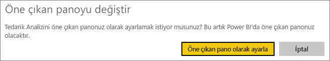
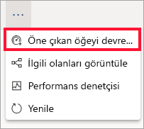

# Power BI hizmetindeki öne çıkan panolar

[!INCLUDE [power-bi-service-new-look-include](../includes/power-bi-service-new-look-include.md)]

Çoğumuzun diğerlerinden daha sık ziyaret ettiğimiz bir pano vardır. Bu, işlerimizi yürütmek için kullandığımız pano olabilir. Veya birçok farklı pano ve rapordaki kutucukların toplamından oluşan bir pano olabilir.

## Öne çıkan pano oluşturma
Panoyu *öne çıkan* olarak ayarlarsanız, Power BI hizmetini açtığınızda bu pano görüntülenir. 

İsterseniz birden fazla pano seçip sık kullanılanlara ekleyebilirsiniz. Bkz. [Sık kullanılan panolar](end-user-favorite.md).

Öne çıkan bir pano belirlemediyseniz, Power BI’da kullandığınız son pano veya Power BI **Giriş** açılır. 

### Bir panoyu öne çıkan olarak ayarlama

1. Öne çıkan olarak ayarlamak istediğiniz panoyu açın. 
2. Üst menü çubuğunda **Diğer seçenekler** (...) ve sonra **Öne çıkan olarak ayarla**’yı seçin. 
   
    
3. Seçiminizi onaylayın.
   
    

## Öne çıkan panoyu değiştirme
İleride fikrinizi değiştirmeniz durumunda yeni bir panoyu öne çıkan pano olarak ayarlayabilirsiniz.

1. Yukarıdaki 1. ve 2. adımları izleyin.
   
2. **Öne çıkan pano olarak ayarla**’yı seçin. Öne çıkanlardan kaldırdığınız pano Power BI’dan kaldırılmaz. 
   
    

## Öne çıkan panoyu kaldırma
Herhangi bir panoyu öne çıkarmak istemediğinize karar verirseniz bu yönergeleri izleyerek öne çıkan panoyu kaldırabilirsiniz.

1. O anda öne çıkan panoyu açın.
2. Üst menü çubuğunda **Diğer seçenekler** (...) ve sonra **Öne çıkan öğeyi devre dışı bırak**’ı seçin.

    
   
## Sonraki adımlar
- [Bir panoyu sık kullanılanlara ekleme](end-user-favorite.md)    
- Başka bir sorunuz mu var? [Power BI Topluluğu](https://community.powerbi.com/)'nu deneyin.

