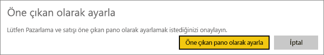

# Power BI hizmetindeki öne çıkan panolar
## Öne çıkan pano oluşturma
Çoğumuzun diğerlerinden daha sık ziyaret ettiğimiz bir pano vardır.  Bu, işlerimizi yürütmek için kullandığımız pano veya birçok farklı pano ve rapordaki kutucukların toplamından oluşan bir pano olabilir.

Panoyu *öne çıkan* olarak ayarlarsanız, Power BI hizmetini açtığınızda bu pano görüntülenir.  

İsterseniz birden fazla pano seçip *sık kullanılanlara* ekleyebilirsiniz. Bkz. [Sık kullanılan panolar](end-user-favorite.md).

Henüz öne çıkan pano belirlemediyseniz, Power BI’da kullandığınız son pano veya Power BI Giriş açılır.  

### Bir panoyu **öne çıkan** olarak belirlemek için
Öne çıkan bir pano oluşturan Amanda'yı izleyin ve ardından kendiniz denemek için videonun altındaki yönergeleri uygulayın.

<iframe width="560" height="315" src="https://www.youtube.com/embed/G26dr2PsEpk" frameborder="0" allowfullscreen></iframe>

1. *Öne çıkan* olarak belirlemek istediğiniz panoyu açın. 
2. Üst menü çubuğunda üç noktayı (...) seçip **Öne çıkan olarak ayarla** seçeneğini belirleyin.  
   
    
3. Seçiminizi onaylayın.
   
    

## Öne çıkan panoyu değiştirme
Elbette ileride fikrinizi değiştirmeniz durumunda yeni bir panoyu öne çıkan pano olarak ayarlayabilirsiniz.

1. Yukarıdaki 1 ve 2 numaralı adımları uygulayın.
   
    
2. **Öne çıkan olarak ayarla**'yı seçin. Öne çıkanlardan kaldırdığınız pano çalışma alanınızdan kaldırılmaz.  
   
    

## Öne çıkan panoyu kaldırma
Herhangi bir panoyu öne çıkarmak istemediğinize karar verirseniz bu yönergeleri izleyerek öne çıkan panoyu kaldırabilirsiniz.

1. Öne çıkan panoyu açın.
2. Üst menü çubuğunda üç noktayı (...) seçip **Öne çıkan öğeyi devre dışı bırak** seçeneğini belirleyin.

    
   
## Sonraki adımlar
[Bir panoyu sık kullanılanlara ekleme](end-user-favorite.md)

Başka bir sorunuz mu var? [Power BI Topluluğu'na başvurun](http://community.powerbi.com/)

