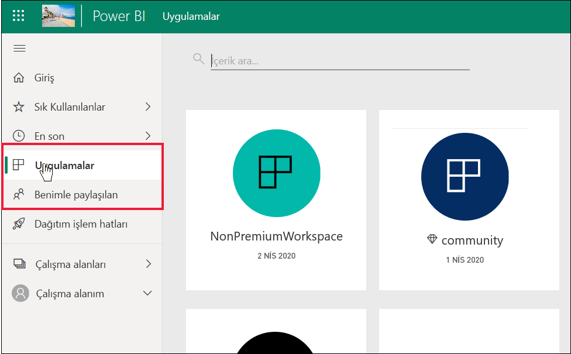
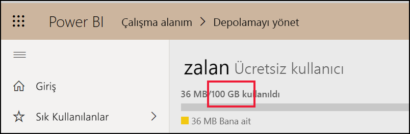
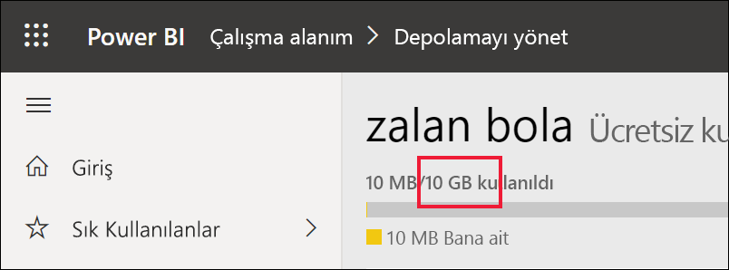

# *Tüketicilere* ve diğer ücretsiz lisans kullanıcılarına yönelik Power BI özellik listesi

[!INCLUDE[consumer-appliesto-ynnn](../includes/consumer-appliesto-ynnn.md)]

*Tüketici* olarak Power BI hizmetini iş kararları alma amacıyla raporları ve panoları keşfetmek için kullanırsınız. Bu raporlar ve panolar Power BI *Pro* lisansına sahip *tasarımcılar* tarafından oluşturulmuştur. Pro kullanıcıları iş arkadaşlarıyla içerik paylaşabilir ve iş arkadaşlarının bu içerikle neler yapabileceğini ve neler yapamayacağını kontrol edebilir. Bazen tasarımcılar size bağlantılar göndererek içerik paylaşır, bazen de içerik otomatik olarak yüklenir ve Power BI’da **Uygulamalar** veya **Benimle paylaşılan** alanında görüntülenir.

Tasarımcıların içerik paylaşmasının birçok farklı yolu vardır. Ama bu makale Power BI *tüketicilerine* yönelik olduğundan, yalnızca tüketicilerin içeriği nasıl alacağı ve içerikle nasıl etkileşim kuracağı açıklanmaktadır. İçerik paylaşmanın diğer yolları hakkında daha fazla bilgi için bkz. [Power BI’da çalışmanızı paylaşmanın yolları](../collaborate-share/service-how-to-collaborate-distribute-dashboards-reports.md).

[Önceki makalede](end-user-license.md), Power BI hizmetinde panolar, raporlar ve uygulamalar (içerik) ile neler yapabileceğinizin üç şeye bağlı olduğunu öğrendiniz: lisanslarınız, rollerinizle izinleriniz ve içeriğin depolandığı yer.

Bu makalede, Power BI hizmetindeki hangi özelliklerin sizin gibi *tüketicilerin* kullanımına sunulduğu listelenmektedir. Tanım gereği, *tüketiciler* Power BI hizmetinde (Power BI Desktop değil) çalışmak için ücretsiz bir lisans kullanır ve Premium kapasiteye sahip kuruluşların üyeleridir.

<art>

## Terminolojiyi hızla gözden geçirme
Listeye gelmeden önce bazı Power BI kavramlarını gözden geçirelim. Bu hızlı bir gözden geçirme olacaktır. Daha fazla ayrıntıya ihtiyacınız varsa [Tüketiciler için lisanslar](end-user-license.md) veya [Power BI temel kavramları](end-user-basic-concepts.md) konusunu ziyaret edin.

### Çalışma alanları ve roller
İki tür çalışma alanı vardır: **Çalışma alanım** ve uygulama çalışma alanları. **Çalışma alanım** sayfanıza yalnızca siz erişebilirsiniz. İşbirliği yapmak ve paylaşmak için Pro lisanslarına sahip içerik *tasarımcılarının* bir uygulama çalışma alanı kullanması gerekir. 

Uygulama çalışma alanları içinde *roller*, ilgili çalışma alanında kimlerin hangi işlemleri yapabileceğini yönetmek için tasarımcılar tarafından atanır. *Tüketicilere* **Görüntüleyici** rolü atanır. 

### Premium kapasite
Kuruluşun Premium kapasite aboneliği olduğunda, yöneticiler ve Pro kullanıcıları *ayrılmış kapasiteye* çalışma alanları atayabilir. Ayrılmış kapasitedeki çalışma alanı, Pro kullanıcılarının ücretsiz lisans kullanıcılarıyla paylaşım ve işbirliği yapabilecekleri bir alandır; bunun için ücretsiz lisans kullanıcılarının Pro lisansları olması gerekmez. Söz konusu çalışma alanları içinde ücretsiz lisans kullanıcılarının yükseltilmiş izinleri olur (aşağıdaki listeye bakın). 

### Lisanslar 
Her Power BI hizmeti kullanıcısının bir ücretsiz lisansı veya Pro lisansı vardır. *Tüketiciler* ücretsiz lisanslara sahiptir.

- **Ücretsiz lisans** - genellikle kuruluş içindeki *tüketicilere* atanır (aşağıdaki ilk görüntüye bakın). Ayrıca Power BI hizmetine birey olarak kaydolan ve [Power BI hizmetini tek başına modunda](../fundamentals/service-self-service-signup-for-power-bi.md) denemek isteyen herkese atanır (aşağıdaki ikinci görüntüye bakın). 

    

    Premium kapasitesi olan bir kuruluşun üyesi olmak ücretsiz lisans kullanıcılarına süper güçler kazandırır. Pro lisansına sahip iş arkadaşları içerik paylaşmak için Premium kapasite çalışma alanlarını kullandığı sürece, ücretsiz lisans kullanıcıları bu içeriği görüntüleyebilir ve Pro iş arkadaşlarıyla işbirliği yapabilir.  **Bu yolla ücretsiz lisans kullanıcısı iş kararları vermek için gereken içeriği alma ve paylaşma becerisine sahip bir Power BI *tüketicisine* dönüşür.** 
 
    

   

## *Tüketicilere* ve ücretsiz lisans kullanıcılarına yönelik Power BI özellik listesi
Aşağıdaki grafik, Premium kapasitede ve paylaşılan kapasitede içerikle etkileşime giren bir *tüketici* tarafından hangi görevlerin gerçekleştirilebileceğini tanımlar.    

İlk sütun **Çalışma alanım**’daki içerikle çalışan ücretsiz lisans kullanıcısını temsil eder. Bu kullanıcı Power BI hizmetinde iş arkadaşlarıyla işbirliği yapamaz. İş arkadaşları bu kullanıcıyla doğrudan içerik paylaşamaz ve bu kullanıcı **Çalışma alanım**’dan paylaşamaz. 

İkinci sütun *tüketiciyi* temsil eder.  Tüketici:

- ücretsiz kullanıcı lisansına sahiptir
- Premium kapasite aboneliği olan bir kuruluşun üyesidir
- Pro kullanıcılarının ayrılmış kapasitedeki uygulama çalışma alanlarını kullanarak paylaştığı içeriği (uygulamalar, panolar, raporlar) alır.
- söz konusu uygulama çalışma alanlarında kendisine atanmış **Görüntüleyici** rolüne sahiptir. 

### Gösterge
  özellik geçerli senaryoda kullanılabilir    
  özellik geçerli senaryoda kullanılamaz    
 **** özellik kullanılabilirliği **Çalışma alanım** ile sınırlıdır. **Çalışma alanım** içinde yer alan içerik sahibinin kişisel kullanımına yöneliktir ve Power BI’da başka kimse tarafından paylaşılamaz veya görüntülenemez.    
 \*  bu özelliğe erişim, Pro kullanıcısı veya yönetici tarafından açılabilir veya kapatılabilir.    
   

### Özellik listesi

|Özellikler   | Senaryo 1: Ayrılmış kapasitede barındırılan içeriğe erişimi olmayan Power BI ücretsiz lisans kullanıcısı.    | Senaryo 2: Ayrılmış kapasitede depolanan içerik üzerinde **Görüntüleyici** izinleri olan Power BI ücretsiz lisans kullanıcısı. Bu kişi bir Power BI *tüketicisidir*. |
|---|---|---|
|**Uygulamalar** 
|Otomatik olarak yüklenir |  | *| 
|Aç |  |   | 
|Sık kullanılanlara ekle |  |   |
 |Düzenleme, güncelleştirme, yeniden paylaşma, yeniden yayımlama |  |   |
 |Yeni uygulama oluşturma |  |   |
 |Appsource: indirme ve açma |   | | 
|Kuruluş deposu: indirme ve açma|  |  |
 |**Uygulama çalışma alanları**
| Çalışma alanı veya içerik oluşturma, düzenleme veya silme  |   | |
|Onay ekleme |   | | 
|Açma ve görüntüleme  |   |    | 
| Çalışma alanı veri akışlarında depolanan verileri okuma | ||
|**Panolar**
|İş arkadaşlarının panolarını alma, görüntüleme ve etkileşim kurma |  |    | 
| Kutucuklara uyarı ekleme  |   |    | 
| Başkalarından gelen açıklamaları görüntüleme ve yanıtlama; kendi açıklamalarınızı ekleme  |   |  *  | 
| Bir kopyasını kaydet |  | | 
|Görseli resim olarak kopyalama | ||
|Oluşturma, düzenleme, güncelleştirme, silme |  | | 
|Kutucuğu Excel’e aktarma | | |
|Sık kullanılanlara ekle || |
|Öne çıkan özelliği | ||
|Tam ekran ve odak modları | | |
|Genel arama |* |* |
|Kutucuklarla ilgili içgörüler |     | *|
|  Soru-Cevap: panoda kullanma  |* |* |
|Soru-Cevap: öne çıkarılan ve kaydedilen sorular ekleme |   | |
|Soru-Ceva:sorulan soruları gözden geçirme |   | |  
|Performans denetçisi |  | |
|Soru-Cevap veya raporlardan kutucukları sabitleme |  | | 
|Yazdır |* |* |
|Yenile |  | | 
|Yeniden paylaşma |   | | 
|Kendinizin abone olmasını sağlama |* |*  |
|Başkalarının abone olmasını sağlama |   | | 
|**Veri kümeleri**
|  Ekleme, silme, düzenleme  |    |   |   
| Başka bir çalışma alanında, bu çalışma alanındaki veri kümesini temel alan rapor oluşturma |   | |  
|  Veri kümeleriyle ilgili içgörüler  |   || 
|Yenileme zamanlama |  || 
|**Raporlar**
|İş arkadaşlarından rapor alma |  |    | 
| İş arkadaşlarıyla raporun aynı sürümü üzerinde işbirliği yapma | |    | 
| Excel'de raporu analiz etme  |*  |*  | 
| Başkalarının oluşturduğu yer işaretlerini görüntüleme ve kendi yer işaretlerinizi ekleme  | |  |
| Başkalarından gelen açıklamaları görüntüleme ve yanıtlama; yeni açıklamalar ekleme  | |  |
|Görüntüleme boyutlarını değiştirme   |  |   | 
| Bir kopyasını kaydet | |*  
|Görseli resim olarak kopyalama* |
| Rapor görsellerini çapraz vurgulama ve çapraz filtreleme   | |  |
|  Detaylandır   |  |  |
| Detaylandırma |* |* |
|  Ekleme (web’de yayımlama, genel) | * | |  
|  Rapor görsellerinden özetlenmiş verileri dışarı aktarma*  | | |
|Rapor görsellerinden temel verileri dışarı aktarma* |  |  | 
|  Raporu sık kullanılanlara ekleme  | | |
|  Filtreler: türleri değiştirme  |* |* |
|  Filtreler: etkileşim kurma   || |
|  Filtreler: kalıcı  |* |* |
| Filtre bölmesini arama yapma |* |* |
| Tam ekran ve odak modları   | | |
|  Raporlarla ilgili içgörüler1  |   || 
| Köken görünümü  | | |
|PDF: rapor sayfalarından oluşturma | |  |
|Performans Denetçisi || |
| PowerPoint: rapor sayfalarından oluşturma*   | | |
|  İçeriği Giriş sayfasına yükseltme  |   | | 
| Rapor sayfalarını yazdırma* | | |
|Soru-Cevap görseliyle etkileşim kurma | | |
|QR Kodu | | |
|  Yenile  | | |
|  Dış kullanıcılarla içerik paylaşma  |   | | 
| Paylaşma: diğer kişilerin öğeleri yeniden paylaşmasına izin verme |   | | 
|Tablo olarak gösterme (verileri gösterme)| | |
|  Dilimleyiciler: ekleme veya silme  | | |
| Dilimleyicilerle etkileşim kurma | | |
|  Rapor görsellerini sıralama  | | |
|  Raporlara kendiniz abone olma* | | |
|  Raporlara diğer kişilerin abone olmasını sağlama  |   | | 
|  İlgili olanları görüntüle | | |
|  Görseller: raporlarda türleri değiştirme  |* |* |
|  Görsel etkileşimleri değiştirme  |  | |
|  Görseller: yeni ekleme  |  | |
|  Görseller: yeni alan ekleme  |   | |
|Görseller: türü değiştirme |  | |
| Görseller: üzerine gelerek ayrıntıları ve araç ipuçlarını ortaya çıkarma  |  | |

1. Yalnızca **Benimle paylaşılan** içerik görünümünden kullanılabilir. 

## Sonraki adımlar
[*Tüketiciler* için Power BI](end-user-consumer.md)    
