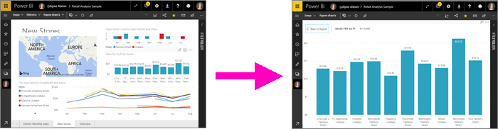
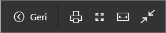
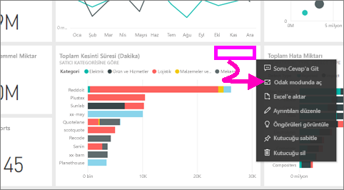
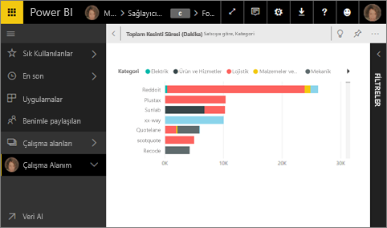
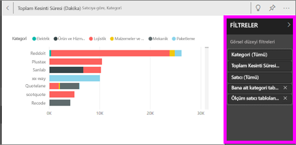
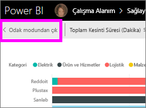
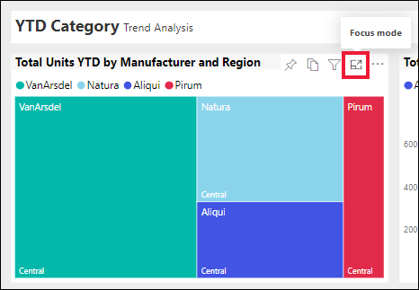
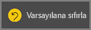
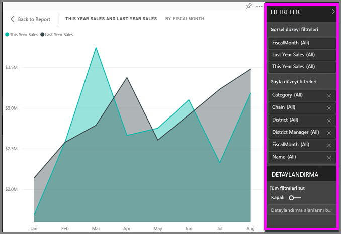
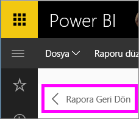

# İçeriği daha ayrıntılı görüntüleyin: odak modu ve tam ekran modu

<iframe width="560" height="315" src="https://www.youtube.com/embed/dtdLul6otYE" frameborder="0" allowfullscreen></iframe>

Odak modu ve tam ekran modu, görsellerinizde, raporlarınızda ve panolarınızda daha fazla ayrıntı görmenin iki farklı yoludur.  Temel farklılık, tam ekranın içeriğinizi çevreleyen tüm bölmeleri kaldırması, odak modunun ise görsellerinizle etkileşime devam etmenize izin vermesidir. Benzerliklere ve farklılıklara daha yakından bakalım.  

|İçerik    | Odak modu  |Tam ekran modu  |
|---------|---------|----------------------|
|Pano     |   Mümkün değil     | evet |
|Rapor sayfası   | Mümkün değil  | evet|
|Rapor görselleştirmesi | evet    | evet |
|Pano kutucuğu | evet    | evet |
|Windows 10 mobile | Mümkün değil | Evet |

## Tam ekran modu nedir?

Power BI hizmeti içeriğinizi (panolar, rapor sayfaları, kutucuklar ve görselleştirmeler) menüler ve gezinti düğmeleri dikkatinizi dağıtmadan görüntüleyebilirsiniz.  Her zaman tek bir bakışta içeriğinizin katıksız bir tam ekran görünümünü elde edersiniz. Bu bazen TV modu olarak adlandırılır.   

Tam ekran modunu açmak için, odak modunda panonuzun, raporunuzun, kutucuğunuzun veya odak modundaki görselin üzerinde bulunan Power BI hizmeti menü çubuğundan **tam ekran** simgesini  seçin.  Seçtiğiniz içerik ekranın tamamını kaplar.
Power BI mobil kullanıyorsanız [Windows 10 mobil uygulamaları için tam ekran kullanılabilir](./mobile/mobile-windows-10-app-presentation-mode.md). 

Tam ekran modunun kullanım alanlarına ilişkin bazı örnekler aşağıda verilmiştir:

* panolarınızı, kutucuklarınızı veya raporlarınızı bir toplantıda veya konferansta sunma
* bir iş yerinde özel bir geniş ekran veya projektör aracılığıyla görüntüleme
* küçük bir ekranda görüntüleme
* kilitli modda gözden geçirme (bağlantılı raporu veya panoyu açmaya gerek kalmadan, ekrana dokunabilir veya fareyle kutucukların üzerine gelebilirsiniz)

## Odak modu nedir?
***Odak*** modu, daha fazla ayrıntı görüntülemek için bir görseli ya da kutucuğu genişletmenize (açmanıza) olanak tanır.  Biraz kalabalık bir panonuz ya da raporunuz varken yalnızca bir görseli yakınlaştırmak isteyebilirsiniz.  Bu, odak modunun mükemmel bir kullanım şeklidir.  

Odak modundayken, bir Power BI *tüketicisi* söz konusu görsel oluşturulduğunda uygulanan herhangi bir filtre ile etkileşimde bulunabilir.  Power BI hizmetinde odak modunu bir pano kutucuğu ya da rapor görseli üzerinde kullanabilirsiniz.

## Tam ekran modunda çalışma
Tam ekran modunda bir pano veya rapor sayfası açmak için üst gezinti çubuğundan  tam ekran simgesini seçin. Tam ekran moduna geçtikten sonra farenizi veya imlecinizi hareket ettirmek bir bağlam menüsü açar. Tam ekran çok çeşitli içerikler için kullanılabildiğinden, bağlam menüsündeki seçeneklerin her biri biraz farklı ancak açıklayıcıdır.  Tanım için fare ile bir simgenin üzerine gelin.

Panolar için menü    
    

Rapor sayfaları için menü    
    

  *     
  Tarayıcınızda önceki sayfaya gitmek için **Geri** düğmesini kullanın. Önceki sayfa bir Power BI sayfasıysa bu da tam ekran modunda görüntülenir.  Siz kapatana kadar tam ekran modu açık kalır.

  *     
  Tam ekran modundaki panonuzu veya rapor sayfanızı yazdırmak için bu düğmeyi kullanın.

  *     
    Panonuzu, kaydırma çubukları olmadan maksimum boyutta görüntülemek için **Ekrana sığdır** düğmesini kullanın.  

    

  *        
    Bazen kaydırma çubuklarını önemsemez ve panonuzun, mevcut alanın tüm genişliğini kullanmasını istersiniz. **Genişliğe uydur** düğmesini seçin.    

    

  *        
    Tam ekran modundaki raporlarda bu okları kullanarak sayfalar arasında gezinebilirsiniz.    
  * Tam ekran modundan çıkmak için **Tam ekrandan çık** simgesini seçin.

      

## Odak modunda çalışma
Odak modunu açmanın iki yolu vardır: biri pano kutucukları, diğeri ise rapor görselleştirmeleri içindir.

### Panolarda odak modu
1. Power BI hizmetinde bir pano açın.

2. Fare ile pano kutucuğunun veya rapor görselleştirmesinin üzerine gelin, üç nokta (...) simgesini seçin ve **Odak modunda aç** seçeneğini belirleyin.

    geçin.

2. Kutucuk, tuvalin tamamını kaplayacak şekilde açılır.

   

3. Bu görsele uygulanan tüm filtreleri görüntülemek için Filtreler bölmesini genişletin.

   

4. [Filtreleri değiştirerek](end-user-report-filter.md) ve verilerinizde ilgi çekici buluşlar arayarak daha fazla araştırın.  

5. Odak modundan ayrılmak ve panoya geri dönmek için **Odak modundan çık** (görselin sol üst köşesinde) seçeneğini belirleyin.

        

## Rapor görselleştirmeleri için odak modu
1. Power BI hizmetinde bir rapor açın.  Bu örnekte Perakende Analizi örneğini kullanarak göstereceğiz.

1. Rapor açıldıktan sonra **Bölge Aylık Satışları sekmesini** seçin.

2. Sol alt köşedeki alan grafiğinin üzerine gelip **odak modu** simgesini  seçin.  

   
2. Görselleştirme, tuvalin tamamını kaplayacak şekilde açılır.

   
3. İsteğe bağlı olarak, bu görsele uygulanan filtrelerle etkileşimde bulunmak için Filtreler bölmesini genişletin. Yeni içgörüler ve sorulara yanıtlar bulmak için verilerin ayrıntılarına inin. *Tüketici* olarak yeni filtreler ekleyemez, görselleştirmelerde kullanılmakta olan alanları değiştiremezsiniz veya yeni görselleştirmeler oluşturamazsınız.  Ancak, Power BI’dan çıktığınızda mevcut filtrelerde yaptığınız tüm değişiklikler kaydedilir. Power BI’ın yaptığınız değişiklikleri hatırlamasını istemiyorsanız **Varsayılana sıfırla**’yı seçin.   

   

5. Odak modundan ayrılmak ve rapora geri dönmek için **Rapora geri dön** (görselin sol üst köşesinde) seçeneğini belirleyin.

      

## Önemli noktalar ve sorun giderme
* Bir rapordaki görselleştirme ile odak modunu kullanırken tüm filtreleri görüntüleyebilir ve etkileşimde bulunabilirsiniz: Görsel düzeyi, Sayfa düzeyi, Detaylandırma ve Rapor düzeyi.    
* Bir panodaki görselleştirme ile odak modunu kullanırken yalnızca Görsel düzeyi filtrelerini görüntüleyebilir ve etkileşimde bulunabilirsiniz.

## Sonraki adımlar
[Raporların ayarlarını görüntüleme](end-user-report-view.md)