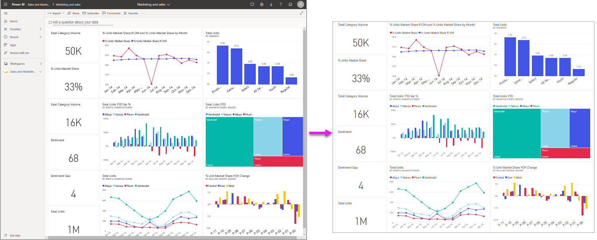
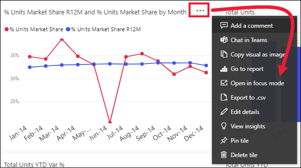

# İçeriği daha ayrıntılı görüntüleyin: odak modu ve tam ekran modu

[!INCLUDE [consumer-appliesto-yynn](../includes/consumer-appliesto-yynn.md)]

<iframe width="560" height="315" src="https://www.youtube.com/embed/dtdLul6otYE" frameborder="0" allowfullscreen></iframe>

Odak modu ve tam ekran modu, görsellerinizde, raporlarınızda ve panolarınızda daha fazla ayrıntı görmenin iki farklı yoludur.  İkisi arasındaki temel fark, tam ekranın içeriğinizi çevreleyen tüm bölmeleri kaldırması, odak modunun ise görsellerinizle etkileşime devam etmenize izin vermesidir. Benzerliklere ve farklılıklara daha yakından bakalım.  

|İçerik    | Odak modu  |Tam ekran modu  |
|---------|---------|----------------------|
|Pano     |   Mümkün değil     | evet |
|Rapor sayfası   | Mümkün değil  | evet|
|Rapor görseli | evet    | evet |
|Pano kutucuğu | evet    | Mümkün değil |
|Windows 10 mobile | Mümkün değil | Evet |

Aşağıdaki örnekte, bir raporla başladık (1), görsellerden birini odak modunda açtık (2) ve sonra aynı görseli tam ekran modunda (3) açtık. 

## Tam ekran modu ne zaman kullanılır?

Power BI hizmeti içeriğinizi (panolar, rapor sayfaları ve görseller) menüler ve gezinti bölmeleri dikkatinizi dağıtmadan görüntüleyebilirsiniz.  Her zaman tek bir bakışta içeriğinizin katıksız bir tam ekran görünümünü elde edersiniz. Bu bazen TV modu olarak adlandırılır.   

Power BI mobil kullanıyorsanız [Windows 10 mobil uygulamaları için tam ekran kullanılabilir](./mobile/mobile-windows-10-app-presentation-mode.md). 

Tam ekran modunun kullanım alanlarına ilişkin bazı örnekler aşağıda verilmiştir:

* panonuzu, görselinizi veya raporunuzu bir toplantıda veya konferansta sunma
* bir iş yerinde özel bir geniş ekran veya projektör aracılığıyla görüntüleme
* küçük bir ekranda görüntüleme
* kilitli modda gözden geçirme (bağlantılı raporu veya panoyu açmaya gerek kalmadan, ekrana dokunabilir veya fareyle kutucukların üzerine gelebilirsiniz)

## Odak modu ne zaman kullanılır?

***Odak** _ modu, daha fazla ayrıntı görüntülemek için bir görseli ya da kutucuğu genişletmenize (açmanıza) olanak tanır.  Biraz kalabalık bir panonuz ya da raporunuz varken yalnızca bir görseli yakınlaştırmak isteyebilirsiniz.  Bu, odak modunun mükemmel bir kullanım şeklidir.  

Odak modundayken, bir Power BI _işletme kullanıcısı* söz konusu görsel oluşturulduğunda uygulanan herhangi bir filtre ile etkileşimde bulunabilir.  Power BI hizmetinde odak modunu bir pano kutucuğu ya da rapor görseli üzerinde kullanabilirsiniz.

## Tam ekran modunda çalışma

Tam ekran modu panolar, rapor sayfaları ve rapor görselleri için sağlanır. 

- Panoyu tam ekran modunda açmak için üst gezinti çubuğundan  öğesini seçin. 

- Rapor sayfasını tam ekran modunda açmak için, **Görünüm** > **Tam ekran**'ı seçin.

    

- Görseli tam ekran modunda görmek için önce odak modunda açın ve ardından **Görünüm** > **Tam ekran**'ı seçin.  

Seçtiğiniz içerik ekranın tamamını kaplar. Tam ekran modundayken, en üstteki ve alttaki menü çubuklarını (raporlar) ve imlecinizi taşıdığınızda görüntülenen menüyü (panolar ve görseller) kullanarak gezinin. Bu kadar çok çeşitli içerik için tam ekran kullanılabilir olduğundan gezinti seçenekleri değişiklik gösterir.   

  * Tarayıcınızda önceki sayfaya gitmek için **Geri**, **Geri dön** veya **Rapora geri dön** düğmesini kullanın. Önceki sayfa bir Power BI sayfasıysa bu da tam ekran modunda görüntülenir.  Siz kapatana kadar tam ekran modu açık kalır.

  *     
    Panonuzu, kaydırma çubukları olmadan maksimum boyutta görüntülemek için **Ekrana sığdır** düğmesini kullanın.  

    

  *        
    Bazen kaydırma çubuklarını önemsemez ve panonuzun, mevcut alanın tüm genişliğini kullanmasını istersiniz. **Genişliğe uydur** düğmesini seçin.    

    

  *        
    Tam ekran modundaki raporlarda bu okları kullanarak sayfalar arasında gezinebilirsiniz.    
  *      
  Tam ekran modundan çıkmak için **Tam ekrandan çık** simgesini seçin.

      

## Odak modunda çalışma

Odak modu panolar, kutucuklar ve rapor görselleri için sağlanır. 

- Pano kutucuğunu odak modunda açmak için bir pano kutucuğunun veya rapor görselinin üzerine gelin, **Diğer seçenekler**’i (...) ve **Odak modunda aç**’ı seçin.

    .. 

- Rapor görselini odak modunda açmak için, görselin üzerine gelin ve **odak modu** simgesini  seçin.  

   

Görsel, tuvalin tamamını kaplayacak şekilde açılır. Görselle etkileşimde bulunmak için kullanabileceğiniz **Filtreler** bölmesinin hala orada olduğuna dikkat edin. **Filtreler** bölmesi daraltılabilir.

   

     

[Filtreleri değiştirerek](end-user-report-filter.md) ve verilerinizde ilgi çekici buluşlar arayarak daha fazla araştırın. *İş kullanıcısı* olarak, yeni filtreler ekleyemez, görsellerde kullanılan alanları değiştiremez veya yeni görseller oluşturamazsınız.  Öte yandan mevcut filtrelerle etkileşim kurabilirsiniz. 

Pano kutucuğu için, yaptığınız değişiklikler kaydedilemez. Rapor görseli için, Power BI’dan çıktığınızda mevcut filtrelerde yaptığınız tüm değişiklikler kaydedilir. Power BI’ın yaptığınız değişiklikleri hatırlamasını istemiyorsanız **Varsayılana sıfırla**’yı seçin.   

Odak modundan çıkıp panoya veya rapora geri dönmek için **Odak modundan çık**’ı veya **Rapora geri dön**’ü (görselin sol üst köşesinde) seçebilirsiniz.

    

  

## Önemli noktalar ve sorun giderme

* Bir rapordaki görsel ile odak modunu kullanırken tüm filtreleri görüntüleyebilir ve etkileşimde bulunabilirsiniz: Görsel düzeyi, Sayfa düzeyi, Detaylandırma ve Rapor düzeyi.    
* Bir panodaki görsel ile odak modunu kullanırken yalnızca Görsel düzeyi filtrelerini görüntüleyebilir ve etkileşimde bulunabilirsiniz.

## Sonraki adımlar

[Raporların ayarlarını görüntüleme](end-user-report-view.md)