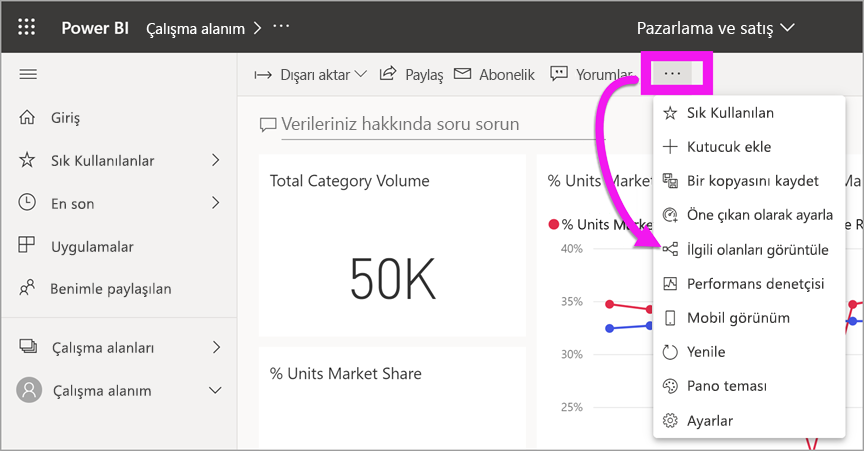

# İçeriğiniz güncel

[!INCLUDE[consumer-appliesto-ynny](../includes/consumer-appliesto-ynny.md)]

[!INCLUDE [power-bi-service-new-look-include](../includes/power-bi-service-new-look-include.md)]

Bir *tüketici* olarak *tasarımcılar* tarafından oluşturulup sizinle paylaşılan içeriklerle etkileşim kurarsınız. Bu içeriğin güncel olup olmadığını merak edebilir ya da yalnızca içeriğin en son ne zaman yenilendiğini öğrenmek isteyebilirsiniz. En yeni içerikle çalıştığınızı bilmek size güven verir.  
 

En son verileri kullandığınızdan emin olmak, çoğu zaman doğru kararları vermenizde kritik rol oynar. En son içeriği kullandığınızdan emin olmak için neler yapabilirsiniz? Çoğu durumda hiçbir şey yapmanız gerekmez. Sizinle paylaşılan uygulamalar uygulama tasarımcısı tarafından ayarlanmış bir zamanlamayla otomatik olarak yenilenir ve güncelleştirilir. Aynı durum sizinle paylaşılan pano ve raporlar için de geçerlidir. Tasarımcılar el ile veya otomatik bir yenileme zamanlamasıyla içeriğinizin güncel kalmasını sağlar.  

Verilerin güncelliği hakkında sorularınız varsa tasarımcıya başvurun.

## Tasarımcının veya sahibin adını bulma

### Pano veya rapor

Sahibin adı panolar ve raporların başlık çubuğunda bulunabilir. **Sahip** gibi ek ayrıntıları ortaya çıkarmak için raporu veya panoyu seçin.

### Uygulamalar

Uygulama ekranı hem tasarımcının adını hem de uygulamanın son güncelleştirildiği tarihi gösterir.  

1. Gezinti bölmesinde **Uygulamalar**’ı seçin.

    

2. Tasarımcının başlığını, güncellik tarihini ve adını göstermek için uygulamanın üzerine gelin. 

    

### Benimle paylaşılıyor mu?
**Benimle paylaşılan** ekranı size içerik sahibinin adını ve içeriğin sizinle son paylaşıldığı tarihi gösterir.

 

## Son yenileme tarihini arama
İlgileniyorsanız, çoğu içeriğin son yenileme tarihini bulabilirsiniz. 

### Pano kutucukları
Pano kutucuklarının Son yenileme zaman damgasını görmek için kutucuğu Odak modunda görüntüleyin.

1. Bir pano kutucuğunda **Diğer seçenekler** (...) ve **Odak modunda aç**’ı seçin.

    

2. Son yenileme tarihi sağ üst köşede görüntülenir. Tarihi görmüyorsanız, büyütmek için tarayıcınızı genişletin. 

    

### Panolar ve raporlar
Son yenileme tarihini bulmanın bir başka yolu da **İlişkilileri görüntüle**’yi kullanmaktır.  **İlişkilileri görüntüle** seçeneği, Power BI’ın üst menü çubuğundan **Diğer seçenekler** (...) seçilerek görüntülenebilir.

**İlişkili içerik** bölmesi pano ve raporların temel aldıkları veri kümesinin son yenileme bilgilerini görüntüler.

## Uygulama, tasarımcısı tarafından silinirse ne olur?

Tasarımcı bir uygulamayı silerse o uygulamayla ilişkilendirilmiş panolar ve raporlar da Power BI çalışma alanınızdan otomatik olarak kaldırılır. Bu seçenekler artık mevcut değildir ve uygulama, Uygulama kapsayıcısında veya gezinti bölmesinin başka bir yerinde görünmemektedir.

## Değişiklikleri görmek için abone olun
Güncelliği korumanın bir diğer yolu da rapora veya panoya abone olmaktır. Raporu veya panoyu açmak için oturum açmak zorunda kalmak yerine Power BI’a kendi ayarladığınız bir zamanlamaya göre size anlık görüntü göndermesini bildirin.  Daha fazla bilgi için bkz. [Pano ve raporlara abone olma](end-user-subscribe.md).

## Veri uyarıları ayarlama
Veriler, ayarladığınız sınırın üzerinde veya dışında değiştirildiğinde bildirim almak mı istiyorsunuz? [Veri uyarısı oluşturun](end-user-alerts.md).  Veri uyarılarını kullanarak kolayca güncelliği koruyabilirsiniz. Veri uyarılarıyla Power BI’a bir rapordaki değerin belirli bir eşiği aşması durumunda size e-posta göndermesini söylersiniz.  Örneğin stok 25 birimin altına düşerse veya satışlar hedefi aşarsa uyarı alabilirsiniz.  

## Sonraki adımlar
[Veri uyarısı oluşturma](end-user-alerts.md)    
[Panolara ve raporlara abone olma](end-user-subscribe.md)    
[İlgili içeriği görüntüleme](end-user-related.md)    
