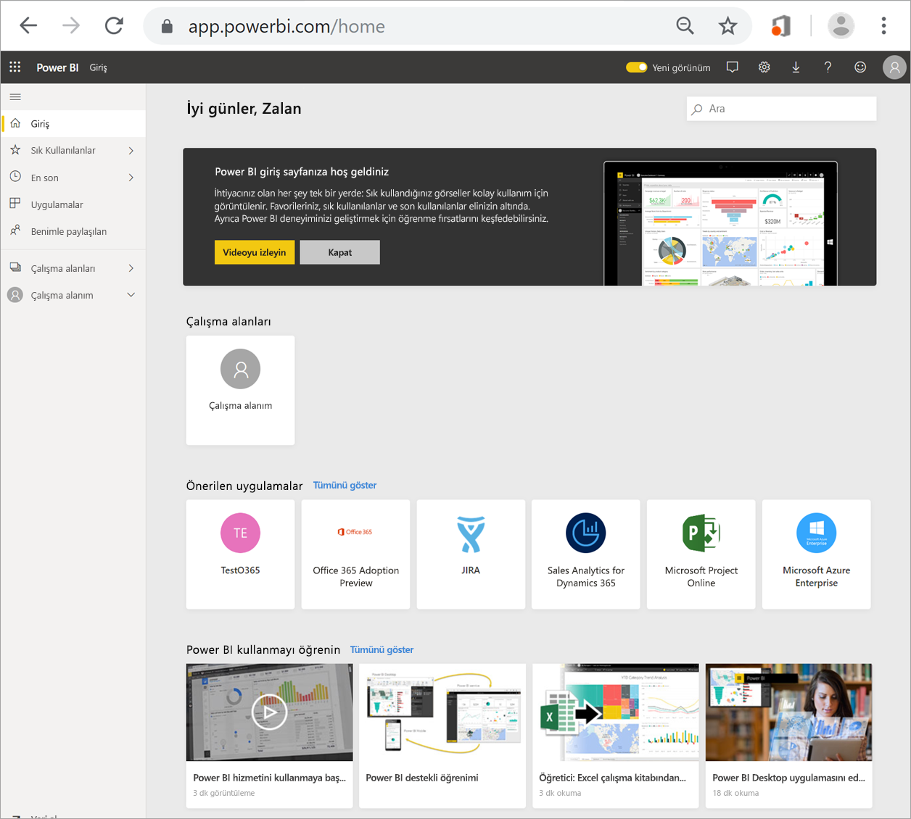
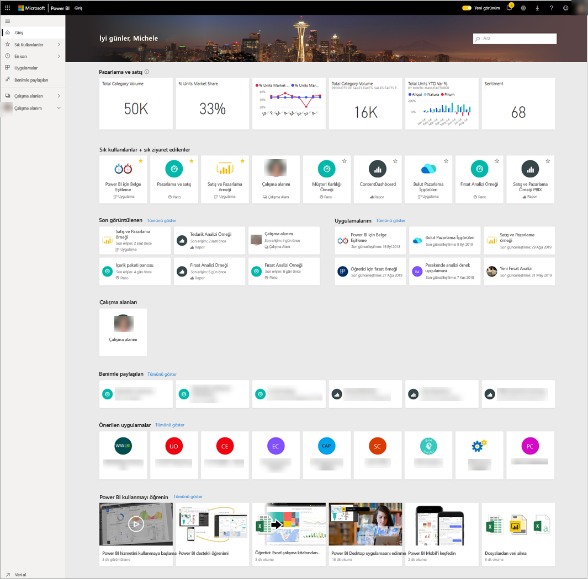
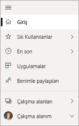
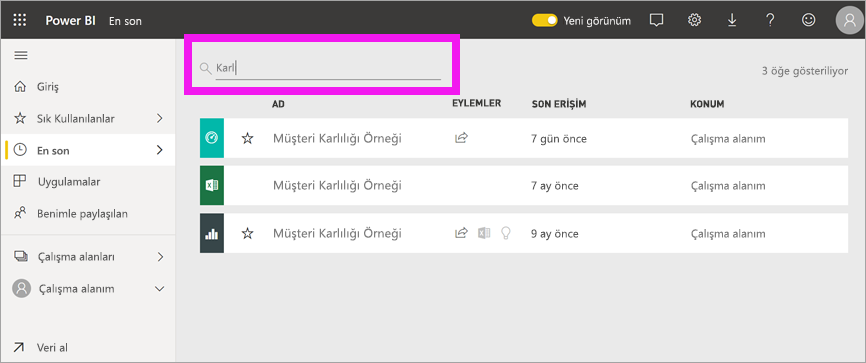

# Panolarınızı, raporlarınızı ve uygulamalarınızı bulma
Power BI’da, *içerik* terimi uygulamaları, panoları ve raporları belirtir. Power BI *tasarımcıları* içerikleri oluşturup sizinle ve diğer iş arkadaşlarıyla paylaşır. İçeriğiniz, Power BI hizmetinden erişilebilir ve buradan görüntülenebilir. Power BI’da çalışmaya başlamak için en iyi yer, giriş sayfanızdır.

## Power BI Giriş’i keşfedin
Oturum açtığınızda Power BI açılır ve aşağıdaki şekilde gösterildiği gibi Giriş tuvaliniz görüntülenir.
 

Power BI Giriş, içeriğinizi bulmanız ve görüntülemeniz için üç farklı yol sunar. Her üç yöntem de aynı içerik havuzuna erişir. Bunlar, aynı içeriğe erişmenizi sağlayan üç farklı yöntemdir. Bazen, bir öğeyi bulmanın en kolay ve en hızlı yolu öğeyi aramak bazen de Giriş tuvalindeki bir *kartı* seçmek olabilir.

- Giriş tuvali, en sık ve en son kullandığınız içeriklerin yanı sıra önerilen içerikleri ve öğrenme kaynaklarını görüntüleyip düzenler. Her içerik parçası, bir başlığı ve simgesi bulunan *kartlar* halinde görüntülenir. Kart seçildiğinde içerik açılır.
- Sol tarafta, gezinti çubuğu olarak adlandırılan gezinti bölmesi bulunur. Bu bölmede içerik aynıdır ancak farklı şekilde düzenlenmiştir (Sık Kullanılanlar, Son Kullanılanlar, Uygulamalar ve Benimle Paylaşılanlar). Buradan, içerik listesini görüntüleyebilir ve açmak için birini seçebilirsiniz.
- Sağ üst köşede yer alan genel arama kutusu, içeriği başlığa, ada veya anahtar sözcüğe göre aramanıza olanak tanır.

Aşağıdaki konular, içeriği bulmaya ve görüntülemeye yönelik seçeneklerin her birini ele alır.

## Giriş tuvali
Giriş tuvalinde, kullanma iznine sahip olduğunuz tüm içerikleri görebilirsiniz. İlk olarak, Giriş tuvalinizde çok fazla içerik bulunmayabilir (yukarıdaki görüntüye bakın). Bu durum, iş arkadaşlarınızla Power BI’ı kullandıkça değişir.

Giriş tuvaliniz, önerilen içerikler ve öğrenme kaynaklarıyla da güncelleştirilir. 
 
Power BI hizmetinde çalışıp iş arkadaşlarınızdan pano, rapor ve uygulama aldıkça Giriş sayfanız da dolmaya başlar. Zamanla, aşağıdaki Giriş sayfasına benzer bir hal alabilir.

 
Aşağıdaki konular, bu Giriş sayfasını yukarıdan aşağıya ilerleyerek daha ayrıntılı şekilde inceler.

## En önemli içerikler elinizin altında

### Sık kullanılanlar ve sık ziyaret edilenler
Bu üst bölüm, en sık ziyaret ettiğiniz veya [öne çıkan ya da sık kullanılan](end-user-favorite.md) olarak etiketlediğiniz içeriklerin bağlantılarını içerir. Bazı kartlarda sarı yıldız olduğunu görebilirsiniz. Bu iki uygulama ve bu pano, sık kullanılan olarak etiketlenmiş.
 
### Son kullanılanlar ve Uygulamalarım
Sonraki bölümde, en son ziyaret ettiğiniz içerikler görüntülenir. Her kartta zaman damgası olduğunu görebilirsiniz. **Uygulamalarım** bölümünde, sizinle paylaşılan veya [AppSource’tan indirdiğiniz](end-user-apps.md) uygulamalar listelenir. En son kullanılan uygulamalar burada listelenir. Sizinle paylaşılan tüm uygulamaların listesini görüntülemek için **Tümünü göster** seçeneğini belirleyebilirsiniz.

### Çalışma alanları
Power BI *tüketicisi* olarak, genellikle yalnızca bir çalışma alanınız (**Çalışma alanım**) bulunur. 

### Benimle paylaşılan
İş arkadaşlarınız, uygulamaların yanı sıra ayrı pano ve raporları da sizinle paylaşabilir. **Benimle paylaşılanlar** bölümünde iş arkadaşlarınızın sizinle paylaştığı üç pano ve üç raporun olduğunu görebilirsiniz.

### Önerilen uygulamalar
Power BI, etkinliklerinize ve hesap ayarlarınıza bağlı olarak bir dizi önerilen uygulama görüntüler. Bir uygulama kartı seçildiğinde uygulama açılır.
 
### Öğrenme kaynakları
Giriş tuvalinin alt kısmında çeşitli öğrenme kaynakları yer alır. Bunlar, Power BI yöneticisindeki etkinliklerinize ve ayarlarınıza bağlı olarak görüntülenen kaynaklardır. 
 
## Gezinti bölmesini (gezinti çubuğunu) keşfetme

Panoları, raporları ve uygulamaları bulup bunların arasında geçiş yapmak için sol gezinti bölmesini (gezinti çubuğunu) kullanın. Gezinti çubuğunun kullanılması, bazen içeriğe erişmenin en hızlı yolu olabilir.
Gezinti çubuğu, Giriş sayfanızı açtığınızda görünür ve Power BI hizmetinin diğer alanlarını açtıkça statik olarak kalır.
  
Gezinti çubuğu, içeriğinizi Giriş tuvalinizde gördüklerinize benzer kapsayıcılar halinde düzenler: Sık kullanılanlar, Son kullanılanlar, Uygulamalar ve Benimle paylaşılanlar. Açılır öğeleri kullanarak bu kapsayıcıların her birindeki son kullanılan içerikleri görüntüleyebilir veya her kapsayıcı kategorisine yönelik tüm içerikleri görmek için içerik listelerine gidebilirsiniz.
 
- Bu içerik bölümlerinin birini açmak ve tüm öğelerin listesini görüntülemek için bölüm başlığını seçin.
- Her kapsayıcıdaki son kullanılan öğeleri görmek için (**>**) açılır öğesini seçin.

    

 
Gezinti çubuğu, istediğiniz içeriği hızla bulmanın bir diğer yoludur. İçerik, Giriş tuvaline benzer şekilde düzenlenir ancak kartlar yerine listeler halinde gösterilir. 

## Tüm içeriğinizi arama
Bazen, içeriğinizi bulmanın en hızlı yolu içeriği aramaktır. Örneğin, uzun zamandır kullanmadığınız bir panonun Giriş tuvalinizde gösterilmediğini fark etmiş olabilirsiniz. Veya iş arkadaşınız Aaron’ın bunu sizinle paylaştığını, ancak buna verdiği adı ya da paylaştığı içeriğin türünü (pano veya rapor) hatırlamıyor olabilirsiniz.
 
Bu panonun tam adını veya adının bir kısmını girerek bunu arayabilirsiniz. Buna ek olarak, iş arkadaşınızın adını girebilir ve sizinle paylaştığı içeriği arayabilirsiniz. Aramanın kapsamı, sahip olduğunuz veya erişiminizin olduğu tüm içeriklerde eşleşmeleri arayacak şekilde belirlenir.

## Sonraki adımlar
[Power BI temel kavramlarına](end-user-basic-concepts.md) genel bakış
