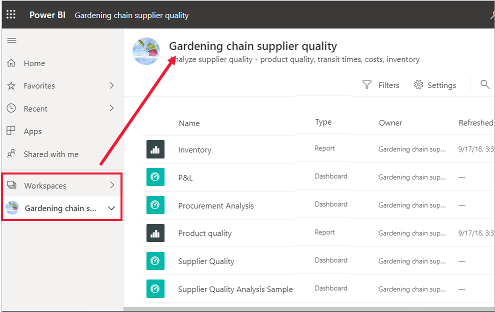

# Panolarınızı, raporlarınızı ve uygulamalarınızı bulma
Power BI’da, *içerik* terimi uygulamaları, panoları ve raporları belirtir. Power BI *tasarımcıları* içerikleri oluşturup sizinle ve diğer iş arkadaşlarıyla paylaşır. İçeriğiniz, Power BI hizmetinden erişilebilir ve buradan görüntülenebilir. Power BI’da çalışmaya başlamak için en iyi yer Power BI **Giriş** tuvalidir.

## Power BI Giriş’i keşfedin
Power BI hizmetinde oturum açtıktan sonra gezinti bölmesinde **Giriş**’i seçin. 

Power BI aşağıdaki şekilde gösterildiği gibi Giriş tuvalinizi görüntüler.
 

Power BI Giriş, içeriğinizi bulmanız ve görüntülemeniz için üç farklı yol sunar. Her üç yöntem de aynı içerik havuzuna erişir. Bunlar, aynı içeriğe erişmenizi sağlayan üç farklı yöntemdir. Bazen, bir öğeyi bulmanın en kolay ve en hızlı yolu öğeyi aramak bazen de Giriş tuvalindeki bir *kartı* seçmek olabilir.

- Giriş tuvali, en sık ve en son kullandığınız içeriklerin yanı sıra önerilen içerikleri ve öğrenme kaynaklarını görüntüleyip düzenler. Her içerik parçası, bir başlığı ve simgesi bulunan *kartlar* halinde görüntülenir. Kart seçildiğinde içerik açılır.
- Sol tarafta, gezinti bölmesi yer alır. Bu bölmede içerik aynıdır ancak farklı şekilde düzenlenmiştir (Sık Kullanılanlar, Son Kullanılanlar, Uygulamalar ve Benimle Paylaşılanlar). Buradan, içerik listesini görüntüleyebilir ve açmak için birini seçebilirsiniz.
- Sağ üst köşede yer alan genel arama kutusu, içeriği başlığa, ada veya anahtar sözcüğe göre aramanıza olanak tanır.

Aşağıdaki konular, içeriği bulmaya ve görüntülemeye yönelik seçeneklerin her birini ele alır.

## Giriş tuvali
Giriş tuvalinde, kullanma iznine sahip olduğunuz tüm içerikleri görebilirsiniz. İlk olarak, Giriş tuvalinizde çok fazla içerik bulunmayabilir (yukarıdaki görüntüye bakın). Bu durum, iş arkadaşlarınızla Power BI’ı kullandıkça değişir.

Giriş tuvaliniz, önerilen içerikler ve öğrenme kaynaklarıyla da güncelleştirilir. 
 
Power BI hizmetinde çalışıp iş arkadaşlarınızdan pano, rapor ve uygulama aldıkça Power BI Giriş tuvali de dolmaya başlar. Zamanla, aşağıdakine benzer bir hal alabilir.

 
Aşağıdaki birkaç konu başlığında bu Giriş tuvali yukarıdan aşağıya doğru ayrıntılı şekilde incelenir.

## En önemli içerikler elinizin altında

### Sık kullanılanlar ve sık ziyaret edilenler
Bu üst bölüm, en sık ziyaret ettiğiniz veya [öne çıkan ya da sık kullanılan](end-user-favorite.md) olarak etiketlediğiniz içeriklerin bağlantılarını içerir. Bazı kartlarda sarı yıldız olduğunu görebilirsiniz. Bu iki uygulama ve bu pano, sık kullanılan olarak etiketlenmiş. 

Ayrıca içerikleri [öne çıkan](end-user-featured.md) olarak etiketleyebilirsiniz. En sık görüntülemeyi planladığınız panoyu veya raporu seçip *öne çıkan* içeriğiniz olarak ayarlayabilirsiniz. Power BI hizmetini her açtığınızda ilk olarak öne çıkan panonuz görüntülenir. 

### Son kullanılanlar ve Uygulamalarım
Sonraki bölümde, en son ziyaret ettiğiniz içerikler görüntülenir. Her kartta zaman damgası olduğunu görebilirsiniz. **Uygulamalarım** bölümünde, sizinle paylaşılan veya [AppSource’tan indirdiğiniz](end-user-apps.md) uygulamalar listelenir. En son kullanılan uygulamalar burada listelenir. Sizinle paylaşılan tüm uygulamaların listesini görüntülemek için **Tümünü göster** seçeneğini belirleyebilirsiniz.

### Çalışma alanları
Her Power BI hizmeti müşterisinin **Çalışma alanım** adlı bir alanı vardır. **Çalışma alanım** yalnızca Microsoft örneklerini indirdiyseniz ya da kendi panolarınızı, raporlarınızı ve uygulamalarınızı oluşturduysanız içerikle dolu olur. Birçok *müşteri* için, **Çalışma alanım** boş olacak ve boş kalacaktır.  

[Uygulama indirdiğiniz](end-user-app-marketing.md) veya [sizinle uygulama paylaşıldığı](end-user-apps.md) her durumda, yeni bir çalışma alanı oluşturulur.  *Uygulama çalışma alanını* açmak için Giriş tuvalinizde bu çalışma alanını seçin. 

Uygulama tuvalinizde açılır ve çalışma alanının adının gezinti bölmenizde listelendiğini görebilirsiniz. Power BI hizmeti, çalışma alanlarındaki içeriğinizi türe göre ayırır: panolar ve raporlar. Bazı durumlarda çalışma kitaplarınız ve veri kümeleriniz de olabilir. Bir çalışma alanını seçtiğinizde bu düzenle karşılaşırsınız. Bu örnekte **Gardening chain** çalışma alanı dört pano ve iki rapor içeriyor.

### Benimle paylaşılan
İş arkadaşlarınız, uygulamaların yanı sıra ayrı pano ve raporları da sizinle paylaşabilir. **Benimle paylaşılanlar** bölümünde iş arkadaşlarınızın sizinle paylaştığı üç pano ve üç raporun olduğunu görebilirsiniz.

### Önerilen uygulamalar
Power BI, etkinliklerinize ve hesap ayarlarınıza bağlı olarak bir dizi önerilen uygulama görüntüler. Bir uygulama kartı seçildiğinde uygulama açılır.
 
### Öğrenme kaynakları
Giriş tuvalinin alt kısmında çeşitli öğrenme kaynakları yer alır. Bunlar etkinliklerinize, ayarlarınıza ve Power BI yöneticisine bağlı olarak görüntülenen kaynaklardır. 
 
## Gezgin bölmesini keşfedin

Gezinti bölmesi, aradıklarınızı hızlıca bulmanıza yardımcı olacak şekilde içeriğinizi sınıflandırır.  

Panoları, raporları ve uygulamaları bulup bunların arasında geçiş yapmak için gezinti bölmesini kullanın. Gezinti bölmesinin kullanılması, bazen içeriğe erişmenin en hızlı yolu olabilir. Gezinti bölmesi, Giriş sayfanızı açtığınızda görünür ve Power BI hizmetinin diğer alanlarını açtıkça orada kalır. Gizli simgesi seçilerek daraltılabilir  .
  
Gezinti bölmesi, içeriğinizi Giriş tuvalinizde gördüklerinize benzer kapsayıcılar halinde düzenler: Sık Kullanılanlar, En Son, Uygulamalar, Benimle paylaşılan ve çalışma alanları. Açılır öğeleri kullanarak bu kapsayıcıların her birindeki son kullanılan içerikleri görüntüleyebilir veya her kapsayıcı kategorisine yönelik tüm içerikleri görmek için içerik listelerine gidebilirsiniz.
 
- Bu içerik bölümlerinin birini açmak ve tüm öğelerin listesini görüntülemek için bölüm başlığını seçin.
- Her kapsayıcıdaki son kullanılan öğeleri görmek için ( **>** ) açılır öğesini seçin.

    

 
Gezinti bölmesi, istediğiniz içeriği hızla bulmanın bir diğer yoludur. İçerik, Giriş tuvaline benzer şekilde düzenlenir ancak kartlar yerine listeler halinde gösterilir. 

## Tüm içeriğinizi arama
Bazen, içeriğinizi bulmanın en hızlı yolu içeriği aramaktır. Örneğin, uzun zamandır kullanmadığınız bir panonun Giriş tuvalinizde gösterilmediğini fark etmiş olabilirsiniz. Öte yandan iş arkadaşınız Aaron’ın sizinle bir şey paylaştığını hatırlıyor ama buna verdiği adı ya da paylaştığı içeriğin türünü (pano veya rapor) hatırlamıyor olabilirsiniz. Çok fazla içeriğiniz bulunduğundan, arama yapmak ekranı kaydırıp sıralamaktan daha kolay olabilir. 
 
Arama alanı Giriş menü çubuğunun sağ üst bölümünde yer alır. Bu panonun tam adını veya adının bir kısmını girerek bunu arayabilirsiniz. Buna ek olarak, iş arkadaşınızın adını girebilir ve sizinle paylaştığı içeriği arayabilirsiniz. Aramanın kapsamı, sahip olduğunuz veya erişiminizin olduğu tüm içeriklerde eşleşmeleri arayacak şekilde belirlenir.

## Sonraki adımlar
[Power BI temel kavramlarına](end-user-basic-concepts.md) genel bakış
