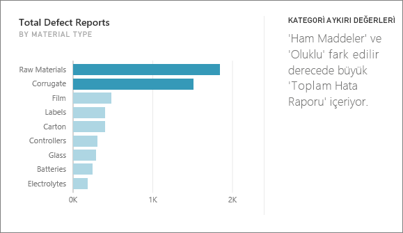
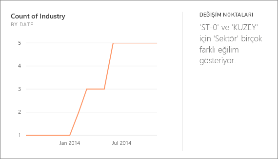
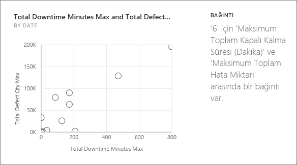
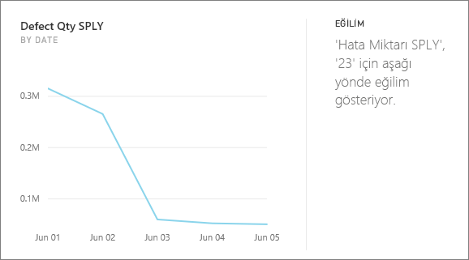
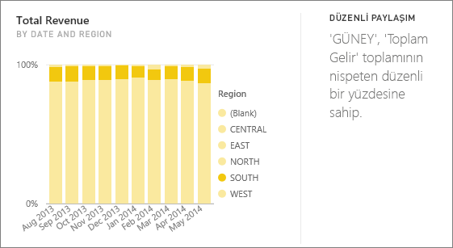
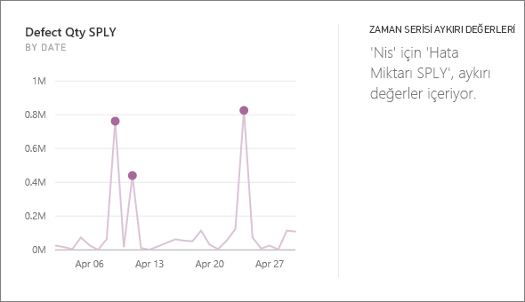

# Power BI tarafından desteklenen öngörü türleri

Power BI hizmeti panolarınız veya raporlarınızdaki içgörülere otomatik olarak bakabilir.

## Öngörüler nasıl çalışır?
Power BI veri kümenizin farklı alt kümelerini hızla arar. Power BI arama yaparken, ilginç olabilecek içgörüleri bulmak için bir dizi gelişmiş algoritma uygular. Power BI, ayrılan bir sürede bir veri kümesinin mümkün olduğu kadar büyük bir kısmını tarar.

Bir veri kümesi veya pano kutucuğunda öngörü çalıştırabilirsiniz.   

## Hangi öngörü türlerini bulabiliriz?
Kullandığımız bazı algoritmalar şunlardır:

## Kategori aykırı değerleri (üst/alt)
Modeldeki bir ölçü için bir boyutun bir veya iki üyesinin, boyutun diğer üyelerinden daha büyük değerlere sahip olduğu durumları vurgular.  

## Zaman serilerindeki değişim noktaları
Verilere ilişkin bir zaman serisindeki eğilimlerde görülen önemli değişiklikleri vurgular.

## Bağıntı
Veri kümesindeki bir boyuta göre değerlendirilen birden fazla ölçü arasında bağıntı görülen durumları algılar.

## Düşük Varyans
Veri noktalarının ortalamaya yakın olduğu durumları algılar.

## Çoğunluk (Ana etkenler)
Bir toplam değerin çoğunluğunun, başka bir boyuta göre değerlendirildiğinde tek bir etkenle ilişkilendirilebildiği durumları bulur.  

## Zaman serisindeki genel eğilimler
Zaman serisi verilerinde görülen yukarı veya aşağı yönlü eğilimleri algılar.

## Zaman serisinde mevsimsellik
Zaman serisi verilerinde haftalık, aylık veya yıllık mevsimsellik gibi dönemsel düzenler bulur.

## Düzenli paylaşım
Üst öğenin toplam değeri ile bir alt değerin payı arasında sürekli bir değişkene göre değerlendirilen bir üst-alt bağıntısının gözlemlendiği durumları vurgular.

## Zaman serisi aykırı değerleri
Bir zaman serisindeki verilerde yer alan belirli tarihlerin veya saatlerin, diğer tarih/saat değerlerinden büyük ölçüde farklılık gösteren değerler içerdiği durumları algılar.

## Sonraki adımlar
[Power BI öngörüleri](end-user-insights.md)

Başka bir sorunuz mu var? [Power BI Topluluğu'na başvurun](https://community.powerbi.com/)

