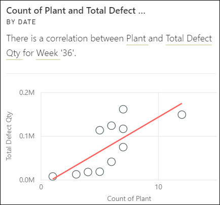

# Power BI tarafından desteklenen öngörü türleri

[!INCLUDE[consumer-appliesto-yyny](../includes/consumer-appliesto-yyny.md)]

Power BI'dan verilerinizi gözden geçirmesini ve ilginç eğilimlerle desenleri bulmasını isteyebilirsiniz. Bu eğilimler ve desenler *İçgörüler* olarak adlandırılan görseller biçiminde sunulur. 

İçgörüler'i kullanmayı öğrenmek için bkz. [Power BI İçgörüleri](end-user-insights.md)

## Öngörüler nasıl çalışır?
Power BI veri kümenizin farklı alt kümelerini hızla arar. Power BI arama yaparken, ilginç olabilecek içgörüleri bulmak için bir dizi gelişmiş algoritma uygular. Power BI *iş kullanıcıları* , pano kutucuklarında İçgörüleri çalıştırabilir.

## Bazı terimler
Power BI İçgörüleri ortaya çıkarmak için istatistiksel algoritmalar kullanır. Algoritmalar bu makalenin sonraki bölümünde listelenmiş ve açıklanmıştır. Algoritmalara gelmeden önce burada tanımıyor olabileceğiniz bazı terimlerin açıklamalarını sağladık. 

* **Ölçü** - ölçü, hesaplamalar yapmak için kullanılabilen nicel (sayısal) bir alandır. Yaygın hesaplamalar toplam, ortalama ve en düşüktür. Örneğin şirketimiz kaykay üretip satıyorsa, ölçülerimiz satılan kaykay sayısı ve yıllık ortalama kar olabilir.  
* **Boyut** - boyutlar kategorik (metin) verilerdir. Boyut bir kişiyi, nesneyi, öğeyi, ürünü, yeri ve zamanı açıklar. Bir veri kümesinde, boyutlar *ölçümleri* kullanışlı kategoriler halinde gruplandırmanın bir yoludur. Kaykay şirketimiz için bazı boyutlar modele, renge, ülkeye veya pazarlama kampanyasına göre satışlara bakmayı (ölçü) içerebilir.   
* **Bağıntı** - bağıntı bize öğelerin davranışının nasıl birbiriyle ilgili olduğunu bildirir.  Bunların artış ve düşüş desenleri benzerse, aralarında pozitif bağıntı var demektir. Öte yandan desenleri birbirinin zıddıysa, aralarında negatif bağıntı vardır. Örneğin bir TV pazarlama kampanyasını her çalıştırdığımızda kırmızı kaykay satışlarımız artıyorsa, kırmızı kaykay satışlarıyla TV kampanyası arasında pozitif bağıntı vardır.
* **Zaman serisi** - bir zaman serisi zamanı birbirini izleyen veri noktaları olarak görüntülemenin bir yoludur. Söz konusu veri noktaları saniye, saat, ay veya yıl gibi artımlar olabilir.  
* **Sürekli değişken** - sürekli değişken en düşük ve en yüksek sınırları arasındaki herhangi bir değer olabilir; aksi takdirde bu bir ayrık değişkendir. Örnek olarak sıcaklık, ağırlık, yaş ve süre verilebilir. Sürekli değişkenler değerin küçük bir bölümünü veya parçasını içerebilir. Satılan mavi kaykayların toplam sayısı ayrık bir değişkendir çünkü bir kaykayın yarısını satamazsınız.  

## Hangi içgörü türlerini bulabilirsiniz?
Bunlar Power BI'ın kullandığı algoritmalardır. 

### Kategori aykırı değerleri (üst/alt)
Bir veya iki kategorinin diğer kategorilerden çok daha yüksek değerlere sahip olduğu durumları vurgular.  

### Zaman serilerindeki değişim noktaları
Verilere ilişkin bir zaman serisindeki eğilimlerde görülen önemli değişiklikleri vurgular.

### Bağıntı
Birden çok ölçünün, veri kümesindeki bir kategori veya değer için çizildiğinde benzer bir desen veya eğilim gösterdiği durumları algılar.

### Düşük Varyans
Bir boyut için veri noktalarının orta değerden uzak olmadığı, dolayısıyla "varyansın" düşük olduğu durumları algılar. "Satış" ölçünüzün ve "bölge" boyutunuzun olduğunu varsayalım. Bölge geneline baktığınızda veri noktalarıyla orta değer (veri noktalarının orta değeri) arasında çok az fark olduğunu görüyorsunuz. Tüm bölgelerdeki satışların varyansı eşiğin altında olduğunda içgörü tekikleniyor. Diğer bir deyişle tüm bölgelerde satışlar birbirine oldukça yakın olduğunda tetikleniyor.

### Çoğunluk (Ana etkenler)
Bir toplam değerin çoğunluğunun, başka bir boyuta göre değerlendirildiğinde tek bir etkenle ilişkilendirilebildiği durumları bulur.  

### Aykırı değerler
Bu içgörü türü, zaman serisi dışı verilerdeki aykırı değerleri bulmak için bir kümeleme modeli kullanır. Aykırı değerler, diğer kategorilere kıyasla önemli ölçüde farklı değerlere sahip belirli kategoriler olduğunu algılar.

### Zaman serisindeki genel eğilimler
Zaman serisi verilerinde görülen yukarı veya aşağı yönlü eğilimleri algılar.

### Zaman serisinde mevsimsellik
Zaman serisi verilerinde haftalık, aylık veya yıllık mevsimsellik gibi dönemsel düzenler bulur.

### Düzenli paylaşım
Üst öğenin toplam değeri ile bir alt değerin payı arasında sürekli bir değişkene göre değerlendirilen bir üst-alt bağıntısının gözlemlendiği durumları vurgular. Düzenli paylaşım içgörüsü bir ölçü, bir boyut ve başka bir tarih/saat boyutu bağlamında uygulanır. Bu içgörü, belirli bir boyut değeri (örneğin “doğu bölgesi”) bu tarih/saat boyutu genelindeki satışların düzenli bir yüzdesine sahip olduğunda tetiklenir.

Düzenli paylaşım içgörüsü düşük varyans içgörüsüne benzer, çünkü her ikisi de zaman içinde bir değerin varyansının eksik olmasıyla ilgilidir. Öte yandan, düzenli paylaşım içgörüsü zaman içinde **genel yüzdenin** varyansının eksikliğini ölçerken, düşük varyans içgörüsü boyut genelinde mutlak ölçü değerlerinin varyansının eksikliğini ölçer.

### Zaman serisi aykırı değerleri
Bir zaman serisindeki verilerde yer alan belirli tarihlerin veya saatlerin, diğer tarih/saat değerlerinden büyük ölçüde farklılık gösteren değerler içerdiği durumları algılar.

## Sonraki adımlar
[Power BI öngörüleri](end-user-insights.md)

Başka bir sorunuz mu var? [Power BI Topluluğu'na başvurun](https://community.powerbi.com/)

