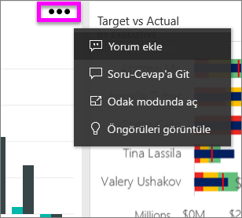
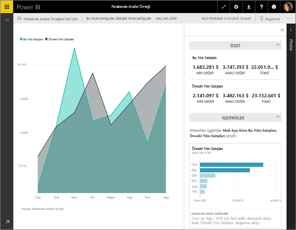
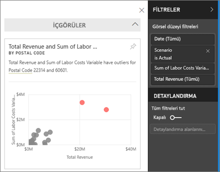
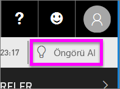
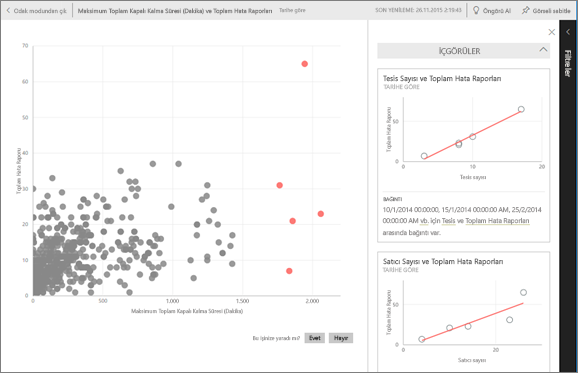

# Power BI ile pano kutucuklarında veri içgörülerini görüntüleme
Panonuzdaki her görselleştirme kutucuğu, veri keşif dünyasına açılan bir yoldur. Bir kutucuğu seçtiğinizde açılan raporda bulunan veri kümesini filtreleyebilir, sıralayabilir ve ayrıntılarına inebilirsiniz. İçgörü çalıştırdığınızda Power BI veri keşfini sizin yerinize gerçekleştirir.

Verilerinizi temel alan ilgi çekici ve etkileşimli görselleştirmeler oluşturmak için hızlı öngörüler çalıştırın. Belirli bir pano kutucuğunda hızlı içgörüler çalıştırabilir ve hatta bir içgörü üzerinde içgörü çalıştırabilirsiniz!

Öngörü özelliği Microsoft Research ekibiyle birlikte geliştirilen ve sayısı artmaya devam eden [gelişmiş analiz algoritmaları kümesi](end-user-insight-types.md) üzerine kurulmuştur. Bu özelliği, daha fazla kullanıcının, verilerindeki öngörülere yeni ve sezgisel yöntemlerle ulaşmasını sağlamak için kullanmaya devam edeceğiz.

## Bir pano kutucuğu üzerinde öngörüler çalıştırma
Bir pano kutucuğunda içgörü çalıştırdığınızda Power BI yalnızca o pano kutucuğunu oluşturmak için kullanılan verilerde arama yapar. 

1. [Bir pano açın](end-user-dashboards.md).
2. Bir kutucuğun üzerine gelin, üç nokta (...) simgesini ve **İçgörüleri görüntüle**'yi seçin. 

    

3. Kutucuk, öngörü kartları sağ tarafta görüntülenecek şekilde [Odak modunda](end-user-focus.md) açılır.    
   
        
4. Öngörülerden biri ilginizi mi çekti? İlgili öngörü kartını seçerek detaylandırabilirsiniz. Seçilen öngörü sol tarafta, yalnızca bu tek öngörüdeki verileri temel alan yeni öngörü kartları da sağ tarafta görüntülenir.    

 ## Öngörü kartlarıyla etkileşim kurma
Açık bir içgörünüz olduğunda keşfetmeye devam edin.

   * Tuval üzerinde görseli filtreleyin.  Filtreleri görüntülemek için sağ üst köşedeki oku seçerek Filtreler bölmesini genişletin.

     
   
   * İçgörü kartı üzerinde içgörü çalıştırın. Bunlar genellikle **ilgili içgörüler** olarak adlandırılır. Sağ üst köşede, ampul simgesini  veya **İçgörü al**’ı seçin.
     
     
     
     Öngörü sol tarafta, yalnızca bu tek öngörüdeki verileri temel alan yeni kartlar da sağ tarafta görüntülenir.
     
     

Özgün içgörü tuvaline geri dönmek için sol üst köşedeki **Odak modundan çık**'ı seçin.

## Önemli noktalar ve sorun giderme
- **İçgörüleri görüntüle** komutu DirectQuery ile birlikte çalışmaz. Yalnızca Power BI'a yüklenmiş olan verilerle birlikte çalışır.
- **İçgörüleri görüntüle** tüm pano kutucuğu türleriyle çalışmaz. Örneğin özel görsellerle kullanılamaz.<!--[custom visuals](end-user-custom-visuals.md)-->

## Sonraki adımlar
[Kullanılabilir Hızlı Öngörü türleri](end-user-insight-types.md) hakkında daha fazla bilgi edinin

