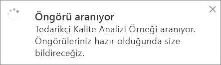

# Power BI ile otomatik olarak veri öngörüleri oluşturma
Yeni bir veri kümeniz var ve keşfetmeye nereden başlayacağınızı bilemiyor musunuz?  Hızla bir pano mu oluşturmanız gerekiyor?  Gözünüzden kaçmış olabilecek öngörülere göz atmak mı istiyorsunuz?

Verilerinizi temel alan ilgi çekici ve etkileşimli görselleştirmeler oluşturmak için hızlı öngörüler çalıştırın. Hızlı öngörüler, bir veri kümesinin tamamında (hızlı öngörüler) veya belirli bir pano kutucuğu üzerinde (kapsamlı öngörüler) çalıştırılabilir. Bir öngörü üzerinde bile hızlı öngörüler çalıştırabilirsiniz!

> **NOT**: Öngörüler DirectQuery ile birlikte çalışmaz. Yalnızca Power BI'a yüklenmiş olan verilerle birlikte çalışır.
> 

Öngörü özelliği Microsoft Research ekibiyle birlikte geliştirilen ve sayısı artmaya devam eden [gelişmiş analiz algoritmaları kümesi](end-user-insight-types.md) üzerine kurulmuştur. Bu özelliği, daha fazla kullanıcının, verilerindeki öngörülere yeni ve sezgisel yöntemlerle ulaşmasını sağlamak için kullanmaya devam edeceğiz.

## Bir veri kümesi üzerinde hızlı öngörüler çalıştırma
Bir veri kümesi üzerinde hızlı öngörüler çalıştıran, öngörüleri Odak modunda açan, öngörülerden birini panosuna kutucuk olarak sabitleyen ve bir görsel için öngörüler edinen Amanda'yı izleyin.

<iframe width="560" height="315" src="https://www.youtube.com/embed/et_MLSL2sA8" frameborder="0" allowfullscreen></iframe>

Şimdi sıra sizde. [Tedarikçi Kalite Analizi örneğini](../sample-supplier-quality.md) kullanarak öngörüler keşfedin.

1. **Veri kümeleri** sekmesinde, üç nokta simgesini (...) ve **Öngörü al**'ı seçin.
   
    
   
    
2. Power BI [çeşitli algoritmalar](end-user-insight-types.md) kullanarak veri kümenizdeki eğilimleri arar.
   
    
3. Öngörüleriniz saniyeler içinde hazır duruma gelir.  Görselleştirmeleri görüntülemek için **Öngörüleri görüntüle**'yi seçin.
   
    
   
   > **NOT**: Bazı veri kümelerindeki veriler istatistiksel olarak önemsiz olduğundan bu veri kümelerinde öngörü oluşturulamaz.  Daha fazla bilgi için bkz. [Verilerinizi öngörüler için en iyi duruma getirme](../service-insights-optimize.md).
   > 
   > 
1. Görselleştirmeler, en fazla 32 ayrı öngörü kartını destekleyen özel bir **Hızlı Öngörüler** tuvalinde görüntülenir. Her kartta bir grafik veya graf ile kısa bir açıklama bulunur.
   
    

## Öngörü kartlarıyla etkileşim kurma
  

1. Kartlardan birinin üzerine gelin ve görselleştirmeyi bir panoya eklemek için raptiye simgesini seçin.
2. Bir kartın üzerine gelin, üç nokta (...) simgesini ve ardından **Öngörüleri görüntüle**'yi seçin. Böylece öngörü tam ekran olarak açılır.
   
    
3. Odak modunda şunları yapabilirsiniz:
   
   * Görselleştirmeleri filtreleyebilirsiniz.  Filtreleri görüntülemek için sağ üst köşedeki oku seçerek Filtreler bölmesini genişletin.
        
   * Raptiye  simgesini veya **Görseli sabitle**’yi seçerek öngörü kartını bir panoya sabitleyin.
   * Kart üzerinde öngörüler çalıştırın. Bunlar genellikle **kapsamlı öngörüler** olarak adlandırılır. Sağ üst köşede, ampul simgesini  veya **Öngörü al**’ı seçin.
     
       
     
     Öngörü sol tarafta, yalnızca bu tek öngörüdeki verileri temel alan yeni kartlar da sağ tarafta görüntülenir.
     
       
4. Özgün öngörü tuvaline geri dönmek için sol üst köşedeki **Odak modundan çık**'ı seçin.

## Bir pano kutucuğu üzerinde öngörüler çalıştırma
Öngörüleri bir veri kümesinin tamamında aramak yerine aramanızı tek bir pano kutucuğunu oluşturmak için kullanılan verilerle sınırlayabilirsiniz. Bunlar da genellikle **kapsamlı öngörüler** olarak adlandırılır.

1. Bir pano açın.
2. Bir kutucuğun üzerine gelin, üç nokta (...) simgesini ve ardından **Öngörüleri görüntüle**'yi seçin. Kutucuk, öngörü kartları sağ tarafta görüntülenecek şekilde [Odak modunda](end-user-focus.md) açılır.    
   
        
4. Öngörülerden biri ilginizi mi çekti? İlgili öngörü kartını seçerek detaylandırabilirsiniz. Seçilen öngörü sol tarafta, yalnızca bu tek öngörüdeki verileri temel alan yeni öngörü kartları da sağ tarafta görüntülenir.    
6. Verilerinizi ayrıntılı olarak incelemeye devam edin, ilginizi çeken bir öngörü bulduğunuzda sağ üst köşedeki **Görseli sabitle**'yi seçerek bu öngörüyü panonuza sabitleyin.

## Sonraki adımlar
Bir veri kümesine sahipseniz [bu veri kümesini Hızlı Öngörüler için en iyi duruma getirebilirsiniz](../service-insights-optimize.md)

[Kullanılabilir Hızlı Öngörü türleri](end-user-insight-types.md) hakkında daha fazla bilgi edinin

Başka bir sorunuz mu var? [Power BI Topluluğu'na başvurun](http://community.powerbi.com/)

