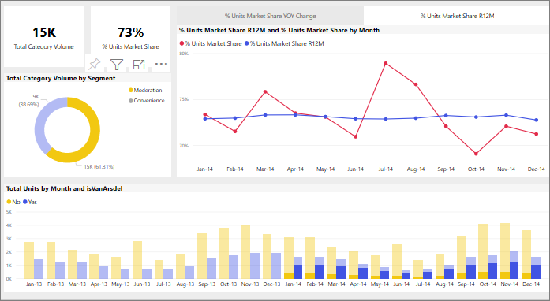

# Görseller bir Power BI raporunda birbirini nasıl çapraz filtreler?
Power BI'ın en önemli özelliklerinden biri, rapor sayfasındaki tüm görsellerin birbirine bağlı olmasıdır. Görsellerin birinde bir veri noktası seçtiğinizde sayfadaki aynı verileri içeren diğer tüm görseller de seçime göre değişir. 

## Görsellerin birbiriyle etkileşimi

Rapor sayfasındaki görselde bulunan bir veri noktası seçildiğinde, sayfadaki diğer görseller için çapraz filtreleme veya çapraz vurgulama işlemleri varsayılan olarak uygulanır. Sayfadaki görseller arasındaki etkileşim rapor *tasarımcısı* tarafından belirlenir. *Tasarımcılar* görsel etkileşimlerini açıp kapatabilir ve varsayılan çapraz filtreleme, çapraz vurgulama ve [detaylandırma](end-user-drill.md) davranışını değiştirebilir. 

Henüz hiyerarşilerle ve detaylandırmayla karşılaşmadıysanız, [Power BI'da detaya gitme](end-user-drill.md) konusunu okuyarak bu konudaki her şeyi öğrenebilirsiniz. 

Çapraz filtreleme ve çapraz vurgulama verilerinizdeki bir değerin farklı bir değere nasıl katkıda bulunduğunu belirlemek için yararlı olabilir. Örneğin, halka grafikteki Denetim segmentini seçtiğinizde, bu segmentin "Total units by Month" grafiğindeki her sütuna yaptığı katkı vurgulanır ve çizgi grafik filtrelenir.

Bkz. [Filtreleme ve vurgulama hakkında](end-user-report-filter.md). 

  
> [!NOTE]
> Görselleri filtrelemek ve vurgulamak için **Filtreler**  bölmesini kullandığınızda gerçekleşen davranış ile burada açıklanan davranış arasındaki farkı belirtmek için *çapraz filtreleme* ve *çapraz vurgulama* terimleri kullanılmıştır.  

## Önemli noktalar ve sorun giderme
- Raporunuzun [detaya gitmeyi](end-user-drill.md) destekleyen bir görseli varsa, bir görselde detaya gidildiğinde rapor sayfasındaki diğer görseller varsayılan olarak bundan etkilenmez.     
- B görseliyle etkileşim kurmak için A görselini kullanırsanız, A görselinin görsel düzeyi filtreleri B görseline uygulanır.

## Sonraki adımlar
[Rapor filtrelerini kullanma](../power-bi-how-to-report-filter.md)
