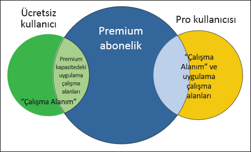
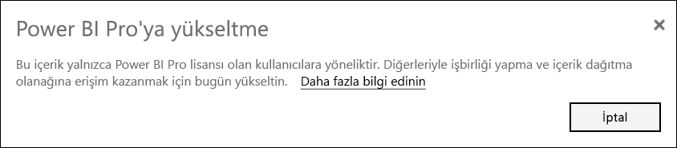
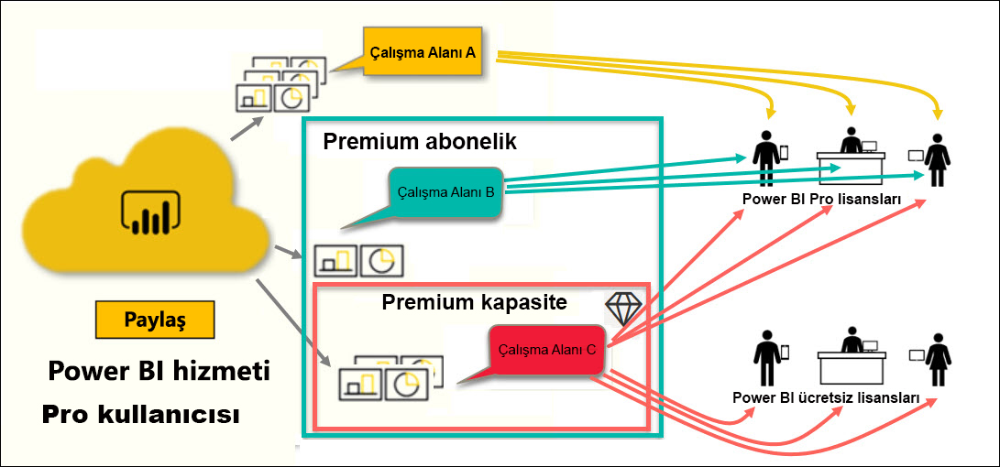

# Power BI lisanslarının türleri

[!INCLUDE[consumer-appliesto-ynnn](../includes/consumer-appliesto-ynnn.md)]

*Tüketici* olarak Power BI hizmetini iş kararları alma amacıyla raporları ve panoları keşfetmek için kullanırsınız. Power BI’ı bir süredir kullanıyor veya *tasarımcı* iş arkadaşlarınızla sohbetini yapıyorsanız bazı özelliklerin yalnızca belirli lisans veya abonelik türleriyle çalıştığının farkında olabilirsiniz. 

Bu makalede, kullanıcı lisansları ve kuruluş abonelikleri arasındaki farklar ve bunların birlikte nasıl çalıştıkları açıklanmaktadır: ücretsiz, Pro, Premium ve Premium kapasite. Ayrıca hangi lisans ve abonelik bileşimini kullandığınızı bulmayı da öğreneceksiniz.  

İlk olarak kullanıcı başına abonelikler ve kuruluş abonelikleri olmak üzere iki lisans kategorisini inceleyeceğiz. Başlangıç noktamız her bir abonelikle sağlanan varsayılan özellikler olacaktır. Ardından Power BI yöneticinizin ve içerik sahiplerinin rolleri ve izinleri kullanarak varsayılan lisans ve abonelik özelliklerini nasıl değiştirebileceğinizi de gözden geçireceğiz. 

Örneğin lisansınız izin verse bile yöneticiniz verileri dışarı aktarma, Soru-Cevap doğal dil sorgularını kullanma veya web’de yayımlama gibi işleri yapma becerinizi sınırlayabilir. Ayrıca rapor *tasarımcısı* çalışma alanına içerik atadığında size de bir [çalışma alanı](end-user-workspaces.md) rolü atayabilir. Roller, söz konusu çalışma alanında neleri yapabileceğinizi ve neleri yapamayacağınızı belirler. *Tasarımcı* izin ayarlarını kullanarak lisansınızın sınırlarını daha ayrıntılı ayarlayabilir. Diğer bir deyişle...bu karmaşık bir durumdur. Neyse ki bu makalede karışıklığın tamamı değilse bile büyük çoğunluğu açıklanacaktır.

## Kullanıcı başına lisanslar
İlk lisans türü, **kullanıcı başına** lisansdır. Her Power BI hizmeti kullanıcısının bir ücretsiz lisansı veya Pro lisansı vardır. Bazı özellikler Pro lisansına sahip kullanıcılara ayrılmıştır.  

- **Power BI Pro lisansı (Premium abonelik olmadan)** kullanıcının içerik oluşturup paylaşarak Pro lisansına sahip olan diğer kullanıcılarla işbirliği yapmasını sağlar. Yalnızca Pro lisansına sahip olan kullanıcılar raporları yayımlayabilir, panolara ve raporlara abone olabilir ve çalışma alanlarında iş arkadaşlarıyla işbirliği yapabilir. 

    

    Power BI Pro kullanıcıların Power BI hizmetinde diğer kullanıcılar tarafından yayımlanan raporları ve panoları okumasını ve bunlarla etkileşimli çalışmasını sağlayan bireysel bir kullanıcı lisansıdır. Bu tür bir lisansa sahip kullanıcılar içerik paylaşabilir ve diğer Power BI Pro kullanıcılarıyla işbirliği yapabilir. Yalnızca Power BI Pro kullanıcıları içerik yayımlayabilir, diğer kullanıcılarla içerik paylaşabilir veya diğer kullanıcılar tarafından oluşturulan içeriği tüketebilir. Bunun tek istisnası [Power BI Premium kapasitede](#understanding-premium-and-premium-capacity) barındırılan içeriktir. (Daha fazla bilgi için aşağıdaki [Power BI Premium kapasite](#understanding-premium-and-premium-capacity) bölümüne bakın.) Pro lisansları genellikle rapor *tasarımcıları*, geliştiriciler tarafından kullanılır. 

- **Tek başına Power BI ücretsiz lisansı (Premium abonelik olmadan)** da önemli avantajlar sunar, ancak Power BI’ı kullanmaya yeni başlayan veya kendileri için içerik oluşturan kullanıcılara yöneliktir. Bkz. [Power BI hizmetine bireysel olarak kaydolma](../service-self-service-signup-for-power-bi.md).   

    Ücretsiz tek başına kullanıcı lisansı, Power BI'ı kullanmayı öğrenmek amacıyla Microsoft örneklerini kullanan kişiler için idealdir. Ücretsiz tek başına lisansına sahip olan kullanıcılar, başkaları tarafından paylaşılan içeriği görüntüleyemez ve kendi içeriklerini diğer Power BI kullanıcılarıyla paylaşamaz. 

    

    Ücretsiz bir tek başına lisansa sahip tüm müşteriler, [ücretsiz Power BI Pro lisans deneme sürümüne](../service-self-service-signup-for-power-bi.md) yükseltebilir. Deneme sürümü, Power BI Pro kullanıcısının sahip olduğu tüm gücün ve işlevselliği sağlar.

    

- **Premium abonelik ile Power BI ücretsiz lisansı**: Bir kuruluşun Premium aboneliği olduğunda, yöneticiler ve Pro kullanıcıları *Premium kapasiteye* çalışma alanları atayabilir ve bu çalışma alanları için kullanıcılara ücretsiz erişim izni verebilir. Premium kapasite içindeki çalışma alanı Pro kullanıcılarının ücretsiz lisans kullanıcılarıyla paylaşabilecekleri ve işbirliği yapabilecekleri bir alandır; bunun için ücretsiz lisans kullanıcılarının Pro hesapları olması gerekmez. Ücretsiz kullanıcılar bu çalışma alanlarında yükseltilmiş izinlere sahiptir. İşbirliği ve paylaşım yapabilir, verileri dışarı aktarabillir, abone olabilir, filtrelerle etkileşim kurabilir ve çok daha fazlasını gerçekleştirebilirler. 

Buraya kadar her şey net mi?  Tamam. **Premium kapasiteye** daha yakından bakalım.

## Premium’u ve Premium kapasiteyi anlama
Premium bir **kuruluş** aboneliğidir. Bunu, kuruluş içindeki tüm Power BI **kullanıcı başına** lisanslarının üzerine eklenen özellikler ve işlevlerden oluşan bir katman olarak düşünebilirsiniz. 

Kuruluş Premium lisansı satın aldığında, yönetici genellikle içerik oluşturacak ve paylaşacak olan çalışanlara Pro lisansları atar. Yönetici ayrıca bu içeriği tüketecek olan herkese ücretsiz lisans atar. Pro kullanıcıları [uygulama çalışma alanları](end-user-workspaces.md) oluşturur ve bu çalışma alanlarına içerik (panolar, raporlar, uygulamalar) ekler. Ücretsiz kullanıcıların bu çalışma alanlarında işbirliği yapmasına olanak sağlamak için yönetici veya Pro kullanıcı, çalışma alanlarını *Premium kapasiteye* kaydeder. 

Bir kuruluş Premium lisansı satın aldığında, Power BI hizmetinde yalnızca kendisine ayrılmış bir kapasite sahibi olur. Bunlar, diğer kuruluşlarla paylaşılmaz. Kapasite tamamen Microsoft tarafından yönetilen adanmış donanımlarla desteklenir. Kuruluşlar ayrılmış kapasitelerini kapsamlı olarak uygulamayı seçebilir veya bu kapasiteyi belirli çalışma alanlarına ayırabilir. Kuruluşlar tüm çalışma alanlarını veya bir kısmını kapasitede tutabilir. Bir çalışma alanının Premium kapasitede olup olmadığını elmas simgesinden ayırt edebilirsiniz .  Premium kapasite içindeki çalışma alanı Pro kullanıcılarının ücretsiz lisans kullanıcılarıyla paylaşabilecekleri ve işbirliği yapabilecekleri bir alandır; bunun için ücretsiz lisans kullanıcılarının Pro hesapları olması gerekmez. 

Yine de Premium kapasitede içerik tasarımcıları için Pro lisansları gerekir. Tasarımcılar uygulama çalışma alanları oluşturma, veri kaynaklarına bağlanma ve verileri modellemenin yanı sıra, paketlenip uygulama olarak paylaşılan veya doğrudan paylaşılan raporlar ve panolar oluşturur. Pro lisansı olmayan kullanıcılar, çalışma alanı Premium *kapasitede* yer aldığı ve çalışma alanı sahibi onlara izin verdiği sürece Power BI Premium’daki uygulama çalışma alanına erişebilir.

Aşağıdaki diyagramın sol tarafında, uygulama çalışma alanlarında içerik oluşturan ve paylaşan Pro kullanıcıları gösterilir. 

- **Çalışma Alanı A**, Premium aboneliği olmayan bir kuruluşta oluşturulmuştur. 

- **Çalışma Alanı B**, Premium aboneliği olan bir kuruluşta oluşturulmuş ancak bu çalışma alanı Premium kapasiteye kaydedilmemiştir. Çalışma alanı adının yanında baklava simgesi yoktur.

- **Çalışma Alanı C**, Premium aboneliği olan bir kuruluşta oluşturulmuş ve Premium kapasiteye kaydedilmiştir. Bu çalışma alanının baklama simgesi vardır.  

Power BI Pro *tasarımcısı* bu üç çalışma alanından herhangi birinde diğer Pro kullanıcılarıyla içerik paylaşıp işbirliği yapabilir. Yalnız bunun için tasarımcının çalışma alanını tüm kuruluşla paylaşması veya Pro kullanıcılarına çalışma alanı rolleri ataması gerekir. 

Power BI Pro kullanıcısı ücretsiz lisans kullanıcılarıyla paylaşmak ve işbirliği yapmak için yalnızca Çalışma Alanı C adlı çalışma alanını kullanabilir. Ücretsiz lisans kullanıcılarının çalışma alanına erişebilmesi için çalışma alanının Premium kapasiteye atanmış olması gerekir. Çalışma alanı içinde tasarımcı işbirliği yaptığı kullanıcılara roller atar: *Yönetici*, *Üye*, *Katkıda Bulunan* veya *Görüntüleyici*. Çalışma alanı içinde yapabileceğiniz eylemler rolünüz tarafından belirlenir. Power BI *tüketicilerine* genellikle *Görüntüleyici* rolü atanır. Daha fazla bilgi edinmek için bkz. [Power BI tüketicileri için çalışma alanları](end-user-workspaces.md).

## Hangi lisans ve aboneliğe sahip olduğunuzu öğrenme
Power BI lisans ve abonelik bilgilerinizi bulmanın birkaç yolu vardır. 

İlk olarak sahip olduğunuz **kullanıcı** lisansının türünü belirleyin.

- Microsoft Office'in bazı sürümleri Power BI Pro lisansı sunar.  Office sürümünüzün Power BI hizmetini içerip içermediğini görmek için [Office portalını](https://portal.office.com/account) ziyaret edin ve **Abonelikler**'i seçin.

    Bu ilk kullanıcı olan Pradtanna, Power BI Pro lisansı içeren Office 365 E5 aboneliğine sahiptir.

    

    İkinci kullanıcı olan Zalan ise ücretsiz Power BI lisansına sahiptir. 

    

Ardından hesabınızın Premium aboneliğin bir parçası olup olmadığını denetleyin. Yukarıdaki kullanıcılardan herhangi biri (Pro veya ücretsiz), Premium lisansına sahip olan bir kuruluşa bağlı olabilir.  İkinci kullanıcı olan Zalan'ı denetleyelim.  

- Power BI hizmetinde **Çalışma alanım**'ı ve ardından sağ üst köşedeki dişli simgesini seçin. **Kişisel depolama alanını yönet**'i seçin.

    

    **Kullanıcı Başına** lisansları (Pro veya ücretsiz), bulutta Power BI raporlarını veya Excel çalışma kitaplarını barındırmak için kullanılabilecek 10 GB depolama alanı sunar. Sahip olduğunuz alanın 10 GB'ın üzerinde olması, Premium lisansına sahip bir kuruluş hesabının üyesi olduğunuzu gösterir.

    

    Office portalı sayfasında Zalan’ın kullanıcı lisansının Power BI (ücretsiz) olduğunu hatırlayın. Ancak kuruluşu Premium abonelik satın aldığı için Zalan, Power BI hizmetinde 10 GB depolama alanıyla sınırlı değildir; 100 GB kullanabilir. Premium lisansına sahip bir kuruluştaki bir *tüketici* olarak, *tasarımcı* çalışma alanını Premium kapasiteye eklediği sürece Zalan paylaşılan içeriği görüntüleme, iş arkadaşlarıyla işbirliği yapma ve uygulamalarla çalışma gibi işlemleri yapabilir. İzinlerinin kapsamı, Power BI yöneticisi ve içerik tasarımcısı tarafından belirlenir. Bir Pro kullanıcısının Zalan ile zaten bir çalışma alanı paylaştığına dikkat edin. Baklava simgesi sayesinde çalışma alanının Premium kapasitede depolandığını anlıyor. 

   
## Çalışma alanı rollerini anlama
Şimdiye kadar kullanıcı başına lisansları, Premium abonelikleri, uygulama çalışma alanlarını ve Premium kapasiteyi gözden geçirdik. Şimdi de çalışma alanı *rollerine* bakalım.

Bu Power BI *tüketicilerine* yönelik bir makale olduğundan şöyle bir senaryomuz var:

-  Power BI Premium aboneliğine sahip bir kuruluşta *ücretsiz* lisansı olan bir kullanıcısınız. 
- Power BI Pro kullanıcısı bir pano ve rapor koleksiyonu oluşturdu, ardından bu koleksiyonu tüm kuruluşunuzla *uygulama* olarak paylaştı.  
- Uygulamalar *çalışma alanları* içinde ve bu çalışma alanı da Premium kapasitede yer alıyor.    
- Bu uygulama çalışma alanının bir panosu ve iki raporu var.
- Pro kullanıcısı bize **Görüntüleyici** rolü atadı.

### Görüntüleyici rolü
Roller Power BI *tasarımcılarının* çalışma alanında kimlerin neler yapabileceğini yönetmesini sağlar ve bu sayede ekipler işbirliği yapabilir. Bu rollerden biri de **Görüntüleyici** rolüdür. 

Çalışma alanı Power BI Premium kapasitesinde olduğunda, Görüntüleyici rolüne sahip kullanıcılar Power BI Pro lisansları olmasa bile çalışma alanına erişebilir. Görüntüleyici rolü temel verilere erişemediğinden veya bu verileri dışarı aktaramadığından panolar, raporlar ve uygulamalarla etkileşim kurmak güvenli bir yoldur.

> [!TIP]
> Diğer roller (Yönetici, Üye ve Katkıda Bulunan) hakkında bilgi edinmek için bkz. [Yeni çalışma alanı oluşturma](../service-new-workspaces.md).

## Sonraki adımlar
[Bir Power BI *tüketicisi* miyim?](end-user-consumer.md)    
[Çalışma alanları hakkında bilgi edinin](end-user-workspaces.md)    
<!--[View Power BI features by license type](end-user-features.md) -->

