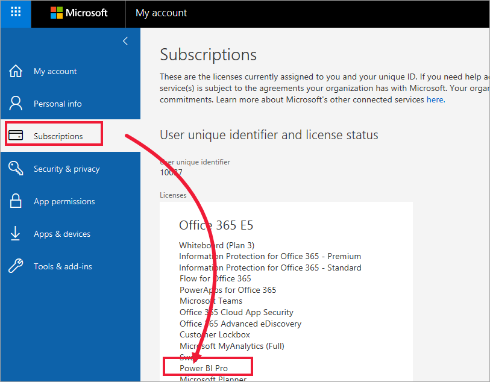

# *Tüketicilere* yönelik lisanslar ve abonelikler

[!INCLUDE[consumer-appliesto-ynnn](../includes/consumer-appliesto-ynnn.md)]

[*Tüketici*](end-user-consumer.md) olarak Power BI hizmetini veri destekli iş kararları almak amacıyla raporları ve panoları keşfetmek için kullanırsınız. Power BI’ı bir süredir kullanıyor veya *tasarımcı* iş arkadaşlarınızla sohbetini yapıyorsanız, bazı özelliklerin yalnızca belirli lisans, abonelik veya izin türleriyle çalıştığını keşfetmiş olabilirsiniz. 

Power BI hizmetinde neler yapabileceğiniz üç şeye bağlıdır:
-    kullandığınız lisansın ve aboneliğin türü
-    içeriğin depolandığı yer
-    size atanan roller ve izinler

Bu makalede, her bir lisans türünün özellikleri ve *içeriğin depolandığı yerin* *bununla neler yapabileceğinizi* nasıl etkileyebileceği açıklanmaktadır. Ayrıca, lisansınızın ve aboneliğinizin nasıl aranacağını ve içeriğinizin nerede depolandığını öğreneceksiniz. Roller ve izinler hakkında daha fazla bilgi için bkz. [çalışma alanı rolleri](end-user-workspaces.md).

## Lisanslar

Her Power BI hizmeti kullanıcısı bir *ücretsiz* lisans veya *Pro* lisansı kullanır. Power BI *tüketicisiyseniz*, büyük olasılıkla Power BI kiracınızı yöneticisi tarafından yönetilen bir lisans kullanıyorsunuz demektir. 

Aynı anda birden fazla lisansa sahip olmak mümkündür.  Hizmet her zaman şu anda sahip olduğunuz en iyi lisansa eşit bir deneyim sunar. 

## Power BI Premium kapasitesi

Premium, içeriğin depolanması için farklı bir yol sağlayan bir kurumsal aboneliktir: ayrılmış kapasitede. Premium ile kuruluşunuzun içinde veya dışında izinleri olan herkes tek tek Power BI Pro lisansı satın almadan Power BI içeriğinizi görüntüleyebilir. 

Premium ayrıca içeriği görüntüleyen alıcılarda Pro lisansı gerektirmeden içeriğin Pro kullanıcıları tarafından geniş ölçekte dağıtılmasını sağlar. İçerik tasarımcıları için Pro lisansları gerekir. Tasarımcılar veri kaynaklarına bağlanır, verileri modeller ve çalışma alanı uygulamaları olarak paketlenen raporlar ve panolar oluşturur. Pro lisansı olmayan kullanıcı [bu çalışma alanında bir role](end-user-workspaces.md) atandığı sürece Power BI Premium kapasitesindeki çalışma alanına yine de erişebilir.

Bu çalışma alanları içinde, tasarımcılar iş arkadaşlarınızın içerikle etkileşime girebileceği kapsamı belirleyen **Görüntüleyici**, **Katkıda bulunan**, **Üye** ve **Yönetici** gibi roller atayabilir. Daha fazla bilgi için bkz. [çalışma alanı izinleri ve rolleri.](end-user-workspaces.md) 

Premium kapasite hakkında daha fazla bilgi için bkz. [Microsoft Power BI Premium nedir?](../admin/service-premium-what-is.md).

## Sahip olduğunuz lisansları öğrenme

Size atanan lisansları görmek için [Microsoft **Hesabım** sayfanızı](https://portal.office.com/account) ziyaret edin.  **Abonelikler** sekmesini seçin.

Bu ilk kullanıcı olan Pradtanna, Power BI Pro lisansı içeren Office 365 E5 aboneliğine sahiptir.

İkinci kullanıcı olan Zalan ise ücretsiz Power BI lisansına sahiptir. 

## Premium kapasiteye erişiminiz olup olmadığını öğrenin

Ardından, Premium kapasiteye sahip bir kuruluşun parçası olup olmadığınızı kontrol edin. Yukarıdaki kullanıcılardan herhangi biri (Pro veya ücretsiz), Premium kapasiteye sahip olan bir kuruluşa bağlı olabilir.  İkinci kullanıcı olan Zalan'ı denetleyelim.  

Zalan’ın kuruluşunun, kullanılabilir depolama alanı miktarına bakarak Premium kapasiteye sahip olup olmadığını belirleyebiliriz. 

- Power BI hizmetinde **Çalışma alanım**'ı ve ardından sağ üst köşedeki dişli simgesini seçin. **Kişisel depolama alanını yönet**'i seçin.

    

    10 GB'ın üzerinde olduğunu görürseniz, Premium aboneliğine sahip bir kuruluşun üyesisiniz demektir. Aşağıdaki görüntüde, Zalan’ın kuruluşunun en fazla 100 GB depolama alanına sahip olduğu gösterilmektedir.  

    

Bir Pro kullanıcısının Zalan ile zaten bir çalışma alanı paylaştığına dikkat edin. Baklava simgesi, bu çalışma alanının Premium kapasitede depolandığını gösterir. 

## Premium kapasitede barındırılan içeriği belirleme

Kuruluşunuzun Premium kapasiteye sahip olup olmadığını bulmanın bir diğer yolu da, baklava simgesine sahip uygulamaları ve uygulama çalışma alanlarını aramaktır. Baklava simgesi, içeriğin Premium kapasitede depolandığını gösterir. 

Aşağıdaki görüntüde, uygulamaların üçü Premium kapasitede depolanır.

    
Ücretsiz lisansı olan bir kullanıcı olarak, *tasarımcı* çalışma alanını ayrılmış Premium kapasiteye eklediği sürece **bu çalışma alanı içinde** paylaşılan içeriği görüntüleme, iş arkadaşlarıyla işbirliği yapma ve uygulama panolarıyla ve raporlarıyla çalışma gibi işlemleri yapabilirsiniz. İzinlerinin kapsamı, Power BI yöneticiniz ve içerik tasarımcısı tarafından belirlenir. 

   

## Hepsini bir araya getirme

Kuruluş, Premium abonelik satın aldığında yönetici genellikle Premium kapasitede çalışarak içerik oluşturacak ve paylaşacak olan çalışanlara Pro lisansları atar. Pro kullanıcıları [çalışma alanları](end-user-workspaces.md) oluşturur ve bu çalışma alanlarına içerik (panolar, raporlar, uygulamalar) ekler. Ücretsiz kullanıcıların bu çalışma alanlarında işbirliği yapmasına olanak sağlamak için yönetici veya Pro kullanıcı, çalışma alanlarını *ayrılmış kapasiteye* atar.    
 

|Lisans türü  |paylaşılan kapasite  |ayrılmış kapasite  |
|---------|---------|---------|
|**Ücretsiz**     |  Kendiniz için içerik oluşturduğunuz ve bu içerikle etkileşime girdiğiniz kişisel bir korumalı alan olarak kullanım için. Bu, Power BI hizmetini denemeniz için harika bir yoldur. Başka birisinden içerik tüketmez veya içeriğinizi başkalarıyla paylaşamazsınız 1     |   Ayrılmış kapasiteye atanan ve sizinle paylaşılan içerikle etkileşime girin. Ücretsiz ve Pro kullanıcıları, ücretsiz kullanıcıların Pro hesaplarına sahip olması gerekmeden işbirliği yapabilir.      |
|**Pro**     |  İçerik oluşturup paylaşarak diğer Pro kullanıcılarıyla işbirliği yapın.        |  İçerik oluşturup paylaşarak ücretsiz ve Pro kullanıcılarıyla işbirliği yapın.       |

1 Bkz. [Önemli noktalar ve sorun giderme](#considerations-and-troubleshooting). 

Aşağıdaki diyagramın sol tarafında, uygulama çalışma alanlarında içerik oluşturan ve paylaşan Pro kullanıcıları gösterilir. 

- **Çalışma Alanı A**, Premium kapasitesi olmayan bir kuruluşta oluşturulmuştur. 

- **Çalışma Alanı B**, Premium aboneliği olan bir kuruluşta oluşturulmuş ve ayrılmış kapasiteye kaydedilmiştir. Bu çalışma alanının baklava simgesi vardır.  

    

Power BI Pro *tasarımcısı* bu çalışma alanlarından herhangi birinde diğer Pro kullanıcılarıyla içerik paylaşıp işbirliği yapabilir. Ancak, Power BI Pro kullanıcısının ücretsiz kullanıcılarla paylaşım ve işbirliği yapabileceği tek yol, Premium ayrılmış kapasitede olan Çalışma Alanı B’yi kullanmaktır.  Çalışma alanı içinde tasarımcı işbirliği yaptığı kullanıcılara roller atar. Çalışma alanı içinde yapabileceğiniz eylemler rolünüz tarafından belirlenir. Power BI *tüketicilerine* genellikle *Görüntüleyici* rolü atanır. Roller hakkında daha fazla bilgi edinmek için bkz. [Power BI tüketicileri için çalışma alanları](end-user-workspaces.md).

## Önemli noktalar ve sorun giderme
- Birden fazla Power BI lisansına sahip olmak mümkündür. Power BI hizmeti her zaman şu anda sahip olduğunuz en iyi lisansa eşit olan deneyimi sunar. Örneğin, hem Pro hem de ücretsiz lisansa sahipseniz, Power BI hizmeti Pro lisansını kullanır.

- İçerik (panolar, raporlar, uygulamalar) paylaşmak ve oluşturmak istiyorsanız, bir Power BI *tüketicisi* yerine *tasarımcı* olabilirsiniz. Pro kullanıcı lisansınızın olduğundan emin olun. Bir Pro özelliğini her kullanma girişiminizde Power BI hizmetinde görünen yükseltme iletişim kutusunu seçerek Power BI Pro’nun 60 günlük ücretsiz bireysel deneme sürümüne kaydolabilirsiniz.

    

  60 günlük deneme süresi sona erdiğinde, lisansınız Power BI ücretsiz lisansına geri döner. Bu gerçekleştikten sonra, artık Power BI Pro lisansı gerektiren özelliklere erişemezsiniz. Bir Pro lisansına devam etmek istiyorsanız, Power BI Pro lisansı satın alma hakkında yöneticinize veya BT Yardım Masanıza başvurun. Yöneticiniz veya BT Yardım Masanız yoksa, [Power BI fiyatlandırma sayfasını](https://powerbi.microsoft.com/pricing/) ziyaret edin.     

- *Ücretsiz deneyin* gibi bir düğmeyi seçerek kendiniz ücretsiz lisansa kaydolduysanız, bu lisansın süresi hiçbir zaman dolmaz. Bu nedenle bir Pro denemesine yükseltirseniz veya kuruluşunuz size bir Pro lisansı sağlarsa ve sonra deneme süreniz biterse veya kuruluşunuz Pro lisansınızı kaldırırsa, siz lisansı iptal etmediğiniz sürece yine de ücretsiz lisansa sahip olursunuz. 

- 1 Power BI hizmeti için ücretsiz bir kullanıcı lisansı, keşfeden veya lisansı **Çalışma alanım** ile kişisel veri analizi ve görselleştirmeler amacıyla kullanan kişiler için mükemmeldir. Ücretsiz tek başına bir kullanıcı, iş arkadaşlarıyla işbirliği yapmak için Power BI kullanmıyor. Ücretsiz lisansı olan tek başına kullanıcılar, başkaları tarafından paylaşılan içeriği görüntüleyemez ve kendi içeriklerini diğer Power BI kullanıcılarıyla paylaşamaz. 

    

## Sonraki adımlar
- [Bir Power BI *tüketicisi* miyim?](end-user-consumer.md)    
- [Çalışma alanları hakkında bilgi edinin](end-user-workspaces.md)    
- [Lisans türüne göre Power BI tüketici özelliklerini görüntüleme](end-user-features.md)
