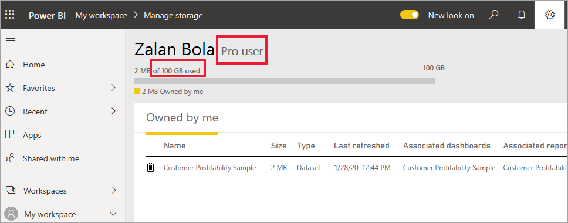

# Power BI lisanslarının türleri
*Tüketici* olarak Power BI hizmetini iş kararları alma amacıyla raporları ve panoları keşfetmek için kullanırsınız. Power BI'ı bir süredir kullanıyor veya *tasarımcı* iş arkadaşlarınızla sohbetini yapıyorsanız bazı özelliklerin yalnızca belirli lisans türleriyle çalıştığının farkında olabilirsiniz. 

Bu makalede lisans türleri (ücretsiz, Pro, ücretsiz ve premium kapasite ile Pro ve premium kapasite) arasındaki farklar açıklanmaktadır. Ayrıca kullandığınız lisans türlerini nasıl tespit edebileceğinizi de öğreneceksiniz.  

İlk olarak kullanıcı lisansları ve kuruluş lisansları olmak üzere iki lisans kategorisini inceleyeceğiz. 

## Kullanıcı lisansları
İlk lisans türü, **kullanıcı** lisansıdır. Her Power BI kullanıcısının bir ücretsiz lisansı veya Pro lisansı vardır. Bazı özelliklerden yalnızca Pro lisansına sahip olan kullanıcılar yararlanabilir.  

- Power BI Pro lisansı, kullanıcının içerik oluşturup paylaşarak Pro lisansına sahip olan diğer kullanıcılarla işbirliği yapmasını sağlar. Yalnızca Pro lisansına sahip olan kullanıcılar raporları yayımlayabilir, panolara ve raporlara abone olabilir ve çalışma alanlarında iş arkadaşlarıyla işbirliği yapabilir. Pro lisansları genellikle rapor *tasarımcıları*, geliştiriciler, analistler ve yöneticiler tarafından kullanılır.

- Ücretsiz Power BI lisansı da önemli avantajlar sunar ancak Power BI'ı kullanmaya yeni başlayan veya kendileri için içerik oluşturan kullanıcılara yöneliktir. Ücretsiz kullanıcı lisansı, Power BI'ı kullanmayı öğrenmek için Microsoft örneklerini kullanan kişiler için idealdir. Ücretsiz lisansa sahip olan kullanıcılar, başkaları tarafından paylaşılan içeriği görüntüleyemez ve kendi içeriklerini diğer Power BI kullanıcılarıyla paylaşamaz.  

Buraya kadar her şey net mi?  Tamam. Şimdi başka bir katman olan **Premium kapasiteyi** ekleyelim.

## Power BI Premium ne işe yarar? Nasıl çalışır?
Premium kapasite bir **kuruluş** lisansıdır. Bunu bir kuruluş içindeki tüm Power BI **kullanıcı** lisanslarının üzerine eklenen özellikler ve işlevlerden oluşan bir katman olarak düşünebilirsiniz. Bunun *tüketicilere* sağladığı avantajlardan biri, kuruluşta *ücretsiz* kullanıcı lisansına sahip olan üyelerin daha fazla özellikten faydalanmasını sağlamasıdır. Şirketinizde Premium kapasite lisansı varsa Pro kullanıcılar, kuruluşun tüm üyeleriyle içerik paylaşabilir ve kullanıcıların içeriği görüntülemek için Power BI Pro lisansına sahip olma şartı ortadan kalkar.   

Kuruluş, Premium kapasite lisansı satın aldığında yönetici genellikle içerik oluşturacak ve paylaşacak olan çalışanlara Pro lisansları atar. Yönetici ayrıca bu içeriği tüketecek olan herkese ücretsiz lisans atar.  

Premium hakkında daha fazla bilgi edinmek mi istiyorsunuz? Okumaya devam edin. İstemiyorsanız aşağıdaki [Sahip olduğunuz lisansları tespit etme](#find-out-which-license-you-have) bölümüne atlayın.

Bir kuruluş Premium kapasite lisansı satın aldığında, Power BI hizmetinde yalnızca kendisine ayrılmış bir kapasite sahibi olur. Bu kapasite başkalarıyla paylaşılmaz. Kapasite tamamen Microsoft tarafından yönetilen adanmış donanımlarla desteklenir. Kuruluşlar adanmış kapasitelerini geniş çapta uygulamayı tercih edebilir veya bu kapasiteyi atanmış çalışma alanlarına kullanıcı sayısına, iş yükü gereksinimlerine veya diğer etmenlere göre atayabilir. Gereksinimler değiştikçe ölçek büyütülebilir veya küçültülebilir.

Power BI Premium, Power BI’da daha tutarlı performans sağlamak için ayrılmış kapasite ve daha büyük hacimli veriler için destek sunar. 

## Sahip olduğunuz lisansları tespit etme
Power BI lisans bilgilerinizi bulmanın birkaç yolu vardır. 

İlk olarak sahip olduğunuz **kullanıcı** lisansının türünü belirleyin.

- Microsoft Office'in bazı sürümleri Power BI Pro lisansı sunar.  Office sürümünüzün Power BI hizmetini içerip içermediğini görmek için [Office portalını](https://portal.office.com/account) ziyaret edin ve **Abonelikler**'i seçin.

    Bu ilk kullanıcı olan Pradtanna, Power BI Pro lisansı içeren Office 365 E5 aboneliğine sahiptir.

    

    İkinci kullanıcı olan Zalan ise ücretsiz Power BI lisansına sahiptir. 

    

Ardından hesabınızda Premium kapasite lisansı olup olmadığını denetleyin. Yukarıdaki kullanıcılardan herhangi biri (Pro veya ücretsiz), Premium kapasite lisansına sahip olan bir kuruluşa bağlı olabilir.  İkinci kullanıcı olan Zalan'ı denetleyelim.  

- Power BI hizmetinde **Çalışma alanım**'ı ve ardından sağ üst köşedeki dişli simgesini seçin. **Kişisel depolama alanını yönet**'i seçin.

    

    **Kullanıcı** lisansları (Pro veya ücretsiz), bulutta Power BI raporlarını veya Excel çalışma kitaplarını barındırmak için kullanılabilecek 10 GB depolama alanı sunar. Sahip olduğunuz alanın 10 GB'ın üzerinde olması, Premium kapasite lisansına sahip bir kuruluş hesabının üyesi olduğunuzu gösterir.

    Office portalı sayfasında Zalan'ın kullanıcı aboneliğinin Power BI (ücretsiz) olduğunu hatırlayın. Ancak kuruluşu Premium kapasite lisansı satın aldığından Zalan, Power BI hizmetinde bir **Pro kullanıcıdır**. Premium kapasite lisansına sahip olan kuruluştaki bir *tüketici* olarak paylaşılan içeriği görüntüleyebilir, iş arkadaşlarıyla işbirliği yapabilir, uygulamalarla çalışabilir ve daha fazlasını yapabilir. İzinlerinin kapsamı, Power BI yöneticisi tarafından belirlenir. Çoğu *tüketiciye* Soru-Cevap özelliğini kullanma, içeriği dışarı aktarma, uygulamaları yeniden paylaşma ve abonelik oluşturma gibi işlemler için izin verilir.  Ancak yeni içerik oluşturma ve paylaşma; *tasarımcı*, analist, geliştirici ve yönetici rollerine sahip kullanıcılarla sınırlıdır.   <!-- how can he be Pro if I assigned him a Free account in the O365 portal?  Is he a Pro user with consumer permissions? -->

    
