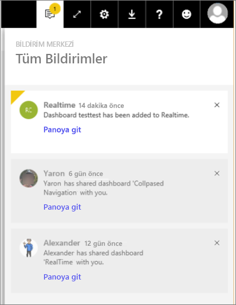

# Power BI bildirimlerini görüntüleme
Bildirim Merkezi, Power BI deneyiminizle ilgili bilgilerin sıralı bir akışıdır. Sizinle paylaşılan yeni panolar, Power BI etkinliklerine ve toplantılarına ilişkin bilgiler, ayarladığınız uyarılar ve daha fazlası hakkındaki iletileri görmek için Bildirim Merkezi’ni açın. Power BI hizmetinin yanı sıra Power BI Mobil uygulamalarında da [uyarılar ayarlayabilirsiniz](end-user-alerts.md).

Amanda’nın bildirimleri incelemesini, yönetmesini ve bunlara yanıt vermesini izleyin. Ardından kendiniz denemek için videonun altındaki yönergeleri uygulayın.    

> [!NOTE]
> Bu videoda Power BI hizmetinin eski bir sürümü gösterilmektedir. 

<iframe width="560" height="315" src="https://www.youtube.com/embed/bZMSv5KAlcE" frameborder="0" allowfullscreen></iframe>

1. Power BI'da oturum açtığınızda, siz çevrimdışıyken size gönderilen tüm bildirimler, akışınıza eklenir. Yeni bildirimleriniz varsa Power BI, yeni öğe sayısının yer aldığı sarı bir baloncuk görüntüler.
   
   
2. Power BI menü çubuğunda **Bildirimler** simgesini seçin.
   
   
3. Bildirimler, son görüntülenenler üstte yer alacak ve okunmamış iletiler vurgulanacak şekilde görüntülenir. Bildirimler, daha önce silmediğiniz veya 100 üst sınırına ulaşmadığınız sürece 90 gün boyunca saklanır.
   
   
4. Bir bildirimi kapatmak için X simgesini seçin.

### Sonraki adımlar
* [Power BI hizmetindeki veri uyarıları](end-user-alerts.md)
* [iPhone uygulamasında (iOS için Power BI) veri uyarıları oluşturma](mobile/mobile-set-data-alerts-in-the-mobile-apps.md)
* [Windows 10 için Power BI mobil uygulamasında veri uyarıları ayarlama](mobile/mobile-set-data-alerts-in-the-mobile-apps.md)
* Başka bir sorunuz mu var? [Power BI Topluluğu'na başvurun](http://community.powerbi.com/)

