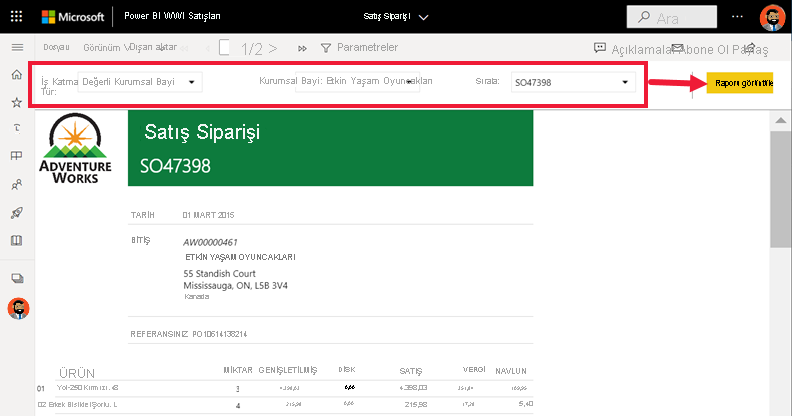

# Power BI hizmetinde sayfalandırılmış raporlar

[!INCLUDE[consumer-appliesto-yyny](../includes/consumer-appliesto-yyny.md)]

[Power BI raporlarını](end-user-reports.md) öğrendiniz ve bunlar karşılaşma olasılığınızın en yüksek olduğu rapor türleridir. Power BI raporları, araştırma ve etkileşim için iyileştirilmiştir. Farklı satış elemanlarının aynı rapordaki verileri kendi bölgelerine/sektörlerine/müşterilerine göre ayırmak ve sayılardaki değişimi görmek istedikleri bir satış raporu için Power BI raporu çok uygun olabilir.

Öte yandan *sayfalandırılmış rapor* olarak adlandırılan bir rapor türü daha vardır. Sayfalandırılmış raporları almak veya görüntülemek için Power BI Pro lisansına sahip olmanız veya raporun Premium kapasitede depolanması gerekir.  [Lisanslar hakkında bilgi edinin](end-user-license.md).  

## Sayfalandırılmış raporu tanımlama

İçerik listelerinde ve Giriş sayfanızda sayfalandırılmış raporlar simgeleriyle  tanımlanabilir.  Sayfalandırılmış rapor sizinle doğrudan veya [Power BI uygulamasının](end-user-apps.md) parçası olarak paylaşılabilir. Rapor *tasarımcısı* size izinleri verirse, sayfalandırılmış raporu yeniden paylaşabilir, kendinizi ve diğer kişileri abone yapabilirsiniz.

## Sayfalandırılmış rapor nedir?

Bu raporların *Sayfalandırılmış* olarak adlandırılmalarının nedeni, yazdırılan sayfaya düzgün yerleştirilecek şekilde biçimlendirilmiş olmalarıdır. Bunların bir avantajı, tablo birden fazla sayfaya yayılsa bile tablodaki tüm verileri gösterebilmeleridir. Sayfalandırılmış raporlar bazen "piksel düzeyinde mükemmel" olarak adlandırılır çünkü rapor *tasarımcıları* rapor sayfası düzenini tamamen denetleyebilir.

Sayfalandırılmış raporlar, üst düzeyde biçimlendirilmiş, yazdırma veya PDF oluşturma için iyileştirilmiş mükemmel çıkışlar gerektiren senaryolara çok uygundur. Kar ve zarar beyanı, büyük olasılıkla sayfalandırılmış rapor olarak görmek isteyebileceğiniz rapor türüne iyi bir örnektir.

## Sayfalandırılmış raporlar nasıl çalışır?

Rapor *tasarımcıları* sayfalandırılmış rapor oluştururken aslında bir *rapor tanımı* oluştururlar. Bu rapor tanımı, verileri içermez. Verilerin nereden alınacağını, hangi verilerin alınacağını ve verilerin nasıl görüntüleneceğini belirtir. Raporu çalıştırdığınızda, rapor işlemcisi rapor tanımını alır, verileri alır ve raporu oluşturmak için rapor düzeni ile birleştirir. Bazı durumlarda raporda varsayılan veriler görüntülenir. Diğer zamanlarda ise raporun veri görüntüleyebilmesi için önce parametreleri girmeniz gerekir. 

Power BI hizmetinde açmak için sayfalandırılmış raporu seçin. Parametreleri varsa, raporu görüntüleyebilmeniz için bunları seçmeniz gerekir.

   

Normalde etkileşimin kapsamı tam olarak bunu yani parametrelerin ayarlanmasını içerir. Faturalama analistiyseniz, sayfalandırılmış raporları kullanarak faturaları oluşturabilir ve yazdırabilirsiniz. Satış yöneticisiyseniz, sayfalandırılmış raporları kullanarak mağazaya veya satış temsilcisine göre siparişleri görüntüleyebilirsiniz. 

Bu basit sayfalandırılmış rapor, siz **Year** parametresini seçtikten sonra yıla göre karı oluşturur. 

Sayfalandırılmış raporlarla karşılaştırıldığında Power BI raporları çok daha etkileşimlidir. Power BI raporları geçici raporlamaya izin verir ve özel görseller de içinde olmak üzere çok daha fazla görsel türünü destekler.

## Sayfalandırılmış raporla etkileşim kurma

Sayfalandırılmış raporla etkileşim biçiminiz diğer raporlardan farklıdır. Yazdırma, yer işareti ekleme, dışarı aktarma ve açıklama ekleme gibi işlemler yapabilirsiniz ama etkileşim çok daha azdır. Genellikle sayfalandırılmış raporlarda rapor tuvalini doldurmak için sizin giriş yapmanız gerekir.  Diğer zamanlarda raporda varsayılan veriler görüntülenir ve farklı verileri görmek için parametreler girebilirsiniz.

### Sayfalandırılmış raporu yazdırma

*Sayfalandırılmış* raporlar güzelce bir sayfaya sığacak ve yazdırılacak şekilde biçimlendirilir. Tarayıcıda gördüğünüz sayfayla yazdırdığınızda gördüğünüz sayfa aynıdır. Artı olarak raporda uzun bir tablo varsa, tablo birden çok sayfaya yayılsa bile tablonun tamamı yazdırılır. 

Sayfalandırılmış raporlar birçok sayfadan oluşabilir. Örneğin bu raporun 563 sayfası vardır. Her biri tam olarak her fatura için bir sayfa olacak ve üst bilgiler ile alt bilgiler tekrarlanacak şekilde düzenlenmiştir. Bu raporu yazdırdığınızda faturalar arasında sayfa sonlarınız olur.

   

### Sayfalandırılmış rapora gitme

Bu satış siparişi raporunda üç parametre vardır: İşletme türü, Bayi ve Sipariş numarası. 

Görüntülenen bilgileri değiştirmek için üç parametreye yeni değerler girin ve **Raporu görüntüle**'yi seçin. Burada biz **Specialty bike shop**, **Alpine Ski House** ve **SO46085** sipariş numarasını seçtik. **Raporu görüntüle** seçildiğinde rapor tuvalimiz bu yeni satış siparişiyle yenilenir.

Yeni satış siparişi, seçtiğimiz parametrelerle görüntülenir. 

Bazı sayfalandırılmış raporlar birçok sayfadan oluşur.  Raporda gezinmek için sayfa denetimlerini kullanın. 

### Sayfalandırılmış raporu dışarı aktarma
Sayfalandırılmış raporları dışarı aktarırken PDF, Word, XML, PowerPoint ve Excel gibi daha birçok seçeneğiniz vardır. Dışarı aktarma sırasında biçimlendirme mümkün olabildiğince korunur. Örneğin Excel, Word, PowerPoint, MHTML ve PDF'ye aktarılan sayfalandırılmış raporlarda "piksel düzeyinde mükemmel" biçimlendirme korunur. 

### Sayfalandırılmış rapora abone olma
Sayfalandırılmış rapora abone olduğunuzda Power BI size ekinde raporun bulunduğu bir e-posta gönderir. Aboneliğinizi ayarlarken ne sıklıkta e-posta almak istediğinizi seçersiniz: günlük, haftalık, saatlik veya aylık. Abonelik, 25 MB boyuta kadar tüm rapor çıkışının bulunduğu bir ek içerir. Raporun tamamını dışarı aktarın veya önceden parametreleri seçin. Excel, PDF ve PowerPoint gibi daha birçok farklı ek türü arasından seçim yapın.  

## Önemli noktalar ve sorun giderme

- Sayfalandırılmış rapor, siz parametreleri ve **Raporu görüntüle**'yi seçene kadar boş gösterilebilir.

- Hiç sayfalandırılmış raporunuz yoksa, bunun nedeni kimsenin sizinle bu türde bir rapor paylaşmamış olması olabilir. Ayrıca bu, sistem yöneticinizin sizin için sayfalandırılmış raporları etkinleştirmediği anlamına da gelebilir. 

 

## Sonraki adımlar
- [Power BI raporları](end-user-reports.md)
- [Power BI’daki sayfalandırılmış raporlar: SSS](../paginated-reports/paginated-reports-faq.md)
- Başka bir sorunuz mu var? [Power BI Topluluğu](https://community.powerbi.com/)'nu deneyin.
