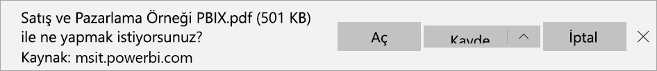

# Raporları Power BI'dan PDF’ye aktarma

[!INCLUDE[consumer-appliesto-yyny](../includes/consumer-appliesto-yyny.md)]

Power BI sayesinde raporunuzu PDF biçiminde yayımlayabilir ve kolayca Power BI raporunuzu temel alan bir belge oluşturabilirsiniz. PDF’ye aktardığınızda Power BI raporundaki her sayfa PDF belgesinde ayrı sayfalara dönüşür.

## Power BI raporunuzu PDF’ye aktarma
Power BI hizmetinde, tuval üzerinde görüntülenecek bir rapor seçin. **Giriş** sayfanızdan, **Uygulamalar**’dan veya gezinti bölmesindeki başka bir kapsayıcıdan bir rapor seçebilirsiniz.

1. Menü çubuğundan **Dışarı Aktar** > **PDF**’i seçin.

    

    Açılan menüde **Geçerli değerler**’i veya **Varsayılan değerler**’i kullanma seçeneği sunulur. **Geçerli değerler** seçeneği, raporu dilimleyici ve filtre değerlerinde yaptığınız etkin değişiklikleri içeren geçerli durumunda dışarı aktarır. Kullanıcıların çoğu bu seçeneği tercih eder. Alternatif olarak, **Varsayılan değerler** seçildiğinde rapor özgün durumunda (*tasarımcının* paylaştığı şekilde) dışarı aktarılır ve bu özgün durumda yaptığınız değişiklikleri yansıtmaz.
    
    Ayrıca, raporun gizli sekmelerinin dışarı aktarılıp aktarılmayacağını seçebileceğiniz bir onay kutusu vardır. Yalnızca tarayıcınızda görebildiğiniz rapor sekmelerini dışarı aktarmak isterseniz bu onay kutusunu seçin. Dışarı aktarma işlemine tüm gizli sekmelerin de alınmasını tercih ederseniz bu kutuyu işaretlemeden bırakabilirsiniz. Onay kutusu soluk görüntüleniyorsa raporda gizli sekme yoktur. Seçimlerinizi yaptıktan sonra devam etmek için **Dışarı Aktar**’ı seçin.
    
    Ayrıca **Yalnızca geçerli sayfayı dışarı aktar** seçeneğini işaretleyerek raporun yalnızca görüntülemekte olduğunuz sayfasını dışarı aktarabilirsiniz.  Bu seçenek varsayılan olarak işaretlenmemiş durumdadır ve raporun tüm sayfaları dışarı aktarılır.
    
    Sağ üst köşede bir ilerleme çubuğu görüntülenir. Dışarı aktarma işlemi birkaç dakika sürebilir. Rapor dışarı aktarılırken Power BI’da çalışmaya devam edebilirsiniz.

    

    Power BI hizmeti dışarı aktarma işlemini tamamladıktan sonra bildirim başlığı bunu bildirecek şekilde değişir.

2. Dosyanız artık, tarayıcınızın indirilen dosyaları görüntülediği konumda kullanılabilir. Aşağıdaki görüntüde, tarayıcı pencerenizin alt kısmında bulunan bir indirme başlığı olarak gösterilmektedir.

    

İşte bu kadar kolay. Dosyayı indirebilir ve Microsoft Edge'de sağlanan görüntüleyici gibi herhangi bir PDF görüntüleyicisiyle açabilirsiniz.

## Sınırlamalar ve önemli noktalar
**PDF’ye Aktar** özelliğiyle çalışırken dikkat edilmesi gereken bazı önemli noktalar ve sınırlamalar vardır.

* PDF, Power BI tuvalinizde görünür olan verileri ve görselleştirmeleri içerir. Görselde kaydırma çubukları varsa PDF, görseli kaydırılmamış varsayılan durumunda içerir.  
* R ve Python görselleri şu anda desteklenmemektedir. PDF’de bu görseller boştur ve bir hata raporu görüntülenir. 
* Sertifikalanmış Power BI görselleri desteklenir. Bir Power BI görselini nasıl sertifikalatacağınız dahil olmak üzere, sertifikalı Power BI görselleri hakkında daha fazla bilgi için bkz. [Power BI görsellerini sertifikalatma](../developer/visuals/power-bi-custom-visuals-certified.md). Sertifikalanmamış Power BI görselleri desteklenmez. PDF’te bunlar bir hata iletisiyle görüntülenir.
* ESRI görseli desteklenmez.
* 50 'den fazla rapor sayfası olan Power BI raporlar Şu anda verilemiyor. Sayfalandırılmış raporlarda bu sınırlama yoktur. Ayrıntılar için bkz. [sayfalandırılmış rapor yazdırma](end-user-paginated-report.md#interact-with-a-paginated-report) . 
* Boyutu 500 MB ve üzeri olan raporlar şu anda dışarı aktarılamaz. 
* Raporu PDF’e aktarma işlemi birkaç dakika sürebilir, bu nedenle sabırlı olun. Raporun yapısı ve Power BI hizmeti üzerindeki geçerli yük gibi etmenler gereken zamanı etkileyebilir.
* Power BI hizmetinde **PDF’ye aktar** menü öğesi kullanılamıyorsa bunun nedeni büyük olasılıkla Power BI yöneticisinin özelliği devre dışı bırakmış olmasıdır. Ayrıntılı bilgi için yöneticinizle iletişime geçin.
* Arka plan görüntüleri grafiğin sınırlayıcı alanına göre kırpılır. Arka plan görüntülerini PDF’e aktarmadan önce arka plan görüntülerini kaldırmanızı öneririz.
* Power BI kiracı etki alanınızın dışındaki bir kullanıcıya ait raporlar (örneğin, kuruluşunuzun dışındaki birine ait olan ve sizinle paylaşılan raporlar) PDF’te yayımlanamaz.
* Bir panoyu kuruluşunuzun dışındaki biriyle (yani Power BI kiracınızda bulunmayan bir kullanıcıyla) paylaştığınızda bu kullanıcı, paylaşılan panonun ilişkili raporlarını PDF’e aktaramaz. Örneğin, siz aaron@contoso.com iseniz cassie@northwinds.com ile paylaşımda bulunabilirsiniz. Ancak, cassie@northwinds.com ilişkili raporları PDF’e aktaramaz.
* Arka plan görüntüsü içeren raporlar PDF’e aktarıldığında **Sayfa Arka Planı** için **Normal** veya **Doldur** seçeneklerinin kullanılması durumunda dışarı aktarılan dosyada yer alan görüntü bozuk olabilir. En iyi sonucu elde etmek ve dışarı aktarılan belgenizde sorun yaşamamak için **Sığdır** seçeneğini kullanın.
* Power BI hizmeti, PDF dışa aktarma dili olarak Power BI dil ayarınızı kullanır. Dil tercihinizi görmek veya ayarlamak için dişli simgesini seçin ve  > **Ayarlar** > **Genel** > **Dil** seçeneğini belirtin.
* Şu anda dışarı aktarma için **Geçerli Değerler**’i seçtiğinizde URL filtreleri dikkate alınmaz.
* Olağan dışı sayıda özel sayfa içeren raporlar, dışarı aktarma senayolarında sorunlara neden olabilir. En iyi sonuçları almak için raporunuzda standart sayfa boyutuna geçmeyi düşünebilirsiniz.
* PDF'ye dışarı aktarırken, özel yazı tipleri bulunan temaların kullanıldığı raporlarda özel yazı tipleri yerine varsayılan yazı tipleri kullanılır.
* Tutarlı bir deneyim sağlamak istiyoruz ama Power BI hizmetinden dışarı aktarılan PDF'nin her zaman yerel Power BI Desktop dosyasından dışarı aktarılan PDF'yle eşleşeceğini garanti edemeyiz.
* PBIX raporları PDF’ye dışarı aktarılırken bunlar için mükemmel piksel uygunluk garantisi verilmez.

## Sonraki adımlar
[Rapor yazdırma](end-user-print.md)
