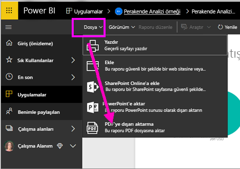
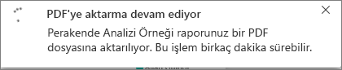
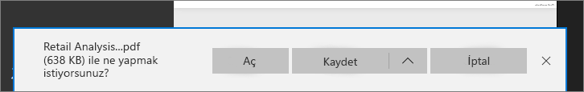

# Raporları Power BI'dan PDF’ye aktarma
Power BI sayesinde raporunuzu PDF biçiminde yayımlayabilir ve kolayca Power BI raporunuzu temel alan bir belge oluşturabilirsiniz. **PDF'ye dışarı aktardığınızda** Power BI raporundaki her sayfa PDF belgesinde ayrı sayfalara dönüşür.

## Power BI raporunuzu PDF'ye aktarma
Power BI hizmetinde, tuval üzerinde görüntülenecek bir rapor seçin. Giriş sayfanızdan, Uygulamalar’dan veya sol gezinti bölmenizdeki başka bir bölümden bir rapor seçebilirsiniz.

1. Menü çubuğundan **Dosya** > **PDF’ye aktar**’ı seçin.

    

    Bir açılan menü görüntülenir ve **Geçerli görünüm**’ü veya **Varsayılan görünüm**’ü kullanma seçeneği sağlanır.  **Geçerli görünüm** raporu geçerli durumda dışarı aktarır. Bu, dilimleyici ve filtre değerlerinde yaptığınız etkin değişiklikleri içerir.  Kullanıcıların çoğu bu seçeneği tercih eder.  Alternatif olarak, **Varsayılan görünüm** seçildiğinde rapor özgün durumunda (yazarın bunu paylaştığı şekilde) dışarı aktarılır ve bu özgün durumda yaptığınız değişiklikleri yansıtmaz.
    
    Ayrıca, raporun gizli sekmelerinin dışarı aktarılıp aktarılmayacağını seçebileceğiniz bir onay kutusu vardır.  Yalnızca tarayıcınızda görebildiğiniz rapor sekmelerini dışarı aktarmak isterseniz, bu kutuyu seçmeniz yeterlidir.  Dışarı aktarma işlemine tüm gizli sekmelerin de alınmasını tercih ederseniz, bu kutuyu işaretsiz bırakabilirsiniz.  Onay kutusu soluk görüntüleniyorsa, raporda hiç gizli sekme yoktur.  Seçimlerinizi yaptıktan sonra devam etmek için Dışarı Aktar düğmesine tıklayın.
    
    Sağ üst köşede bir ilerleme çubuğu görüntülenir. Dışarı aktarma işlemi birkaç dakika sürebilir ve rapor dışarı aktarılırken Power BI'da çalışmaya devam edebilirsiniz.

    

    İşlem tamamlandıktan sonra bildirim başlığı, Power BI hizmetinin dışarı aktarma işlemini tamamladığını belirtecek şekilde değişir.

2. Dosyanız artık, tarayıcınızın indirilen dosyaları görüntülediği konumda kullanılabilir. Aşağıdaki görüntüde, tarayıcı pencerenizin alt kısmında bulunan bir indirme başlığı olarak gösterilmektedir.

    

İşte bu kadar kolay. Dosyayı indirebilir ve Microsoft Edge'de sağlanan görüntüleyici gibi herhangi bir PDF görüntüleyicisiyle açabilirsiniz.

## Sınırlamalar ve önemli noktalar
**PDF’ye Aktar** özelliğiyle çalışırken dikkat edilmesi gereken bazı önemli noktalar ve sınırlamalar vardır.

* **R görselleri** şu anda desteklenmemektedir. PDF’de bu görseller boş olacak ve bir hata raporu görüntüleyecektir.  

* **Sertifikalanmış** **özel görseller** desteklenir. Bir özel görseli nasıl sertifikalatacağınız dahil olmak üzere, sertifikalı özel görseller hakkında daha fazla bilgi için bkz. [getting a custom visual certified (Özel görselleri sertifikalatma)](../power-bi-custom-visuals-certified.md). Sertifikalanmamış özel görseller desteklenmez. PDF’de bunlar bir hata iletisiyle görüntülenir.   

* 30'dan fazla rapor sayfası içeren raporlar şu anda dışarı aktarılamaz.

* Raporu PDF’ye aktarma işlemi birkaç dakika sürebilir, bu nedenle sabırlı olun. Raporun yapısı ve Power BI hizmeti üzerindeki geçerli yük gibi etmenler gereken zamanı etkileyebilir.

* Power BI hizmetinde **PDF'ye aktar** menü öğesi kullanılamıyorsa bunun nedeni büyük olasılıkla kiracı yöneticisinin özelliği devre dışı bırakmış olmasıdır. Ayrıntılar için kiracı yöneticinizle iletişime geçin.

* Arka plan görüntüleri grafiğin sınırlayıcı alanına göre kırpılır. PDF’ye aktarmadan önce arka plan görüntülerini kaldırmanız kesinlikle önerilir.

* Power BI kiracı etki alanınızın dışındaki bir kullanıcıya ait raporlar (örneğin, kuruluşunuzun dışındaki birine ait olan ve sizinle paylaşılan raporlar) PDF’de yayımlanamaz.

* Panoyu kuruluşunuzun dışındaki biriyle (yani Power BI kiracınızda bulunmayan bir kullanıcıyla) paylaştığınızda bu kullanıcı, paylaşılan panonun ilişkili raporlarını PDF'ye aktaramaz. Örneğin, siz aaron@contoso.com iseniz cassie@cohowinery.com ile paylaşımda bulunabilirsiniz. Ancak, cassie@cohowinery.com ilişkili raporları PDF’ye aktaramaz.

* Arka plan görüntüsü içeren raporlar PDF'ye aktarıldığında Sayfa Arka Planı için "Normal" veya "Doldur" seçeneğinin kullanılması durumunda dışarı aktarılan dosyada yer alan görüntü bozuk olabilir.  Dışarı aktarılan belgenizde sorun yaşamamak ve en iyi sonucu elde etmek için "Sığdır" seçeneğini kullanmanız önerilir.

* Power BI hizmeti, PDF dışa aktarma dili olarak Power BI dil ayarınızı kullanır. Dil tercihinizi görmek veya ayarlamak için dişli simgesini seçin ve **Ayarlar** > **Genel** > **Dil** seçeneğini belirtin.

* Şu anda dışarı aktarma için “Geçerli Değerler” seçeneği belirlendiğinde URL filtreleri dikkate alınmaz.

## Sonraki adımlar
[Rapor yazdırma](end-user-print.md)
