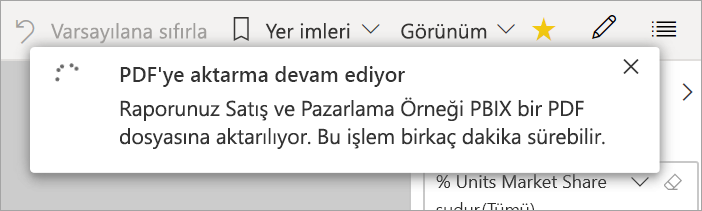

# Raporları Power BI'dan PDF’ye aktarma

[!INCLUDE [power-bi-service-new-look-include](../includes/power-bi-service-new-look-include.md)]

Power BI sayesinde raporunuzu PDF biçiminde yayımlayabilir ve kolayca Power BI raporunuzu temel alan bir belge oluşturabilirsiniz. PDF’ye aktardığınızda Power BI raporundaki her sayfa PDF belgesinde ayrı sayfalara dönüşür.

## Power BI raporunuzu PDF’ye aktarma
Power BI hizmetinde, tuval üzerinde görüntülenecek bir rapor seçin. **Giriş** sayfanızdan, **Uygulamalar**’dan veya sol gezinti bölmesindeki başka bir kapsayıcıdan da bir rapor seçebilirsiniz.

1. Menü çubuğundan **Dışarı Aktar** > **PDF**’i seçin.

    

    Açılan menüde **Geçerli değerler**’i veya **Varsayılan değerler**’i kullanma seçeneği sunulur. **Geçerli değerler** seçeneği, raporu dilimleyici ve filtre değerlerinde yaptığınız etkin değişiklikleri içeren geçerli durumunda dışarı aktarır. Kullanıcıların çoğu bu seçeneği tercih eder. Alternatif olarak, **Varsayılan değerler** seçildiğinde rapor özgün durumunda (*tasarımcının* paylaştığı şekilde) dışarı aktarılır ve bu özgün durumda yaptığınız değişiklikleri yansıtmaz.
    
    Ayrıca, raporun gizli sekmelerinin dışarı aktarılıp aktarılmayacağını seçebileceğiniz bir onay kutusu vardır. Yalnızca tarayıcınızda görebildiğiniz rapor sekmelerini dışarı aktarmak isterseniz bu onay kutusunu seçin. Dışarı aktarma işlemine tüm gizli sekmelerin de alınmasını tercih ederseniz bu kutuyu işaretlemeden bırakabilirsiniz. Onay kutusu soluk görüntüleniyorsa raporda gizli sekme yoktur. Seçimlerinizi yaptıktan sonra devam etmek için **Dışarı Aktar**’ı seçin.
    
    Sağ üst köşede bir ilerleme çubuğu görüntülenir. Dışarı aktarma işlemi birkaç dakika sürebilir. Rapor dışarı aktarılırken Power BI’da çalışmaya devam edebilirsiniz.

    

    Power BI hizmeti dışarı aktarma işlemini tamamladıktan sonra bildirim başlığı bunu bildirecek şekilde değişir.

2. Dosyanız artık, tarayıcınızın indirilen dosyaları görüntülediği konumda kullanılabilir. Aşağıdaki görüntüde, tarayıcı pencerenizin alt kısmında bulunan bir indirme başlığı olarak gösterilmektedir.

    

İşte bu kadar kolay. Dosyayı indirebilir ve Microsoft Edge'de sağlanan görüntüleyici gibi herhangi bir PDF görüntüleyicisiyle açabilirsiniz.

## Sınırlamalar ve önemli noktalar
**PDF’ye Aktar** özelliğiyle çalışırken dikkat edilmesi gereken bazı önemli noktalar ve sınırlamalar vardır.

* R görselleri şu anda desteklenmemektedir. PDF’de bu görseller boştur ve bir hata raporu görüntülenir. 
* Sertifikalanmış özel görseller desteklenir. Bir özel görseli nasıl sertifikalatacağınız dahil olmak üzere, sertifikalı özel görseller hakkında daha fazla bilgi için bkz. [Özel görselleri sertifikalatma](../power-bi-custom-visuals-certified.md). Sertifikalanmamış özel görseller desteklenmez. PDF’te bunlar bir hata iletisiyle görüntülenir. 
* 30’dan fazla rapor sayfası içeren raporlar şu anda dışarı aktarılamaz.
* Raporu PDF’e aktarma işlemi birkaç dakika sürebilir, bu nedenle sabırlı olun. Raporun yapısı ve Power BI hizmeti üzerindeki geçerli yük gibi etmenler gereken zamanı etkileyebilir.
* Power BI hizmetinde **PDF’ye aktar** menü öğesi kullanılamıyorsa bunun nedeni büyük olasılıkla kiracı yöneticisinin özelliği devre dışı bırakmış olmasıdır. Ayrıntılar için kiracı yöneticinizle iletişime geçin.
* Arka plan görüntüleri grafiğin sınırlayıcı alanına göre kırpılır. Arka plan görüntülerini PDF’e aktarmadan önce arka plan görüntülerini kaldırmanızı öneririz.
* Power BI kiracı etki alanınızın dışındaki bir kullanıcıya ait raporlar (örneğin, kuruluşunuzun dışındaki birine ait olan ve sizinle paylaşılan raporlar) PDF’te yayımlanamaz.
* Bir panoyu kuruluşunuzun dışındaki biriyle (yani Power BI kiracınızda bulunmayan bir kullanıcıyla) paylaştığınızda bu kullanıcı, paylaşılan panonun ilişkili raporlarını PDF’e aktaramaz. Örneğin, siz aaron@contoso.com iseniz cassie@cohowinery.com ile paylaşımda bulunabilirsiniz. Ancak, cassie@cohowinery.com ilişkili raporları PDF’e aktaramaz.
* Arka plan görüntüsü içeren raporlar PDF’e aktarıldığında **Sayfa Arka Planı** için **Normal** veya **Doldur** seçeneklerinin kullanılması durumunda dışarı aktarılan dosyada yer alan görüntü bozuk olabilir. En iyi sonucu elde etmek ve dışarı aktarılan belgenizde sorun yaşamamak için **Sığdır** seçeneğini kullanın.
* Power BI hizmeti, PDF dışa aktarma dili olarak Power BI dil ayarınızı kullanır. Dil tercihinizi görmek veya ayarlamak için dişli simgesini seçin ve  > **Ayarlar** > **Genel** > **Dil** seçeneğini belirtin.
* Şu anda dışarı aktarma için **Geçerli Değerler**’i seçtiğinizde URL filtreleri dikkate alınmaz.

## Sonraki adımlar
[Rapor yazdırma](end-user-print.md)
