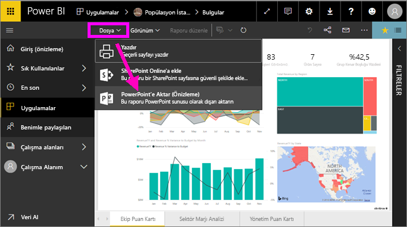
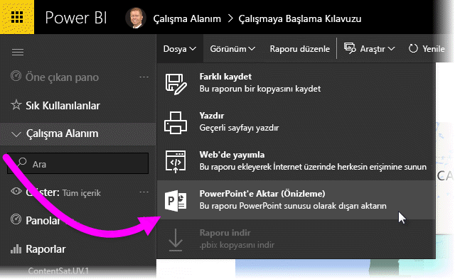
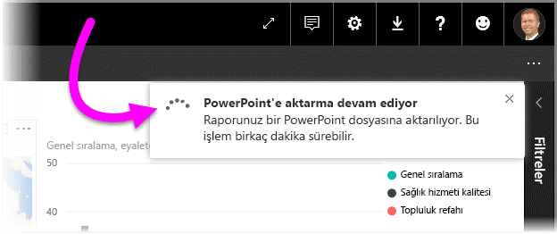
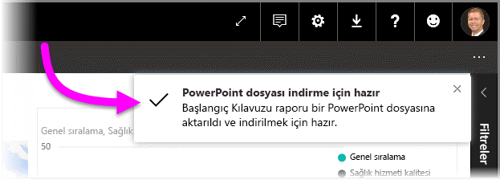
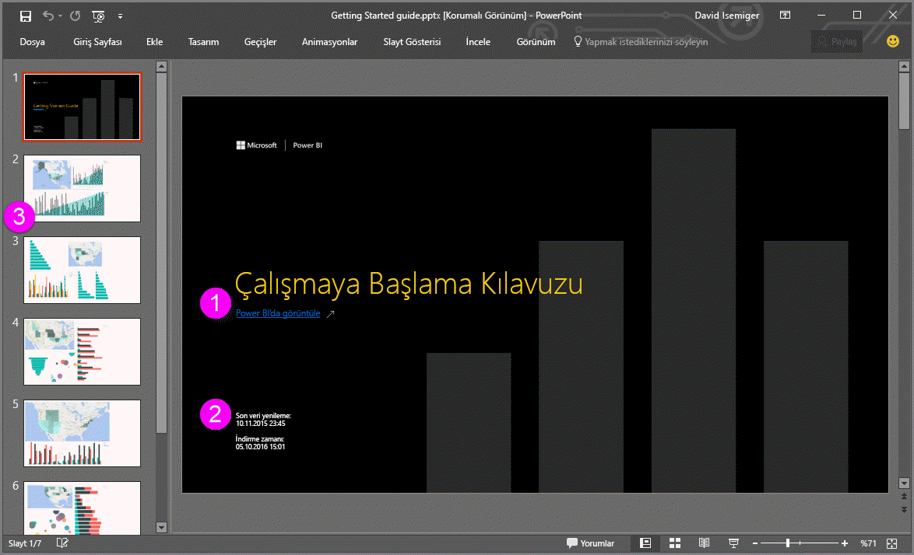
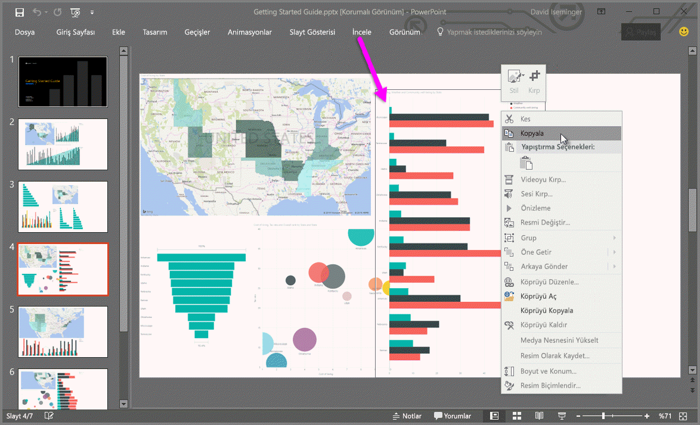

# Raporları Power BI'dan PowerPoint'e aktarma
Power BI sayesinde raporunuzu **Microsoft PowerPoint**’te yayımlayabilir ve Power BI raporunuzu temel alan bir slayt destesini kolayca oluşturabilirsiniz. **PowerPoint'e aktardığınızda**, aşağıdakiler gerçekleşir:

* Power BI raporundaki her sayfa, PowerPoint'te tek bir slayt olur
* Power BI raporundaki her sayfa, PowerPoint’te yüksek çözünürlüklü tek bir görüntü olarak dışarı aktarılır <!-- * The filters and slicers settings that you added to the report are preserved. -->
* PowerPoint'te Power BI raporuna bağlanan bir bağlantı oluşturulur 

**Power BI raporunuzu** **PowerPoint**’e hızla aktarabilirsiniz. Sonraki bölümde açıklanan adımları uygulamanız yeterlidir.

## Power BI raporunuzu PowerPoint'e aktarma
Power BI hizmetinde, tuval üzerinde görüntülenecek bir rapor seçin. **Giriş** sayfanızdan, **Uygulamalar**’dan veya sol gezinti bölmenizdeki başka bir bölümden bir rapor seçebilirsiniz.

PowerPoint’e aktarmak istediğiniz rapor tuvalde görüntülendiğinde, Power BI hizmetindeki menü çubuğundan **Dosya > PowerPoint’e aktar** seçeneğini belirleyin.

   
Bir açılan menü görüntülenir ve **Geçerli görünüm**’ü veya **Varsayılan görünüm**’ü kullanma seçeneği sağlanır.  **Geçerli görünüm** raporu geçerli durumda dışarı aktarır. Bu, dilimleyici ve filtre değerlerinde yaptığınız etkin değişiklikleri içerir.  Kullanıcıların çoğu bu seçeneği tercih eder.  Alternatif olarak, **Varsayılan görünüm** seçildiğinde rapor özgün durumda (yazarın bunu paylaştığı şekilde) dışarı aktarılır ve özgün durumda yaptığınız değişiklikleri yansıtmaz.
    
Ayrıca, raporun gizli sekmelerinin dışarı aktarılıp aktarılmayacağını seçebileceğiniz bir onay kutusu vardır.  Yalnızca tarayıcınızda görebildiğiniz rapor sekmelerini dışarı aktarmak isterseniz, bu kutuyu seçmeniz yeterlidir.  Dışarı aktarma işlemine tüm gizli sekmelerin de alınmasını tercih ederseniz, bu kutuyu işaretsiz bırakabilirsiniz.  Onay kutusu soluk görüntüleniyorsa, raporda hiç gizli sekme yoktur.  Seçimlerinizi yaptıktan sonra devam etmek için **Dışarı Aktar**’a tıklayın.

Power BI hizmeti tarayıcı penceresinin sağ üst köşesinde, raporun PowerPoint'e aktarıldığını belirten bir bildirim başlığı görürsünüz. Bu işlem birkaç dakika sürebilir ve rapor dışarı aktarılırken Power BI'da çalışmaya devam edebilirsiniz.

İşlem tamamlandıktan sonra bildirim başlığı, Power BI hizmetinin dışarı aktarma işlemini tamamladığını belirtecek şekilde değişir.

Dosyanız artık, tarayıcınızın indirilen dosyaları görüntülediği konumda kullanılabilir. Aşağıdaki görüntüde, tarayıcı pencerenizin alt kısmında bulunan bir indirme başlığı olarak gösterilmektedir.

İşte bu kadar kolay. Dosyayı indirebilir, PowerPoint ile açabilir ve ardından herhangi bir PowerPoint destesi ile aynı şekilde dosyayı değiştirebilir veya geliştirebilirsiniz.

## Dışarı aktarılan PowerPoint dosyanızı kullanıma alma
Power BI'dan aktarılan PowerPoint dosyasını açtığınızda, ilgi çekici ve kullanışlı birkaç öğeyle karşılaşırsınız. Aşağıdaki görüntüye bir göz atın, ardından bu ilgi çekici özelliklerden bazılarının açıklandığı aşağıdaki numaralı öğeleri inceleyin.

1. Slayt destesinin ilk sayfasında raporunuzun adı, ayrıca slayt destesi için temel alınan raporu **Power BI'da Görüntülemenizi** sağlayan bir bağlantı bulunur.
2. Dışarı aktarılan rapor için temel alınan *son veri yenileme* ve Power BI raporunun bir PowerPoint dosyasına aktarıldığı tarih ve saat olan *indirme zamanı* tarihi ve saati gibi raporla ilgili bazı kullanışlı bilgiler de elde edersiniz.
3. Sol gezinti bölmesinde gösterildiği gibi her rapor sayfası ayrı bir slayttır. 
4. Yayımlanan raporunuz, varsa ilgili Power BI ayarlarınıza, yoksa tarayıcınızın yerel ayarına göre seçilen dilde gösterilir. Dil tercihinizi görmek veya belirlemek için dişli simgesini  seçin ve **Ayarlar > Genel > Dil** seçeneğini belirleyin. Yerel ayarıyla ilgili bilgi için bkz. [Power BI için desteklenen diller ve ülkeler/bölgeler](../supported-languages-countries-regions.md).
5. PowerPoint sunusu, dışa aktarılan zamanın doğru saat diliminde gösterildiği bir kapak slaydı içerir.

Tek bir slayta gittiğinizde her rapor sayfasının bağımsız bir görüntü olduğunu fark edersiniz.

>[!NOTE]
> Yeni davranış doğrultusunda her rapor sayfası için bir görsel bulunur. Her görsel için bağımsız bir görüntünün sağlandığı eski davranış artık kullanılmamaktadır. 
 

Buradan sonra PowerPoint destenizle veya yüksek çözünürlüklü görüntülerden biriyle ne yapacağınız size kalmıştır!

## Sınırlamalar
**PowerPoint'e Aktar** özelliği ile çalışırken dikkat edilmesi gereken bazı önemli noktalar ve sınırlamalar vardır.

* **R görselleri** şu anda desteklenmemektedir. Bu türdeki tüm görseller, görselin desteklenmediğini belirten bir hata iletisi ile birlikte PowerPoint'e boş bir görüntü olarak aktarılır.
* **Sertifikalanmış** **özel görseller** desteklenir. Bir özel görseli nasıl sertifikalatacağınız dahil olmak üzere, sertifikalı özel görseller hakkında daha fazla bilgi için bkz. [getting a custom visual certified (Özel görselleri sertifikalatma)](../power-bi-custom-visuals-certified.md). Sertifikalatılmamış özel görseller desteklenmez ve görselin desteklenmediğini belirten bir hata iletisi ile birlikte PowerPoint'e boş bir görüntü olarak aktarılır.
* 30'dan fazla rapor sayfası içeren raporlar şu anda dışarı aktarılamaz.
* Raporu PowerPoint'e aktarma işlemi birkaç dakika sürebilir, bu nedenle lütfen sabırlı olun. Raporun yapısı ve Power BI hizmeti üzerindeki geçerli yük gibi etmenler gereken zamanı etkileyebilir.
* Power BI hizmetinde **PowerPoint'e aktar** menü öğesi kullanılamıyorsa bunun nedeni büyük olasılıkla kiracı yöneticisinin özelliği devre dışı bırakmış olmasıdır. Ayrıntılar için lütfen kiracı yöneticinizle iletişime geçin.
* Arka plan görüntüleri grafiğin sınırlayıcı alanına göre kırpılır. Arka plan görüntülerini PowerPoint'e aktarmadan önce arka plan görüntülerini kaldırmak kesinlikle önerilir.
* PowerPoint sayfaları, Power BI raporundaki özgün sayfa büyüklüklerinden veya boyutlarından bağımsız olarak her zaman standart 9:16 boyutunda oluşturulur.
* Power BI kiracı etki alanınızın dışındaki bir kullanıcıya ait raporlar (örneğin, kuruluşunuzun dışındaki birine ait olan ve sizinle paylaşılan raporlar) PowerPoint'te yayımlanamaz.
* Bir panoyu kuruluşunuzun dışındaki biriyle (yani Power BI kiracınızda bulunmayan bir kullanıcıyla) paylaştığınızda bu kullanıcı, paylaşılan panonun ilişkili raporlarını PowerPoint'e aktaramaz. Örneğin, siz aaron@contoso.com iseniz david@cohowinery.com ile paylaşımda bulunabilirsiniz. Ancak, david@cohowinery.com ilişkili raporları PowerPoint'e aktaramaz.
* Daha önce belirtildiği gibi, her rapor sayfası PowerPoint dosyasına tek bir görüntü olarak aktarılır.
* Power BI hizmeti, PowerPoint dışa aktarma dili olarak Power BI dil ayarınızı kullanır. Dil tercihinizi görmek veya belirlemek için dişli simgesini  seçin ve **Ayarlar > Genel > Dil** seçeneğini belirleyin.
* Dışa aktarılan PowerPoint dosyasının kapak slaydında görünen **İndirme saati**, bilgisayarınızın saat diliminde dışa aktarma işleminin saatine ayarlanır.

## Sonraki adımlar
[Rapor yazdırma](end-user-print.md)
