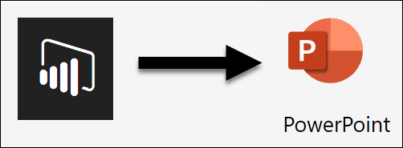
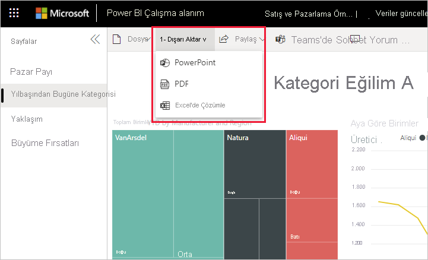

# Raporları Power BI'dan PowerPoint'e aktarma

[!INCLUDE[consumer-appliesto-yyny](../includes/consumer-appliesto-yyny.md)]

[!INCLUDE [power-bi-service-new-look-include](../includes/power-bi-service-new-look-include.md)]

Power BI hizmetiyle (app.powerbi.com) raporunuzu Microsoft PowerPoint’te yayımlayabilir ve Power BI raporunuzu temel alan bir slayt destesini kolayca oluşturabilirsiniz. PowerPoint’e aktardığınızda aşağıdakiler gerçekleşir:

* Power BI raporundaki her sayfa, PowerPoint’te tek bir slayt olur.
* Power BI raporundaki her sayfa, PowerPoint’te yüksek çözünürlüklü tek bir görüntü olarak dışarı aktarılır.
* Rapora eklediğiniz filtre ve dilimleyici ayarlarını koruyabilirsiniz.
* PowerPoint’te Power BI raporuna bağlanan bir bağlantı oluşturulur.

**Power BI raporunuzu** **PowerPoint**’e hızla aktarabilirsiniz. Sonraki bölümde açıklanan adımları uygulayın.

Ayrıca belirli görselleri Power BI hizmetinden kopyalayabilir ve PowerPoint’e yapıştırabilirsiniz. **Resim olarak kopyala** simgesini seçerek görseli panonuza kopyalayın. Ardından PowerPoint’i açın ve görseli yapıştırın.

## Power BI raporunuzu PowerPoint’e aktarma
**Power BI hizmetinde**, tuval üzerinde görüntülenecek bir rapor seçin. **Giriş**'ten, **Uygulamalar**’dan veya gezinti bölmesindeki başka bir kapsayıcıdan bir rapor seçebilirsiniz.

PowerPoint’e aktarmak istediğiniz rapor tuvalde görüntülendiğinde menü çubuğundan **Dışarı Aktar** > **PowerPoint** seçeneğini belirleyin.

Açılan menüde **Geçerli değerler**’i veya **Varsayılan değerler**’i kullanma seçeneği sunulur. **Geçerli değerler** seçeneği, raporu dilimleyici ve filtre değerlerinde yaptığınız etkin değişiklikleri içeren geçerli durumunda dışarı aktarır. Kullanıcıların çoğu bu seçeneği tercih eder. Alternatif olarak, **Varsayılan değerler** seçildiğinde rapor özgün durumda (*tasarımcının* paylaştığı şekilde) dışarı aktarılır ve özgün durumda yaptığınız değişiklikleri yansıtmaz.

> [!NOTE]
> **Geçerli değerler** görsellerin kaydırma durumunu içermez.

 
Ayrıca, raporun gizli sekmelerinin dışarı aktarılıp aktarılmayacağını seçebileceğiniz bir onay kutusu vardır. Yalnızca tarayıcınızda görebildiğiniz rapor sekmelerini dışarı aktarmak isterseniz bu onay kutusunu seçin. Dışarı aktarma işlemine tüm gizli sekmelerin de alınmasını tercih ederseniz bu kutuyu işaretlemeden bırakın. Onay kutusu soluk görüntüleniyorsa raporda gizli sekme yoktur. Gizli sekmeye örnek olarak bir araç ipucu sekmesi verilebilir. [Özel araç ipuçları](../desktop-tooltips.md) rapor *tasarımcıları* tarafından oluşturulur ve Power BI hizmetinde *tüketiciler* için rapor sekmeleri olarak görüntülenmez. 

Seçimlerinizi yaptıktan sonra devam etmek için **Dışarı Aktar**’ı seçin. Power BI hizmeti tarayıcı penceresinin sağ üst köşesinde, raporun PowerPoint’e aktarıldığını belirten bir bildirim başlığı görürsünüz. Dışarı aktarma işlemi birkaç dakika sürebilir. Rapor dışarı aktarılırken Power BI’da çalışmaya devam edebilirsiniz.

Power BI hizmeti dışarı aktarma işlemini tamamladıktan sonra bildirim başlığı bunu bildirecek şekilde değişir. Dosyanız artık, tarayıcınızın indirilen dosyaları görüntülediği konumda kullanılabilir. Aşağıdaki görüntüde, tarayıcı pencerenizin alt kısmında bulunan bir indirme başlığı olarak gösterilmektedir.

İşte bu kadar kolay. Dosyayı indirebilir, PowerPoint ile açabilir ve ardından herhangi bir PowerPoint destesi ile aynı şekilde dosyayı değiştirebilir veya geliştirebilirsiniz.

## Dışarı aktarılan PowerPoint dosyanızı kullanıma alma
Power BI'dan aktarılan PowerPoint dosyasını açtığınızda, ilgi çekici ve kullanışlı birkaç öğeyle karşılaşırsınız. Aşağıdaki görüntüye bir göz atın ve bu ilgi çekici özelliklerden bazılarının açıklandığı numaralı maddeleri inceleyin.

1. Slayt destesinin ilk sayfasında raporunuzun adı ve ayrıca slayt destesi için temel alınan raporu **Power BI’da Görüntülemenizi** sağlayan bir bağlantı bulunur.
2. Raporla ilgili bazı yararlı bilgiler de bulabilirsiniz. **Son veri yenileme**, dışarı aktarılan raporun temel aldığı tarih ve saati gösterir. **İndirme zamanı**, Power BI raporunun bir PowerPoint dosyasına aktarıldığı tarih ve saati gösterir.
3. Gezinti bölmesinde gösterildiği gibi her rapor sayfası ayrı bir slayttır. 
4. Yayımlanan raporunuz, varsa ilgili Power BI ayarlarınıza, yoksa tarayıcınızın yerel ayarına göre seçilen dilde gösterilir. Dil tercihinizi görmek veya ayarlamak için dişli simgesini seçin ve  > **Ayarlar** > **Genel** > **Dil** seçeneğini belirtin. Yerel ayar bilgileri için bkz. [Power BI için desteklenen diller ve ülkeler veya bölgeler](../supported-languages-countries-regions.md).

Tek bir slayta gittiğinizde her rapor sayfasının bağımsız bir görüntü olduğunu görürsünüz.

Buradan sonra PowerPoint destenizle veya yüksek çözünürlüklü görüntülerden biriyle ne yapacağınız size kalmıştır.

## Önemli noktalar ve sorun giderme
**PowerPoint’e Aktar** özelliği ile çalışırken dikkat edilmesi gereken bazı önemli noktalar ve sınırlamalar vardır.

* Raporu PowerPoint’e aktarma işlemi birkaç dakika sürebilir, bu nedenle sabırlı olun. Raporun yapısı ve Power BI hizmeti üzerindeki geçerli yük gibi etmenler gereken zamanı etkileyebilir.
* Sertifikalanmış Power BI görselleri desteklenir. Bir özel görseli nasıl sertifikalatacağınız dahil olmak üzere, sertifikalı özel görseller hakkında daha fazla bilgi için bkz. [Özel görselleri sertifikalatma](../developer/power-bi-custom-visuals-certified.md). Sertifikalanmamış özel görseller desteklenmez. Bu tür görseller, görselin desteklenmediğini belirten bir hata iletisi ile birlikte PowerPoint’e boş bir görüntü olarak aktarılır.
* Şu anda dışarı aktarma için **Geçerli Değerler**’i seçtiğinizde URL filtreleri dikkate alınmaz.
* [ESRI ArcGIS görseli](../visuals/power-bi-visualizations-arcgis.md) desteklenmiyor
* 30'dan fazla rapor sayfası içeren raporlar şu anda dışarı aktarılamaz.
* Kaydırma çubukları olan görseller varsayılan durumlarında dışarı aktarılır. Görsel PowerPoint'te verilerin yalnızca üst bölümünü gösterir. PowerPoint'te her slayt bir resim olduğundan kaydırma kullanılamaz. 
* Power BI hizmetinde **PowerPoint’e Aktar** menü öğesi kullanılamıyorsa bunun nedeni büyük olasılıkla kiracı yöneticisinin özelliği devre dışı bırakmış olmasıdır. Ayrıntılar için kiracı yöneticinizle iletişime geçin.
* Arka plan görüntüleri grafiğin sınırlayıcı alanına göre kırpılır. Raporu PowerPoint’e aktarmadan önce arka plan görüntülerini kaldırmanızı öneririz.
* PowerPoint sayfaları, Power BI raporundaki özgün sayfa büyüklüklerinden veya boyutlarından bağımsız olarak her zaman standart 9:16 boyutunda oluşturulur.
* Power BI kiracı etki alanınızın dışındaki bir kullanıcıya ait raporlar (örneğin, kuruluşunuzun dışındaki birine ait olan ve sizinle paylaşılan raporlar) PowerPoint’te yayımlanamaz.
* Bir panoyu kuruluşunuzun dışındaki biriyle (yani Power BI kiracınızda bulunmayan bir kullanıcıyla) paylaştığınızda bu kullanıcı, paylaşılan panonun ilişkili raporlarını PowerPoint’e aktaramaz. Örneğin, siz aaron@contoso.com iseniz david@cohowinery.com ile paylaşımda bulunabilirsiniz. Ancak david@cohowinery.com, ilişkili raporları PowerPoint’e aktaramaz.
* Dışarı aktarma, PowerPoint’in eski sürümleriyle çalışmayabilir.
* Daha önce belirtildiği gibi, her rapor sayfası PowerPoint dosyasına tek bir görüntü olarak aktarılır.
* Power BI hizmeti, PowerPoint dışa aktarma dili olarak Power BI dil ayarınızı kullanır. Dil tercihinizi görmek veya ayarlamak için dişli simgesini seçin ve  > **Ayarlar** > **Genel** > **Dil** seçeneğini belirtin.
* Dışa aktarılan PowerPoint dosyasının kapak slaydında görünen **İndirme saati**, bilgisayarınızın saat diliminde dışa aktarma işleminin saatine ayarlanır.
* PPTX'e dışarı aktarırken, özel yazı tipleri bulunan temaların kullanıldığı raporlarda özel yazı tipleri yerine varsayılan yazı tipleri kullanılır.
* R ve Python kullanılarak oluşturulmuş olan görseller şu anda desteklenmemektedir. Bu türdeki tüm görseller, görselin desteklenmediğini belirten bir hata iletisi ile birlikte PowerPoint’e boş bir görüntü olarak aktarılır.

## Sonraki adımlar
[Görselleri statik resim olarak kopyalama](../power-bi-visualization-copy-paste.md)    
[Rapor yazdırma](end-user-print.md)
