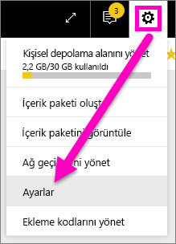
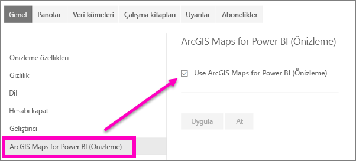

# Power BI hizmetinin önizleme özelliklerini kullanma
## *Önizleme özellikleri* nedir?
Power BI hizmetini geliştirmeye devam ederken yeni işlevlerin bazılarını *önizleme özellikleri* olarak kullanıma sunarız. Önizleme özelliklerini etkinleştirebilir veya devre dışı bırakabilir ve dilediğiniz gibi deneyebilirsiniz.

> [!TIP]
> Önizleme özellikleri Power BI Desktop ile de kullanılabilir. Daha fazla bilgi için [Power BI Desktop topluluk forumunu ziyaret edin](https://community.powerbi.com/t5/Desktop/bd-p/power-bi-designer).
> 
> 

## Önizlemeleri bulma ve açma (ve kapatma)
1. Power BI ekranınızın sağ üst köşesindeki dişli simgesini ve ardından **Ayarlar**'ı seçerek Ayarlar menüsünü açın.
   
   geçin.
2. **Genel** sekmesini seçin. Önizleme varsa **Önizleme özellikleri** seçeneği veya sol tarafta listelenen önizleme özelliğini görürsünüz.  Bu örnekte ArcGIS Maps için listelenen bir önizleme mevcuttur. 
   
   
3. Yeni deneyimi görmek için **Açık** radyo düğmesini seçin veya onay kutusunu işaretleyin. Ardından **Uygula**'yı seçin.
4. Önizleme özelliklerini kapatmak için yukarıdaki 1-3 arası adımları izleyin ve 3. adımda **Kapalı**'yı seçin veya onay işaretini kaldırın ve **Uygula**'yı seçin.

Sorularınız veya geri bildiriminiz mi var? [Power BI topluluk forumunu ziyaret edin](http://community.powerbi.com/t5/Navigation-Preview-Forum/bd-p/NavigationPreview).

