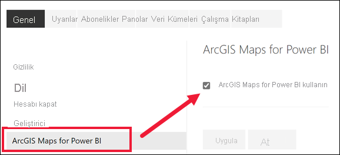

# Power BI hizmetinin önizleme özelliklerini kullanmayı kabul etme

[!INCLUDE[consumer-appliesto-yynn](../includes/consumer-appliesto-yynn.md)]

## *Önizleme özellikleri* nedir?
Power BI hizmetini geliştirmeye devam ederken bazı yeni işlevleri, *önizleme özellikleri* olarak kullanıma sunarız. Önizleme özelliklerini etkinleştirebilir veya devre dışı bırakabilir ve dilediğiniz gibi deneyebilirsiniz.

Bazı önizleme özellikleri Power BI panonuzdan, Giriş'ten veya raporun kendisinden açılabilir ve kapatılabilir. **Yeni görünüm** önizleme özelliği Giriş, raporlar ve panoların üzerinde görüntülenen Power BI menü çubuğundan açılıp kapatılabilir. 

   

Bu arada diğer önizleme özellikleri *Ayarlar* menünüzden kullanıma sunulur. Bu makalede size Ayarlar menüsü aracılığıyla önizleme özelliklerine nasıl erişebileceğiniz gösterilir.

## Önizlemeleri bulma ve açma (ve kapatma)
1. Power BI ekranınızın sağ üst köşesindeki dişli simgesini ve ardından **Ayarlar**’ı seçerek Ayarlar menüsünü açın.
   
   .
2. **Genel** sekmesini seçin. Önizleme varsa **Önizleme özellikleri** seçeneği veya sol tarafta listelenen önizleme özelliğini görürsünüz.  Bu örnekte ArcGIS Maps için listelenen bir önizleme mevcuttur. 
   
   
3. Yeni deneyimi görmek için **Açık** radyo düğmesini seçin veya onay kutusunu işaretleyin. Sonra **Uygula**'yı seçin.
4. Önizleme özelliklerini kapatmak için yukarıdaki 1-3 arası adımları izleyip 3. adımda **Kapalı**'yı seçin veya onay işaretini kaldırıp **Uygula**'yı seçin.

Sorularınız veya geri bildiriminiz mi var? [Power BI topluluk forumunu ziyaret edin](https://community.powerbi.com/t5/Navigation-Preview-Forum/bd-p/NavigationPreview).

