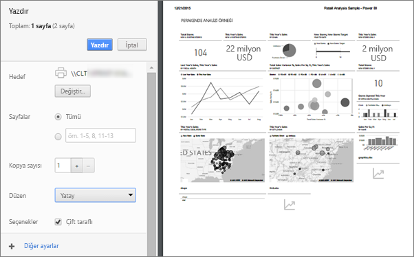

# Power BI hizmetinden yazdırma
Power BI hizmetinden bir panonun tamamını, bir Pano kutucuğunu, bir rapor sayfasını veya rapor görselini yazdırın. Raporlar yalnızca sayfa sayfa yazdırılabilir; tek seferde raporun tamamını yazdıramazsınız.

   > [!NOTE]
   > Göreceğiniz yazdırma iletişim kutusu, kullandığınız tarayıcıya göre değişir.
   > 
## Pano yazdırma
1. Yazdırmak istediğiniz panoyu açın.
2. Üst sol üst köşedeki dışarı aktarma seçip **bu sayfayı yazdırmanız**.
   
    
3. Tarayıcınızın Yazdır penceresi açılır. Ayarları ve yazdırma hedefini seçip **Yazdır** seçeneğini belirleyin.
   

   
    

## Pano kutucuğu yazdırma
1. Panoda açın [tam ekran modu](end-user-focus.md) tam ekran simgesini seçerek  üst menü çubuğundan.
3. [Kutucuğu odak modunda açmak](end-user-focus.md) üç nokta (...) açığa çıkarmak için vurgulama ve seçerek **odak modunda Aç** veya odak simgesini .
   
    
4. Seçenekler menüsünün gösterilmesi için kutucuğun üzerine gelin.
   
    
4. Yazdır simgesini  seçin.     
   

## Rapor sayfası yazdırma
Tek seferde yalnızca bir rapor sayfası yazdırılabilir.

1. Seçin ve raporu açın **dışarı** > **yazdırma** geçerli rapor sayfasını yazdırma.
   
    
3. Tarayıcınızın Yazdır penceresi açılır.
   

## Rapor görseli yazdırma
1. [Görseli Odak modunda açmak](end-user-focus.md) için kutucuğun üzerine gelin ve sağ üst köşedeki Odak simgesini  seçin.

2. Sol üst köşesinden seçin **dışarı** > **yazdırma** görsel yazdırmak için.

    

## Önemli noktalar ve sorun giderme

* S: Tüm rapor sayfalarını tek seferde yazdıramıyorum.    
* Y: Doğru. Rapor sayfaları yalnızca tek tek yazdırılabilir.
* S: PDF olarak yazdıramıyorum.    
* Y: Bu seçeneği yalnızca tarayıcınızda PDF sürücüsünü yapılandırmış olmanız durumunda görürsünüz.    
* S: **Yazdır** seçeneğini belirlediğimde görüntülediğim ekran burada gösterilen ile aynı değil.    
* Y: Yazdır ekranları, tarayıcı ve yazılım sürümüne göre değişiklik gösterir.
* S: Çıktım doğru ölçeklendirilmemiş.  Panom sayfaya sığmıyor. Ölçeklendirme ve yönlendirme ile ilgili diğer sorular.    
* Y: Power BI hizmetinde göründüğü gibi yazdırılan kopyanın içeriğin tam olarak aynı olacağını garanti edemez. Ölçeklendirme, kenar boşlukları, görsel ayrıntıları, yönlendirme ve boyut gibi konular Power BI tarafından denetlenmez. Bu gibi sorunlarla ilgili yardım almak için, kullandığınız tarayıcıya yönelik belgelere göz atın.      

## Sonraki adımlar
[İş arkadaşlarınızla ve diğer kişilerle pano ve rapor paylaşma](../service-share-dashboards.md)

Başka bir sorunuz mu var? [Power BI Topluluğu'na başvurun](http://community.powerbi.com/)

