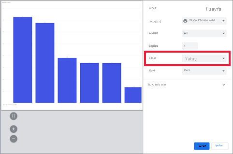
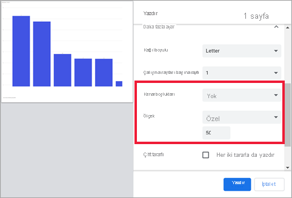
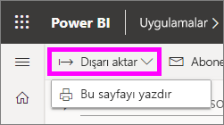
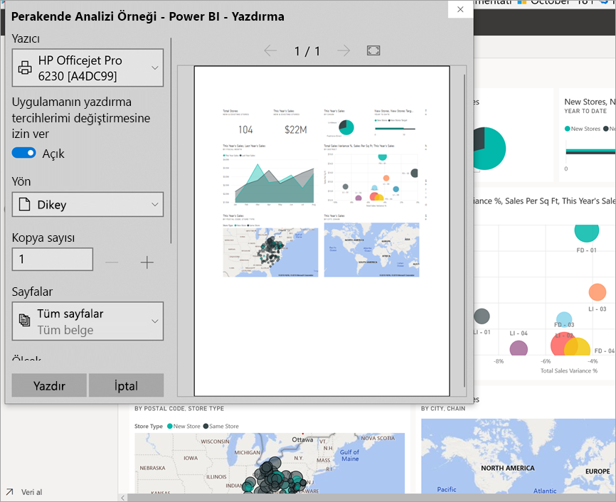
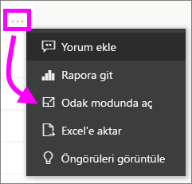
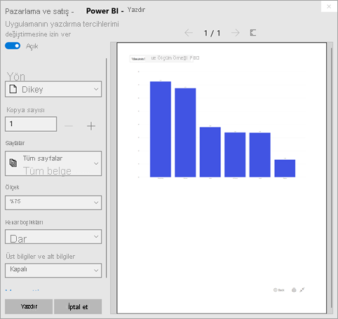
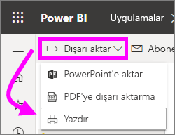

# Power BI hizmetinden yazdırma

[!INCLUDE[consumer-appliesto-yynn](../includes/consumer-appliesto-yynn.md)]
## Neler yazdırılabilir?
[!INCLUDE [power-bi-service-new-look-include](../includes/power-bi-service-new-look-include.md)]

Power BI hizmetinden bir panonun tamamını, pano kutucuğunu, rapor sayfasını veya rapor görselini yazdırın. Raporunuzun birden çok sayfası varsa her sayfayı ayrı yazdırmanız gerekir. 

## Yazdırma işleminde dikkat edilmesi gerekenler

Çoğu Power BI panosu ve raporu, rapor *tasarımcıları* tarafından çevrimiçi ortamda kullanılacak ve çeşitli cihazlarda görüntülendiğinde harika görünecek şekilde oluşturulur. Raporu yazdırdığınızda, bu içeriğin kağıt üzerinde nasıl görüneceği tarayıcınız tarafından denetlenir. 

Basılı çıktıyı ayarlamak için kullanabileceğiniz tarayıcı ayarları vardır ama bunlarla birlikte bile istediğiniz sonucu elde edemeyebilirsiniz. Önce [PDF'ye dışarı aktarmayı](end-user-pdf.md) ve PDF'yi yazdırmayı göz önünde bulundurun. 

## Tarayıcınızın yazdırma ayarlarını belirleme
Power BI'dan yazdırdığınızda tarayıcınız bir Yazdırma penceresi açar. Her tarayıcının Yazdırma penceresi diğerlerinden farklıdır. Ama hepsinde basılı çıktınızın görünümünü denetlemek için size benzer seçenekler sağlandığını fark edeceksiniz. 

Burada basılı çıktınızı biçimlendirmek için kullanabileceğiniz birkaç hızlı ipucu verilmiştir.

   > 
1. Panonuzun, raporunuzun veya görselinizin genişliği yüksekliğinden fazlaysa **Yatay** düzeni kullanmayı düşünün. 

   

2. Basılı sayfaya daha fazla içerik sığdırmak için kenar boşluğu ve ölçek gibi öğeleri ayarlayın. 

    

İstediğiniz görünümü elde edene kadar kendi tarayıcınızın ayarlarıyla denemeler yapın. Bazı tarayıcılarda arka plan grafiklerini yazdırma seçenekleri bile vardır. 

## Pano yazdırma
1. Yazdırmak istediğiniz panoyu açın.
2. Sol üst köşede Dışarı Aktar’ı seçip **Bu sayfayı yazdır** seçeneğini belirleyin.
   
    

3. Tarayıcınızın Yazdır penceresi açılır. Ayarları seçin. Örneğin panonuzun genişliği uzunluğundan fazlaysa, düzeni **Yatay** olarak değiştirmek isteyebilirsiniz. **Yazdır**'ı seçin.
   
    

## Pano kutucuğu yazdırma
1. Üst menü çubuğundan tam ekran simgesini  seçerek panoyu [tam ekran modunda](end-user-focus.md) açın.

3. **Diğer seçenekler**’in (...) üzerine gelip **Odak modunda aç** seçeneğini veya odak simgesini  seçerek [Kutucuğu odak modunda açın](end-user-focus.md).
   
    

4. Seçenekler menüsünün gösterilmesi için kutucuğun üzerine gelin.
   
    

4. Yazdır simgesini seçin .     

5. Tarayıcınızın Yazdır penceresi açılır. Ayarları seçin. Örneğin kutucuğunuz sayfaya sığmıyorsa ölçeği %75 olarak değiştirmek isteyebilirsiniz. **Yazdır**'ı seçin.

     

> [!TIP]
> Bu adımların tümünü izlediyseniz ve kutucuğunuz hala istediğiniz gibi görüntülenmiyorsa aşağıdakini deneyin.
> 1. Yazdır penceresini açın ve yazdırma ayarlarında en iyi basılı çıktıyı vereceğine inandığınız değişiklikleri yapın. Örneğin düzeni, kenar boşluklarını ve ölçeği değiştirin. 
> 2. Ama, yazdırmak yerine **İptal**'i seçin. 
> 3. 1-5 arasındaki adımları yeniden izleyin. Kutucuğunuz yeni Yazdır penceresi ayarlarına uydurulur ve yazdırmaya hazır olur.

## Rapor sayfası yazdırma
Tek seferde yalnızca bir rapor sayfası yazdırılabilir.

1. Geçerli rapor sayfasını yazdırmak için raporu açıp **Dışarı aktar** > **Yazdır** seçeneğini belirleyin.
   
    
2. Tarayıcınızın Yazdır penceresi açılır.

3. Yukarıdaki **Pano yazdırma** altında verilen yazdırma adımlarını izleyin.
   

## Rapor görseli yazdırma
1. [Görseli Odak modunda açmak](end-user-focus.md) için kutucuğun üzerine gelin ve sağ üst köşedeki Odak simgesini  seçin.

2. Görseli yazdırmak için sol üst köşedeki **Dışarı aktar** > **Yazdır** seçeneğini belirleyin.

    

3. Yukarıdaki **Pano yazdırma** altında verilen yazdırma adımlarını izleyin.

## Önemli noktalar ve sorun giderme

* S: Tüm rapor sayfalarını tek seferde yazdıramıyorum.    
* Y: Doğru. Rapor sayfaları yalnızca tek tek yazdırılabilir.
* S: PDF olarak yazdıramıyorum.    
* Y: Bu seçeneği yalnızca tarayıcınızda PDF sürücüsünü yapılandırmış olmanız durumunda görürsünüz.    
* S: **Yazdır** seçeneğini belirlediğimde görüntülediğim ekran burada gösterilen ile aynı değil.    
* Y: Yazdır ekranları, tarayıcı ve yazılım sürümüne göre değişiklik gösterir.
* S: Çıktım doğru ölçeklendirilmemiş.  Panom sayfaya sığmıyor. Ölçeklendirme ve yönlendirme ile ilgili diğer sorular.    
* Y: Yazdırılan kopyanın Power BI hizmetinde göründüğü haliyle aynı olacağını garanti edemeyiz. Ölçeklendirme, kenar boşlukları, görsel ayrıntıları, yönlendirme ve boyut gibi konular Power BI tarafından denetlenmez. Tarayıcınız için yazdırma ayarlarını belirlemeyi deneyin. Yukarıda önerdiklerimizden bazıları sayfa yönlendirmesi (dikey veya yatay), kenar boşluğu boyutu ve ölçektir. Bunlar işe yaramazsa kullandığınız tarayıcıya yönelik belgelere göz atın.      
* S: Tam ekran modundan yazdırırken görselin üzerine geldiğimde yazdırma seçeneğini görmüyorum.   
* Y: Varsayılan görünümde panoya veya rapora dönün, görseli Odak modunda ve sonra da Tam ekran modunda yeniden açın. 

## Sonraki adımlar
[İş arkadaşlarınızla ve diğer kişilerle pano ve rapor paylaşma](../collaborate-share/service-share-dashboards.md)

Başka bir sorunuz mu var? [Power BI Topluluğu'na başvurun](https://community.powerbi.com/)
