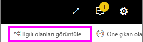
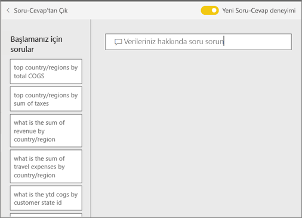

# Power BI **tüketicileri** için Soru-Cevap
## Soru-Cevap nedir?
Bazen verilerinize ilişkin cevaplar edinmenin en hızlı yolu doğal dil kullanarak bir soru sormaktır. Örneğin, "What were total sales last year?" (Bu yılki toplam satış rakamları nedir?)

Kullanımı kolay olan doğal dil özelliklerinden yararlanarak verilerinizi araştırmak ve grafikler ile graflar biçiminde cevaplar almak için Soru-Cevap'ı kullanın. Bir arama motorundan farklı olan Soru-Cevap, yalnızca Power BI'daki verilerle ilgili sonuçlar sunar.

**Power BI Soru-Cevap**, Pro veya Premium lisansla sunulur.  [Power BI mobil uygulamalarında Soru-Cevap](mobile/mobile-apps-ios-qna.md) ve [Power BI Embedded’da Soru-Cevap](../developer/qanda.md) konuları ayrı makalelerde ele alınmıştır. Şu anda **Power BI Soru-Cevap** yalnızca İngilizce sorulan doğal dil sorgularını destekler ancak Power BI yöneticiniz tarafından etkinleştirilebilecek olan bir İspanyolca önizleme sürümü vardır.

Soruyu sormak yalnızca bir başlangıçtır.  Sorunuzu daraltarak veya genişleterek, dikkate değer yeni bilgiler keşfederek, ayrıntılara yoğunlaşarak ve daha geniş bir görünüm elde etmek için uzaklaştırarak verilerinizde yaptığınız yolculuğun tadını çıkarın. Edindiğiniz öngörülere ve yaptığınız keşiflere inanamayacaksınız.

Bu, gerçekten etkileşimli ve hızlı bir deneyim. Bellek içi bir depolama birimi sayesinde neredeyse anında cevap alırsınız.

## Soru-Cevap özelliğini nerede kullanabilirim?
Soru-Cevap özelliğini Power BI hizmetindeki panolarda ve Power BI mobilde panonun en altında bulabilirsiniz. Panonun tasarımcısı size düzenleme izinleri vermediyse verileri araştırmak için Soru-Cevap özelliğini kullanabilirsiniz ancak Soru-Cevap ile oluşturulan görselleştirmeleri kaydedemezsiniz.

## Power BI hizmetindeki bir panoda Soru-Cevap özelliğini kullanma
Power BI hizmetinde (app.powerbi.com) panolar, bir veya daha fazla veri kümesinden sabitlenmiş kutucuklar içerir. Bu nedenle, bu veri kümelerinde bulunan tüm verilerle ilgili sorular sorabilirsiniz. Panonun oluşturulması için hangi raporların ve veri kümelerinin kullanıldığını görmek üzere menü çubuğundan **İlişkilileri görüntüle**'yi seçin.

## Nereden başlayabilirim?
Öncelikle içerikle ilgili bilgi edinin. Panodaki ve rapordaki görselleri gözden geçirin. Kullanabileceğiniz veri türünü ve aralığını inceleyin. 

Örnek:

* Bir görselin eksen etiketlerinde ve değerlerinde "sales", "account", "month" ve "opportunities" yazıyorsa rahatlıkla şöyle sorular sorabilirsiniz: "Which *account* has the highest *opportunity*, or show *sales* by month as a bar chart."

* Google Analytics'te web sitesi performans verileri varsa Soru-Cevap özelliğine web sayfasında geçirilen süreyi, benzersiz sayfa ziyareti sayısını ve kullanıcı etkileşim oranlarını sorabilirsiniz. Demografik verileri sorguluyorsanız yaş ve konuma göre hane geliriyle ilgili sorular sorabilirsiniz.

Verileri tanıdıktan sonra panoya dönün ve imlecinizi soru kutusuna yerleştirin. Soru-Cevap ekranı açılır.

 

Soru-Cevap özelliği, yazmaya başlamadan önce sorunuzu oluşturmanıza yardımcı olacak önerilerin bulunduğu yeni bir ekran görüntüler. Temel alınan veri kümelerinde adları içeren ifade ve soruları görürsünüz ve veri kümesi sahibi tarafından oluşturulan *öne çıkan** soruları da görüntüleyebilirsiniz.

Bunlardan herhangi birini seçerek soru kutusuna ekleyebilir ve belirli bir yanıtı bulmak için bunlardan faydalanabilirsiniz. 

Soru-Cevap özelliği ayrıca istemler, otomatik tamamlama ve görsel ipuçları ile de soru sormanıza yardımcı olur. 

 

### Soru-Cevap hangi görselleştirmeleri kullanır?
Soru-Cevap görüntülenen verilere en uygun görselleştirmeyi seçer. Bazen temel alınan veri kümeleri belirli bir tür veya kategoride tanımlanmış olur ve bu durum Soru-Cevap özelliğine ilgili verileri görüntüleme konusunda yardımcı olur. Örneğin, verilerin türü tarih olarak tanımlanmışsa çizgi grafik olarak görüntülenme olasılığı yüksektir. Kategorisi şehir olarak belirlenmiş veriler ise genelde harita olarak görüntülenir.

Sorunuza görselin türünü ekleyerek Soru-Cevap özelliğinin o türü kullanmasını sağlayabilirsiniz. Ancak Soru-Cevap özelliğinin, verileri her zaman istediğiniz görsel türünde görüntülemesinin mümkün olmayacağını unutmayın. Soru-Cevap, çalışabileceğiniz görsel türlerini listesini gösterir.

## Önemli noktalar ve sorun giderme
**Soru**: Panoda Soru-Cevap özelliğini göremiyorum.    
**Yanıt 1:** Soru kutusu görmüyorsanız öncelikle ayarlarınızı kontrol edin. Bunun için Power BI araç çubuğunuzun sağ üst köşesindeki dişli simgesini seçin.   

Ardından **Ayarlar** > **Panolar**'ı seçin. **Soru-Cevap arama kutusunu bu panoda göster** seçeneğinin yanında onay işareti bulunduğundan emin olun.    
  

**Yanıt 2**: Bazen pano *tasarımcısı* veya yöneticiniz Soru-Cevap özelliğini kapatabilir. Bu kişilerle iletişime geçerek özelliği açmalarının mümkün olup olmadığını sorabilirsiniz.   

**Soru**: Bir soru yazdığımda beklediğim sonuçları alamıyorum.    
**Yanıt**: Panonun *tasarımcısıyla* iletişime geçin. Tasarımcının Soru-Cevap sonuçlarını geliştirmek için gerçekleştirebileceği birçok işlem vardır. Örneğin tasarımcı, veri kümesindeki sütunların adını değiştirerek daha kolay anlaşılır hale getirebilir (`CustFN` yerine `CustomerFirstName`). Tasarımcı veri kümesine hakim olduğundan yararlı sorular oluşturup bunları Soru-Cevap tuvaline de ekleyebilir.

## Sonraki adımlar
[Power BI tüketicileri için Soru-Cevap ipuçları](end-user-q-and-a.md)
