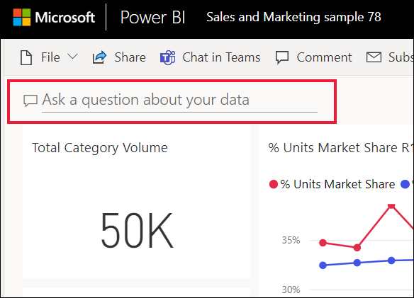

# Power BI **tüketicileri** için Soru-Cevap
## Soru-Cevap nedir?
Bazen verilerinize ilişkin cevaplar edinmenin en hızlı yolu doğal dil kullanarak bir soru sormaktır. Örneğin, "What were total sales last year?" (Bu yılki toplam satış rakamları nedir?)  
Kullanımı kolay olan doğal dil özelliklerinden yararlanarak verilerinizi araştırmak ve grafikler ile graflar biçiminde cevaplar almak için Soru-Cevap'ı kullanın. Bir arama motorundan farklı olan Soru-Cevap, yalnızca Power BI'daki verilerle ilgili sonuçlar sunar.

**Power BI Soru-Cevap** yalnızca İngilizce sorulan doğal dil sorgularının yanıtlanmasını destekler. Power BI yöneticiniz tarafından etkinleştirilebilecek olan bir İspanyolca önizleme sürümü mevcuttur.

**Power BI Soru-Cevap**, Pro veya Premium lisansla sunulur. 
>

Soruyu sormak yalnızca bir başlangıçtır.  Sorunuzu daraltarak veya genişleterek, dikkate değer yeni bilgiler keşfederek, ayrıntılara yoğunlaşarak ve daha geniş bir görünüm elde etmek için uzaklaştırarak verilerinizde yaptığınız yolculuğun tadını çıkarın. Edindiğiniz öngörülere ve yaptığınız keşiflere inanamayacaksınız.

Bu, gerçekten etkileşimli ve hızlı bir deneyim. Bellek içi bir depolama birimi sayesinde neredeyse anında cevap alırsınız.

## Soru-Cevap özelliğini nerede kullanabilirim?
Soru-Cevap özelliğini Power BI hizmetindeki panolarda, Power BI mobilde panonun en altında ve Power BI Embedded'da görselleştirmenin üzerinde bulabilirsiniz. Panonun tasarımcısı size düzenleme izinleri vermediyse verileri araştırmak için Soru-Cevap özelliğini kullanabilirsiniz ancak Soru-Cevap ile oluşturulan görselleştirmeleri kaydedemezsiniz.

## Soru-Cevap, sorularınızı nasıl cevaplıyor?
Soru-Cevap, panoyla ilişkilendirilmiş olan tüm veri kümelerinde yanıt arar. Bir veri kümesi panoda bir kutucuğa sahipse Soru-Cevap o veri kümesinde yanıt arar. 

## Nereden başlayabilirim?
Öncelikle içerikle ilgili bilgi edinin. Panodaki ve rapordaki görselleştirmelere bir göz atın. Kullanabileceğiniz veri türünü ve aralığını inceleyin. Ardından panoya dönün ve imlecinizi soru kutusuna yerleştirin. Soru-Cevap ekranı açılır.

 

* Görselleştirmenin eksen etiketlerinde ve değerlerinde "sales", "account", "month" ve "opportunities" yazıyorsa rahatlıkla şöyle sorular sorabilirsiniz: "Which *account* has the highest *opportunity*, or show *sales* by month as a bar chart."

* Google Analytics'te web sitesi performans verileri varsa Soru-Cevap özelliğine web sayfasında geçirilen süreyi, benzersiz sayfa ziyareti sayısını ve kullanıcı etkileşim oranlarını sorabilirsiniz. Demografik verileri sorguluyorsanız yaş ve konuma göre hane geliriyle ilgili sorular sorabilirsiniz.

Ekranın en altında diğer faydalı öğeleri bulabilirsiniz. Soru-Cevap özelliği her veri kümesine özgü anahtar sözcükler ve bazen örnek veya önerilen sorular gösterir. Bu girişleri seçerek soru kutusuna ekleyebilirsiniz. 

Soru-Cevap özelliği ayrıca istemler, otomatik tamamlama ve görsel ipuçları ile de soru sormanıza yardımcı olur. 

 

### Soru-Cevap hangi görselleştirmeleri kullanır?
Soru-Cevap görüntülenen verilere en uygun görselleştirmeyi seçer. Bazen temel alınan veri kümeleri belirli bir tür veya kategoride tanımlanmış olur ve bu durum Soru-Cevap özelliğine ilgili verileri görüntüleme konusunda yardımcı olur. Örneğin, verilerin türü tarih olarak tanımlanmışsa çizgi grafik olarak görüntülenme olasılığı yüksektir. Kategorisi şehir olarak belirlenmiş veriler ise genelde harita olarak görüntülenir.

Sorunuza görselleştirme türünü ekleyerek Soru-Cevap özelliğinin o türü kullanmasını sağlayabilirsiniz. Ancak Soru-Cevap özelliğinin, verileri her zaman istediğiniz görselleştirme türünde görüntülemesinin mümkün olmayacağını unutmayın. Soru-Cevap, çalışabileceğiniz görselleştirme türlerini sunar.

## Önemli noktalar ve sorun giderme
**Soru**: Panoda Soru-Cevap özelliğini göremiyorum.    
**Yanıt 1:** Soru kutusu görmüyorsanız öncelikle ayarlarınızı kontrol edin. Bunun için Power BI araç çubuğunuzun sağ üst köşesindeki dişli simgesini seçin.   

Ardından **Ayarlar** > **Panolar**'ı seçin. **Soru-Cevap arama kutusunu bu panoda göster** seçeneğinin yanında onay işareti bulunduğundan emin olun.
  

**Yanıt 2**: Bazen pano *tasarımcısı* veya yöneticiniz Soru-Cevap özelliğini kapatabilir. Bu kişilerle iletişime geçerek özelliği açmalarının mümkün olup olmadığını sorabilirsiniz.   

**Soru**: Bir soru yazdığımda beklediğim sonuçları alamıyorum.    
**Yanıt**: Panonun *tasarımcısıyla* iletişime geçin. Tasarımcının Soru-Cevap sonuçlarını geliştirmek için gerçekleştirebileceği birçok işlem vardır. Örneğin tasarımcı, veri kümesindeki sütunların adını değiştirerek daha kolay anlaşılır hale getirebilir (`CustFN` yerine `CustomerFirstName`). Tasarımcı veri kümesine hakim olduğundan yararlı sorular oluşturup bunları Soru-Cevap tuvaline de ekleyebilir.

## Sonraki adımlar

