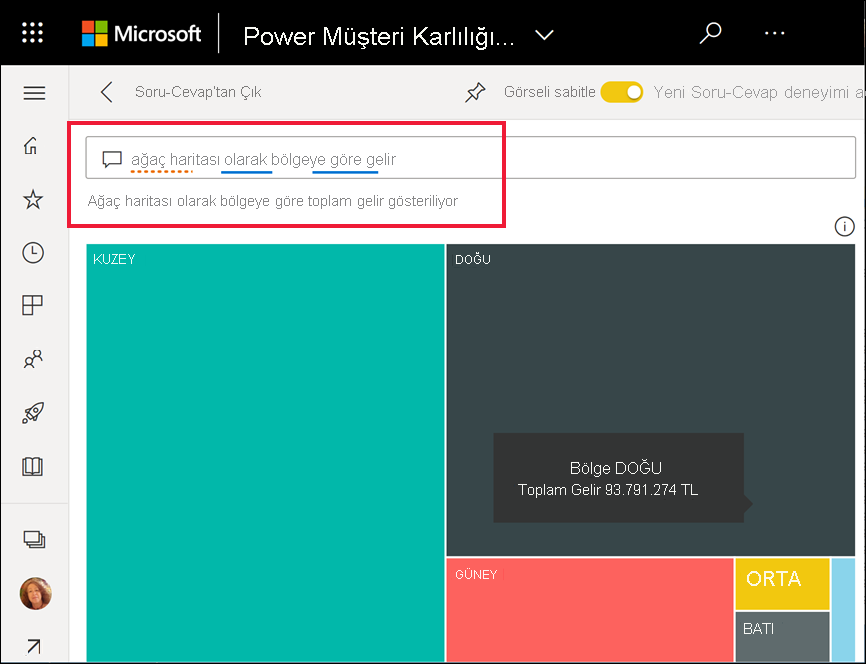
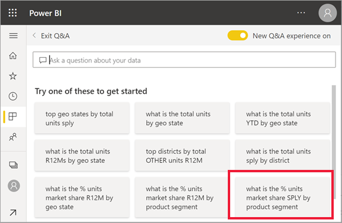
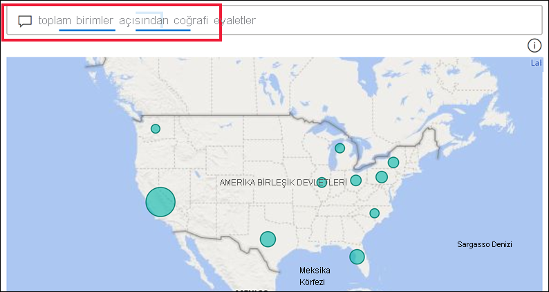
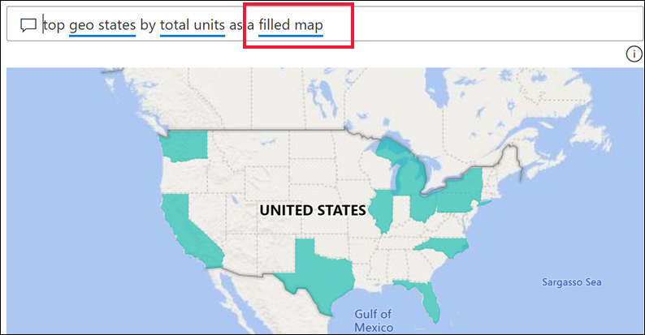
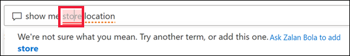
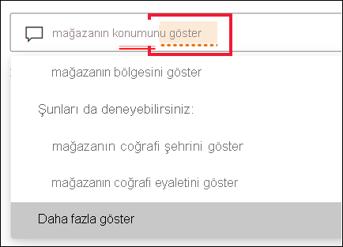
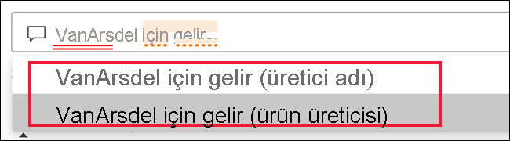
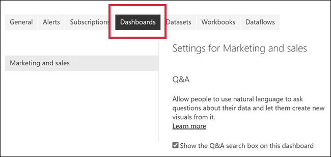
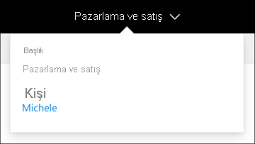
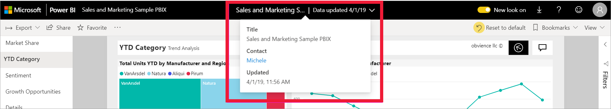

# Power BI işletme kullanıcıları için Soru-Cevap

[!INCLUDE[consumer-appliesto-yyny](../includes/consumer-appliesto-yyny.md)]

[!INCLUDE [power-bi-service-new-look-include](../includes/power-bi-service-new-look-include.md)]

## Soru-Cevap nedir?
Bazen verilerinize ilişkin cevaplar edinmenin en hızlı yolu doğal dil kullanarak bir soru sormaktır. Örneğin, "What were total sales last year?" (Bu yılki toplam satış rakamları nedir?)

Kullanımı kolay olan doğal dil özelliklerinden yararlanarak verilerinizi araştırmak ve grafikler ile graflar biçiminde cevaplar almak için Soru-Cevap'ı kullanın. Bir arama motorundan farklı olan Soru-Cevap, yalnızca Power BI'daki verilerle ilgili sonuçlar sunar.

## Soru-Cevap hangi görselleştirmeleri kullanır?
Soru-Cevap görüntülenen verilere en uygun görselleştirmeyi seçer. Bazen temel alınan veri kümesi belirli bir tür veya kategoride tanımlanmış olur ve bu durum Soru-Cevap özelliğine ilgili verileri görüntüleme konusunda yardımcı olur. Örneğin, verilerin türü tarih olarak tanımlanmışsa çizgi grafik olarak görüntülenme olasılığı yüksektir. Kategorisi şehir olarak belirlenmiş veriler ise genelde harita olarak görüntülenir.

Sorunuza görselin türünü ekleyerek Soru-Cevap özelliğinin o türü kullanmasını sağlayabilirsiniz. Ancak Soru-Cevap özelliğinin, verileri her zaman istediğiniz görsel türünde görüntülemesinin mümkün olmayacağını unutmayın. Soru-Cevap, çalışabileceğiniz görsel türlerini listesini gösterir.

## Soru-Cevap özelliğini nerede kullanabilirim?
Soru-Cevap özelliğini Power BI hizmetindeki panolarda ve Power BI mobilde panonun en altında bulabilirsiniz. Panonun tasarımcısı size düzenleme izinleri vermediyse verileri araştırmak için Soru-Cevap özelliğini kullanabilirsiniz ancak Soru-Cevap ile oluşturulan görselleştirmeleri kaydedemezsiniz.

Rapor *tasarımcısı* bir [Soru-Cevap görseli](../visuals/power-bi-visualization-q-and-a.md) eklediyse raporlarda Soru-Cevap da bulabilirsiniz.   

## Panolarda Soru-Cevap

**Power BI Soru-Cevap**, Pro veya Premium lisansla sunulur.  [Power BI mobil uygulamalarında Soru-Cevap](mobile/mobile-apps-ios-qna.md) ve [Power BI Embedded’da Soru-Cevap](../developer/embedded/qanda.md) konuları ayrı makalelerde ele alınmıştır. Şu anda **Power BI Soru-Cevap** yalnızca İngilizce sorulan doğal dil sorgularını destekler ancak Power BI yöneticiniz tarafından etkinleştirilebilecek olan bir İspanyolca önizleme sürümü vardır.

Soruyu sormak yalnızca bir başlangıçtır.  Sorunuzu daraltarak veya genişleterek, dikkate değer yeni bilgiler keşfederek, ayrıntılara yoğunlaşarak ve daha geniş bir görünüm elde etmek için uzaklaştırarak verilerinizde yaptığınız yolculuğun tadını çıkarın. Elde ettiğiniz içgörülere ve yaptığınız keşiflere inanamayacaksınız.

Bu, gerçekten etkileşimli ve hızlı bir deneyim. Bellek içi bir depolama birimi sayesinde neredeyse anında cevap alırsınız.

## Power BI hizmetindeki bir panoda Soru-Cevap özelliğini kullanma
Power BI hizmetinde (app.powerbi.com) panolar, bir veya daha fazla veri kümesinden sabitlenmiş kutucuklar içerir. Bu nedenle, bu veri kümelerinde bulunan tüm verilerle ilgili sorular sorabilirsiniz. Panonun oluşturulması için hangi raporların ve veri kümelerinin kullanıldığını görmek için **Diğer eylemler** açılan menüsünden **İlgili içeriği görüntüle**'yi seçin.

## Nereden başlayabilirim?
Öncelikle içerikle ilgili bilgi edinin. Panodaki ve rapordaki görselleri gözden geçirin. Kullanabileceğiniz veri türünü ve aralığını inceleyin. 

Örnek:

* Bir görselin eksen etiketlerinde ve değerlerinde "sales", "account", "month" ve "opportunities" yazıyorsa rahatlıkla şöyle sorular sorabilirsiniz: "Which *account* has the highest *opportunity*, or show *sales* by month as a bar chart."

* Google Analytics'te web sitesi performans verileri varsa Soru-Cevap özelliğine web sayfasında geçirilen süreyi, benzersiz sayfa ziyareti sayısını ve kullanıcı etkileşim oranlarını sorabilirsiniz. Demografik verileri sorguluyorsanız yaş ve konuma göre hane geliriyle ilgili sorular sorabilirsiniz.

Verileri tanıdıktan sonra panoya dönün ve imlecinizi soru kutusuna yerleştirin. Soru-Cevap ekranı açılır.

 

Soru-Cevap özelliği, yazmaya başlamadan önce sorunuzu oluşturmanıza yardımcı olacak önerilerin bulunduğu yeni bir ekran görüntüler. Temel alınan veri kümelerinde adları içeren ifade ve soruları görürsünüz ve veri kümesi sahibi tarafından oluşturulan *öne çıkan* soruları da görüntüleyebilirsiniz.

Bunlardan herhangi birini seçerek soru kutusuna ekleyebilir ve belirli bir yanıtı bulmak için bunlardan faydalanabilirsiniz. 

 

Power BI ayrıca istemler, otomatik tamamlama ve görsel ipuçları gibi özelliklerle de soru sormanıza yardımcı olur. Power BI bu yardımı panolarda Soru-Cevap ve Soru-Cevap görseli ile sağlar. Aşağıdaki [Doğal dil sorgusu yazarak kendi Soru-Cevap görselinizi oluşturma](#create-a-visual-using-your-own-qa-question) bölümünde bu özellikleri ayrıntılı olarak açıklayacağız

## Power BI raporlarında Soru-Cevap görseli

Soru-Cevap görseli, doğal dil soruları sormanıza ve görsel biçiminde yanıtlar almanıza olanak tanır. Soru-Cevap görseli de rapordaki diğer tüm görseller gibi davranır. Çapraz filtre/çapraz vurgu uygulanabilir ve aynı zamanda yer işaretleri ile yorumları destekler. 

Bir Soru-Cevap görselini üst kısımdaki soru kutusundan tanıyabilirsiniz. Buraya doğal dil kullanarak sorular girebilir veya yazabilirsiniz. Soru-Cevap görseli, verileriniz hakkında sorular sormak için tekrar tekrar kullanılabilir. Rapordan ayrıldığınızda Soru-Cevap varsayılan değerine sıfırlanır. 

## Soru-Cevap kullanma 
Panoda Soru-Cevap veya raporda Soru-Cevap görseli kullanmak için, önerilen sorulardan birini seçin veya kendi doğal dil sorunuzu yazın. 

### Önerilen bir soruyu kullanarak görsel oluşturma

Burada, **toplam birim sayısı en fazla olan coğrafi durumları** seçtik. Power BI kullanılacak görsel türünü en iyi şekilde seçmeye çalışır. Bu örnekte görsel türü basit bir haritadır.

Ancak, doğal dil sorgunuza ekleyerek hangi görsel türünü kullanacağını Power BI’a söyleyebilirsiniz. Tüm görsel türlerinin verileriniz üzerinde işe yaramayacağını veya mantıklı olmayacağını unutmayın. Örneğin, bu veriler anlamlı bir dağılım grafiği oluşturmaz. Ancak bir kartogram gibi çalışır.

Ne tür sorular soracağınızdan veya hangi terminolojiyi kullanacağınızdan emin değilseniz **Tüm önerileri göster**’i genişletin veya rapordaki diğer görsellere bakın. Bunu yaparak veri kümesinin terim ve içeriklerini yakından tanıyabilirsiniz.

### Kendi Soru-Cevap sorunuzu kullanarak görsel oluşturma

1. Doğal dil kullanarak Soru-Cevap alanına sorunuzu yazın. Sorunuzu yazarken, Power BI otomatik tamamlama, görsel ipuçları ve geri bildirim ile size yardımcı olur.

    **Otomatik tamamlama** - Sorunuzu yazarken Power BI Soru-Cevap, doğal dil ile hızlıca üretken olmanıza yardımcı olacak ilgili ve bağlamsal önerileri gösterir. Siz yazarken anında geri bildirim ve sonuçlar alırsınız. Deneyim bir arama altyapısına yazmaya benzer.

    Bu örnekte istediğimiz öneri en sondakidir. 

    

    **Düz ve noktalı çizgiler**: Power BI Soru-Cevap, Power BI'ın hangi sözcükleri tanıdığını hangilerini tanımadığını görmenize yardımcı olmak için sözcükleri alt çizgilerle gösterir. 

    Düz mavi alt çizgi Power BI'ın sözcüğü tanıdığına işaret eder. Aşağıdaki örnekte Soru-Cevap özelliğinin **sales fact sentiment** ve **region** terimlerini tanıdığı gösterilmiştir.

    

    İki kırmızı çizgi, Power BI'ın sözcüğü tanımadığını gösterir. Verilerin hiçbir yerinde mevcut olmamasına rağmen 'coğrafya' sözcüğünün kullanılması bu durumun örneği olabilir. Sözcük Türkçe sözlükte yer alır ancak Soru-Cevap bu sözcüğe kırmızı alt çizgi ekler. Power BI Soru-Cevap görselleştirme oluşturamaz ve rapor tasarımcısından terimi eklemesini istemenizi önerir.  

    

    Power BI'ın emin olmadığı sözcüklerin altında noktalı çizgi görüntülenir. Sözcüğü seçerek öneri listesini görüntüleyebilirsiniz. 'Konum' sözcüğü örnek olabilir. Birden fazla alan "Konum" sözcüğünü içerebilir. Bu nedenle sistem, hedeflediğiniz alanı seçmenizi ister.  

    

    
    
    Power BI Soru-Cevap, Bing ve Office ile tümleştirme sayesinde aynı anlama gelen sözcükleri tanır. Soru-Cevap, sözcüğe alt çizgi ekler, böylece doğrudan eşleşme olmadığını bilirsiniz

    

    **Öneriler** - Harf girmeye devam ettikçe, Power BI soruyu anlamaması durumunda size bildirir ve yardımcı olmaya çalışır. Aşağıdaki örnekte Power BI, "VanArsdel" için tanıdığı iki farklı alanı önermiştir. 

    

    Power BI'ın düzeltmesini seçtikten sonra tüm sözcüklerin tanındığına ve mavi alt çizgiye sahip olduğuna dikkat edin. Sonuçlarınız çizgi grafik olarak görüntülenir. 

    

    Ancak, çizgi grafiği başka bir görsel türü ile değiştirebilirsiniz.  

    

## Önemli noktalar ve sorun giderme

**Soru**: Panoda Soru-Cevap özelliğini göremiyorum.    
**Yanıt 1**: Soru kutusu görmüyorsanız öncelikle ayarlarınızı kontrol edin. Bunun için Power BI araç çubuğunuzun sağ üst köşesinden veya Diğer seçenekler (...) açılan menüsünden dişli simgesini seçin.   

Ardından **Ayarlar** > **Panolar**'ı seçin. **Soru-Cevap arama kutusunu bu panoda göster** seçeneğinin yanında onay işareti bulunduğundan emin olun.    
  

**Yanıt 2**: Bazen ayarlara erişemezsiniz. Pano sahibi veya yöneticiniz Soru-Cevap özelliğini kapattıysa, tekrar açmanın uygun olup olmadığını sorun. Sahibini bulmak için üst menü çubuğundan panonun adını seçin.

    

**Soru**: Bir soru yazdığımda beklediğim sonuçları alamıyorum.    
**Yanıt**: Rapor veya pano sahibiyle iletişim kurma seçeneğini belirleyin. Bunu doğrudan Soru-Cevap panosu sayfasından veya Soru-Cevap görselinden yapabilirsiniz. Ya da Power BI üst bilgisinden sahibi arayabilirsiniz.  Sahibin Soru-Cevap sonuçlarını geliştirmek için gerçekleştirebileceği birçok işlem vardır. Örneğin sahip, veri kümesindeki sütunların adını değiştirerek daha kolay anlaşılır hale getirebilir (`CustFN` yerine `CustomerFirstName`). Sahip veri kümesine hakim olduğundan yararlı sorular oluşturup bunları Soru-Cevap önerilen sorularına ekleyebilir.

## Gizlilik

Microsoft sorularınızı Power BI'ı geliştirmek için kullanabilir. Daha fazla bilgi edinmek için [Microsoft Gizlilik Bildirimi](https://go.microsoft.com/fwlink/?LinkId=521839)'ni gözden geçirin.

## Sonraki adımlar
Bir Soru-Cevap görselinin rapor *tasarımcısı* tarafından nasıl oluşturulup yönetildiğini öğrenmek için bkz. [Soru-Cevap görsel türü](../visuals/power-bi-visualization-q-and-a.md).
