<!-- once the sample aps are live, change this so consumers can follow along -->
# Hızlı başlangıç: ***Tüketiciler*** için Power BI özellikleri hakkında bilgi edinin
Bu hızlı başlangıçta Power BI ile etkileşim kurarak veri temelli iş içgörülerini keşfetmeyi öğreneceksiniz. Bu makalede ayrıntılı bilgiler yerine Power BI **tüketicileri** için sunulan eylemlerin bazılarıyla ilgili kısa bilgiler verilmektedir.

Power BI’ya kaydolmadıysanız başlamadan önce [ücretsiz deneme için kaydolun](https://app.powerbi.com/signupredirect?pbi_source=web).

## Önkoşullar
- Power BI hizmeti (app.powerbi.com) <!-- app from AppSource -->

## Okuma görünümü
Okuma görünümü, rapor *tüketicileri* için Power BI hizmetinde kullanılabilir. Okuma görünümü, iş arkadaşlarınızın sizinle paylaştığı raporları keşfetmek ve etkileşim kurmak için kullanabileceğiniz görünümdür. 

Power BI hizmetindeki diğer rapor modu olan [Düzenleme görünümü](../service-interact-with-a-report-in-editing-view.md), rapor *tasarımcıları* tarafından kullanılabilir.  

Okuma görünümü, panolarınızı ve raporlarınızı keşfetmek için kullanabileceğiniz güçlü ve güvenli bir yoldur. Sizinle paylaşılan panoları ve raporları ayrıntılı olarak incelediğinizde bağlı veri kümeleri değiştirilmez. 

Okuma görünümünde sayfadaki görsellere çapraz vurgulama ve çapraz filtreleme uygulama gibi işlemler yapabilirsiniz.  Görsellerin birindeki değerlerin birini vurguladığınızda veya seçtiğinizde diğer görseller üzerindeki etkisini de anında görebilirsiniz. Rapor sayfasına filtre eklemek, var olan filtreleri değiştirmek ve görselleştirme içindeki değerlerin sıralamasını değiştirmek için Filtre bölmesini kullanabilirsiniz. Bunlar, Power BI'daki *tüketici* özelliklerinden bazılarıdır.  Bu özellikler ve diğerleri hakkında daha fazla bilgi edinmek için okumaya devam edin.

 
### Bir uygulamayı görüntüleme
Power BI'da *uygulamalar*, ilgili panoları ve raporları bir yerde toplar.

1. **Uygulamalar**  > **Uygulama edinin**'i seçin. 
   
     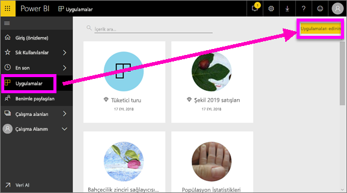
2. AppSource'ta **Kuruluşum** altında, sonuçları daraltmak ve aradığınız uygulamayı bulmak için arama yapabilirsiniz.
   
     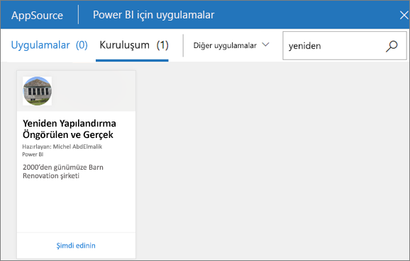
3. Uygulamalar kapsayıcınıza eklemek için **Şimdi edinin**'i seçin. 

### Pano görüntüleme
Bu uygulama bir panoyu açar. Power BI ***panosu***, görselleştirmeler kullanarak bir hikaye anlatan ve genellikle tuval olarak adlandırılan tek bir sayfadır. Tek sayfayla sınırlı olduğundan, iyi tasarlanmış bir panoda yalnızca hikayenin en önemli parçaları yer alır.

Panoda gördüğünüz görselleştirmeler, *kutucuk* olarak adlandırılır ve panolara raporlardan *sabitlenir*.

### Bir panoya (veya rapora) abone olma
Bir panoyu izlemek için Power BI'ı açmanıza gerek yoktur.  Bunun yerine abone olabilir ve Power BI'ın belirlediğiniz aralıklarla ilgili panonun anlık görüntüsünü e-posta ile göndermesini sağlayabilirsiniz. 

geçin.

1. Üstteki menü çubuğundan **Abone ol** seçeneğini belirleyin veya zarf simgesini  seçin.
   
   

3. Aboneliği açıp kapatmak için sarı kaydırıcıyı kullanın.  İsterseniz e-posta iletisinin ayrıntıları doldurun. 

    Aşağıdaki ekran görüntülerinde, bir rapora abone olduğunuzda aslında bir rapor *sayfasına* abone olduğunuzu görebilirsiniz.  Bir rapordaki birden çok sayfaya abone olmak için **Başka bir abonelik ekle**’yi seçip farklı bir sayfa seçin. 
      
   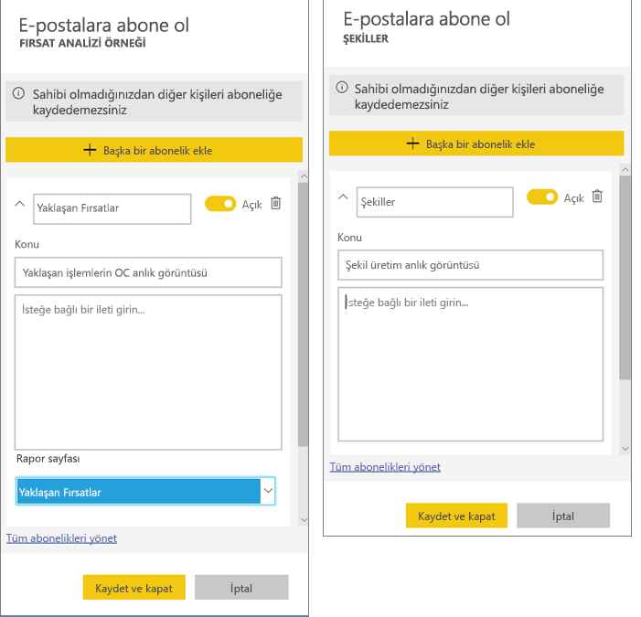
   
    Rapor sayfasını yenilediğinizde veri kümesi yenilenmez. Yalnızca veri kümesi sahibi bir veri kümesini el ile yenileyebilir. Bağlı veri kümelerinin adlarını görmek için üst menü çubuğundan **İlişkilileri görüntüle**'yi seçin.

### İlgili içeriği görüntüle
**İlişkili içerik** bölmesi, Power BI hizmet içeriğinizin (panolar, raporlar ve veri kümeleri) birbirine nasıl bağlı olduğunu gösterir. Bölme, ilişkili içeriği görüntülemenin yanı sıra içerik üzerinde işlem yapmanıza ve ilişkili içerik arasında kolayca gezinmenize olanak tanır.

Bir panoda veya raporda üst menü çubuğundan **İlgili olanları görüntüle**'yi seçin.

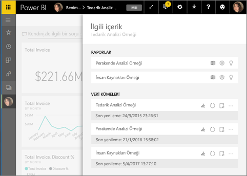

### Doğal dil kullanarak soru sormak için Soru-Cevap özelliğini kullanma
Bazen verilerinize ilişkin cevaplar edinmenin en hızlı yolu doğal dil kullanarak bir soru sormaktır. Soru-Cevap soru kutusu panonuzun en üstünde bulunur. Örneğin "show me count of large opportunities by sales stage as a funnel" (satış aşamasına göre büyük fırsat sayısını huni olarak göster). 

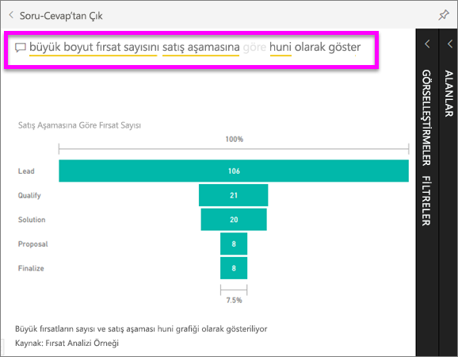

### Bir panoyu sık kullanılanlara ekleme
Bir içeriği *sık kullanılanlara* eklediğinizde panoya sol gezinti çubuğundan erişebilirsiniz. Sol gezinti çubuğu, Power BI'ın neredeyse tüm alanlarından görünebilir. Sık kullanılanlar, en çok ziyaret ettiğiniz panolar, rapor sayfaları ve uygulamalardır.

1. Bir panoya dönmek için Soru-Cevap ekranından çıkın.    
2. Power BI hizmetinin sağ üst köşesinde bulunan **Sık kullanılanlara ekle**’yi veya yıldız  simgesini seçin.
   
   

### Bir raporu ve rapor sayfalarını açma ve görüntüleme
Rapor, görsellerden oluşan bir veya daha çok sayfalık bir belgedir. Raporlar Power BI *rapor tasarımcıları* tarafından oluşturulur ve [*tüketicilerle* doğrudan](end-user-shared-with-me.md) veya bir [uygulama](end-user-apps.md) aracılığıyla paylaşılır. 

Raporlar panodan açılabilir. Çoğu pano kutucuğu, raporlardan *sabitlenmiştir*. Bir kutucuğu seçtiğinizde panoyu oluşturmak için kullanılan rapor açılır. 

1. Panodan bir kutucuk seçin. Bu örnekte, "Revenue" sütun grafiği kutucuğunu seçmeyi tercih ettik.

    

2.  İlişkili rapor açılır. "Revenue overview" sayfasında olduğumuza dikkat edin. Bu, panodan seçtiğimiz sütun grafiğinin yer aldığı rapor sayfasıdır.

    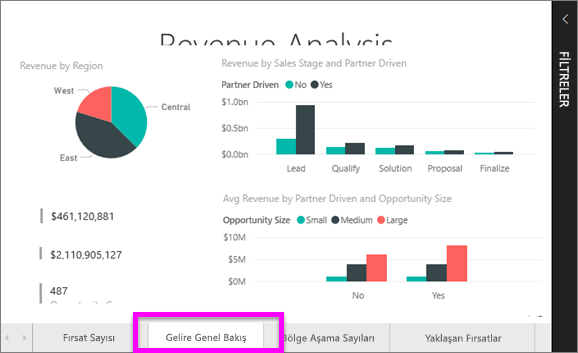

### Görüntüleme boyutlarını ayarlama
Raporlar çok farklı cihazlarda görüntülenir ve bu cihazların ekran boyutlarıyla en/boy oranları birbirinden farklıdır.  Rapor, varsayılan oluşturma işlemi sonucunda cihazda görüntülemek istediğinizden farklı olabilir.  

1. Ayarlamak için üst menü çubuğundan **Görünüm**'ü seçin.

    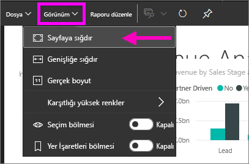

2.  Görüntüleme seçeneklerinden birini belirleyin. Bu örnekte **Sayfaya sığdır**'ı seçtik.

    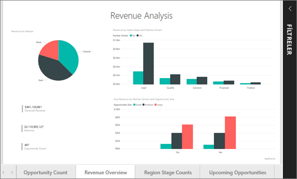    

### Rapordaki Filtreler bölmesini kullanma
Rapor yazarının rapor sayfalarından birine filtre eklemesi durumunda bu filtrelerle etkileşim kurabilir ve değişiklikleri rapora kaydedebilirsiniz.

1. Sağ üst köşedeki **Filtreler** simgesini seçin.
   
     

2. Bir görseli seçerek etkin hale getirin. İlgili görsele (Görsel düzeyi filtreleri), rapor sayfasının tamamına (Sayfa düzeyi filtreleri) ve raporun tamamına (Rapor düzeyi filtreleri) uygulanmış olan tüm filtreleri görürsünüz.
   
   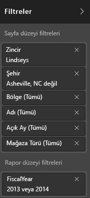

3. Filtrelerden birinin üzerine gelip aşağı oku seçerek genişletin.
   
   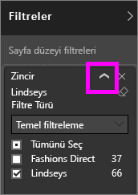

4. Filtrelerde değişiklik yaparak görsellerin nasıl etkilendiğini inceleyin.  
   
     
     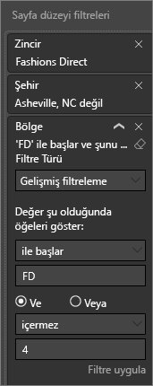

### Sayfadaki tüm görseller arasındaki bağlantıyı görme
Sayfadaki ilgili görselleştirmeleri çapraz vurgulayın ve çapraz filtreleyin. Tek bir rapor sayfasındaki görselleştirmeler birbirine "bağlıdır".  Başka bir deyişle, görselleştirmenizdeki değerlerin birini veya daha fazlasını seçtiğinizde aynı verileri kullanan diğer görselleştirmeler de yaptığınız seçime göre değişir.

> 
### Görselleştirme ayrıntılarını görüntüleme
Ayrıntıları görmek için görsel öğelerin üzerine gelme

### Bir görselleştirmeyi sıralama
Bir rapor sayfasındaki görseller sıralanabilir ve yaptığınız değişiklikler kaydedilebilir. 

1. Bir görselin üzerine giderek etkin hale getirin.    
2. Sıralama seçeneklerini açmak için üç noktayı (...) seçin.

     

###  **Seçim** bölmesini açın
Rapor sayfasındaki görselleştirmeler arasında kolayca gezinebilirsiniz. 

1. Seçim bölmesini açmak için **Görünüm > Seçim bölmesi** yolunu izleyin. **Seçim bölmesi**'ni Açık duruma getirin.

    

2. Rapor tuvalinizde Seçim bölmesi açılır. Listeden bir görseli seçerek etkin hale getirin.

    

### Görselleri yakınlaştırma
Görselin üzerine gelip **Odak modu** simgesini  seçin. Bir görselleştirmeyi Odak modunda görüntülediğinizde aşağıda gösterildiği gibi rapor tuvalinin tamamını dolduracak şekilde genişletilir.

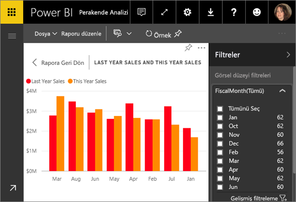

Aynı görselleştirmeyi menü çubukları, filtre bölmesi ve diğer görselleştirmeler olmadan görüntülemek için üst menü çubuğundaki **Tam Ekran** simgesini  seçin.

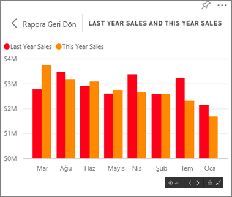

### Görselleştirmeyi oluşturmak için kullanılan verileri gösterme
Power BI görselleştirmeleri, bağlı veri kümelerindeki veriler kullanılarak oluşturulur. Verilerin kaynağını merak ediyorsanız Power BI, görseli oluşturmak için kullanılan verileri *görüntülemenizi* sağlar. **Verileri Göster**'i seçtiğinizde, Power BI ilgili verileri görselleştirmenin altında (veya yanında) görüntüler.

1. Power BI hizmetinde bir raporu açıp içinden bir görsel seçin.  
2. Görselde kullanılan verileri görüntülemek için üç noktayı (...) ve ardından **Verileri göster**'i seçin.
   
   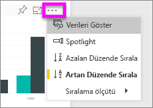

Bu hızlı başlangıç, **tüketicilerin** Power BI hizmeti ile gerçekleştirebileceği işlemlere hızlı bir genel bakış niteliğindedir.  

## Kaynakları temizleme
- Bir uygulamaya bağlandıysanız sol gezinti çubuğunda **Uygulamalar**'ı seçerek Uygulamalar içerik listesini açın. Silmek istediğiniz uygulamanın üzerine gelip çöp kutusu simgesini seçin.

- Bir Power BI örnek raporunu içeri aktardıysanız veya bağlantı kurduysanız sol gezinti çubuğundan **Çalışma alanım**'ı açın. Yukarıdaki sekmeleri kullanarak panoyu, raporu ve veri kümesini bulun ve her birinin yanındaki çöp kutusu simgesini seçin.

## Sonraki adımlar

