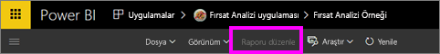
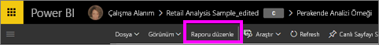
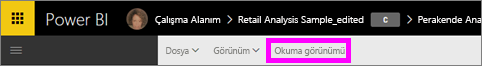

# Power BI hizmeti raporlarındaki Okuma görünümü ve Düzenleme görünümü
Power BI hizmetinde (Power BI Desktop uygulamasında değil) raporları görüntülemek ve onlarla etkileşim kurmak için kullanabileceğiniz iki mod vardır: Okuma görünümü ve Düzenleme görünümü. Okuma görünümü, özellikle veri *kullanıcıları* için tasarlanmıştır ve tüm kullanıcılar tarafından kullanılabilir; Düzenleme görünümü ise yalnızca rapor *oluşturucuları* ve rapor sahipleri tarafından kullanılabilir.

## Rapor Okuma görünümü

 Raporu araştırmak ve raporla etkileşime geçmek için Okuma görünümü'nü kullanırsınız. Bu görünümü kullanarak eğlenceli ve güvenli bir şekilde verilerinizle denemeler yapabilir ve verilerinizi daha yakından tanıyabilirsiniz. Okuma görünümü rapor *kullanıcıları* için tasarlanmıştır ve bu kişiler, raporları Uygulamalardan veya [kendileriyle yapılan paylaşımlardan](../service-share-dashboards.md) açan kullanıcılardır. Okuma görünümü, belirli bir raporu görüntüleyen herkesin aynı raporu ve aynı görselleştirmeleri, isteğe bağlı olarak aynı filtreler uygulanmış halde görmesini sağlar.  Tüketiciler, raporlarla etkileşim kurabilir, mevcut filtreleri değiştirebilir (ve bu değişiklikler rapora kaydedilir), ancak yeni filtreler ekleyemez.

>**NOT**: Belirli durumlarda satır düzeyi güvenlik ve veri izinleri nedeniyle rapor tüketicilerinin görüntülediği veriler farklı olabilir.

## Rapor Düzenleme görünümü

Düzenleme görünümü yalnızca raporu oluşturan veya [uygulama çalışma alanının üyesi ya da yöneticisi olarak raporun ortak sahiplerinden biri olan](end-user-create-apps.md) kişiler tarafından kullanılabilir.

Düzenleme görünümü rapor *oluşturucuları* için tasarlanmıştır. Oluşturucular bu görünümde veri kümelerini içeri aktarabilir, bunlara bağlanabilir, verileri araştırabilir ve raporlar ile panolar oluşturabilir. *Oluşturucular* Düzenleme görünümü'nde alan ekleyip kaldırmanın, görselleştirme türünü değiştirmenin ve yeni görselleştirmeler oluşturmanın yanı sıra rapora görselleştirmeler ile sayfalar ekleyip bunları silerek verilerini çok daha derinlemesine inceleyebilir. Ardından, söz konusu raporları iş arkadaşlarıyla paylaşabilirler.

## Okuma görünümü ve Düzenleme görünümü
Bu grafikte Power BI hizmetinin sunduğu rapor özelliklerinin tamamı yer almamaktadır! Okuma ve Düzenleme görünümlerinden yalnızca **birinde** kullanılabilen rapor görevlerine yer verilmiştir.

|Görev  | Okuma görünümü  | Düzenleme görünümü |
|-------------------------|-------|-------|
|**Bir bütün olarak raporlar**  |
| [Rapor oluşturma veya düzenleme](../service-report-create-new.md) | Hayır  | Evet |
| [Rapor paylaşma](../service-share-reports.md)| Evet | Evet, ayrıca izinler (başkalarına *sahip* izinleri verme de dahil) yönetilebilir. |
| [Filtreler bölmesinden sürekli (kalıcı) görsel düzeyi, detaylandırma, sayfa düzeyi ve rapor düzeyi filtreleri oluşturma](../power-bi-report-add-filter.md) | Hayır  | Evet |
| [Rapordaki Filtreler bölmesini kullanma](end-user-report-filter.md) | Evet, mevcut filtreler kullanılabilir ve değişiklikler rapora kaydedilebilir, ancak yeni filtreler eklenemez. | Evet |
| [Rapordaki Analiz bölmesini kullanma](../service-analytics-pane.md) | Hayır | Evet |
| [Rapordaki **Görünüm** seçenekleri](../power-bi-report-display-settings.md) | Evet ancak bazı özel durumlar mevcuttur. | Evet, tüm seçenekler (kılavuz çizgileri, yaslama ve kilitleme de dahil) kullanılabilir. |
| [Yenileme zamanlaması oluşturma](../refresh-data.md) | Hayır  | Evet |
| [Bir rapora abone olma](end-user-subscribe.md) | Evet | Hayır |
| [Soru-Cevap ile raporlarda soru sorma](end-user-q-and-a.md) | Hayır  | Evet |
| [Kullanım ölçümlerini görüntüleme](../service-usage-metrics.md) | Evet, rapor tuvalinde kullanılabilir. | Evet, rapor listesinde (içerik görünümü) kullanılabilir. |
| [İlişkilileri görüntüleme](end-user-related.md) | Evet, rapor tuvalinde kullanılabilir. | Evet, rapor listesinde (içerik görünümü) kullanılabilir. |
| [Bir raporu kaydetme](../service-report-save.md) | Evet, ancak yalnızca **Farklı kaydet** seçeneği ile kullanılabilir. | Evet |
| [Bir raporu silme](end-user-delete.md) | Hayır  | Evet |
|**Rapor sayfaları** |
| [Bir rapor sayfası ekleme veya sayfayı yeniden adlandırma](../power-bi-report-add-page.md)  | Hayır  | Evet  |
| [Bir rapor sayfasını yineleme](../power-bi-report-copy-paste-page.md) | Hayır  | Evet |
| [Bir rapor sayfasını silme](end-user-delete.md) | hayır | evet |
|**Rapor görselleştirmeleri ile çalışma**|
| [Bir rapora görselleştirme ekleme](../visuals/power-bi-report-add-visualizations-i.md) | Hayır  | Evet |
| [Bir rapora metin kutusu ve şekil ekleme](../power-bi-reports-add-text-and-shapes.md) | Hayır  | Evet |
| [Rapordaki Biçimlendirme bölmesini kullanma](../service-the-report-editor-take-a-tour.md) | Hayır | Evet |
| [Görsel etkileşimler ayarlama](end-user-interactions.md) | Hayır  | Evet |
| [Görselleştirmeyi oluşturmak için kullanılan verileri gösterme](end-user-show-data.md) | Hayır  | Evet |
| [Detaylandırmayı yapılandırma](end-user-drill.md) | Hayır  | Evet |
| [Kullanılmakta olan görselleştirmeyi değiştirme](../visuals/power-bi-report-change-visualization-type.md) | Hayır | Evet|
| [Bir görselleştirmeyi, metin kutusunu veya şekli silme](end-user-delete.md)| Hayır | Evet |

## Düzenleme görünümü ile Okuma görünümü arasında geçiş yapma
Raporları yalnızca rapor oluşturucularının ve rapor sahiplerinin Düzenleme görünümü'nde açabileceğini unutmayın.

1. Raporlar varsayılan olarak Okuma görünümü'nde açılır. **Raporu düzenle** seçeneğinin görünmesi, Okuma görünümü'nün etkin olduğunu gösterir. **Raporu düzenle** seçeneğinin gri renkte olması, raporu Düzenleme görünümü'nde açma izninizin olmadığı anlamına gelir.

   

2. **Raporu Düzenle** seçeneği gri renkte değilse tıklayarak raporu Düzenleme görünümü'nde açabilirsiniz.

   

   Rapor şimdi Düzenleme görünümü'ndedir ve raporda, Okuma görünümü'nde son kullandığınız [görüntü ayarları](../power-bi-report-display-settings.md) kullanılır.

2. **Okuma görünümü**'ne dönmek için üst gezinti çubuğunda Okuma görünümü'nü seçin.

    

### Sonraki adımlar
Okuma görünümü'nde raporunuzla etkileşim kurmanın, öngörüler keşfetmek ve sorularınıza cevap bulmak için verilerinizi ayrıntılı olarak incelemenin çok çeşitli yolları vardır.  Bir sonraki konuda ([Okuma görünümü'nde bir raporla etkileşim kurma](../service-interact-with-a-report-in-editing-view.md)), bunlardan bazıları ayrıntılı bir şekilde açıklanmaktadır.    
[Power BI'daki raporlar](end-user-reports.md)   bölümüne dönün  
Başka bir sorunuz mu var? [Power BI Topluluğu'na başvurun](http://community.powerbi.com/)
