# Hızlı başlangıç: *Tüketiciler* için Power BI özellikleri hakkında bilgi edinin

[!INCLUDE[consumer-appliesto-ynny](../includes/consumer-appliesto-ynny.md)]

Bu hızlı başlangıçta Power BI ile etkileşim kurarak veri temelli iş içgörülerini keşfetmeyi öğreneceksiniz. Bu makalede ayrıntılı bilgiler yerine Power BI **tüketicileri** için sunulan eylemlerin bazılarıyla ilgili kısa bilgiler verilmektedir.

Power BI’ya kaydolmadıysanız başlamadan önce [ücretsiz deneme için kaydolun](https://app.powerbi.com/signupredirect?pbi_source=web).

## Power BI nedir? 
Power BI, birbirinden bağımsız veri kaynaklarınızı tutarlı, görsel olarak sürükleyici ve etkileşimli içgörülere dönüştürmenizi sağlamak için birlikte çalışan yazılım hizmetlerinden, uygulamalardan ve bağlayıcılardan oluşan bir koleksiyondur. Verilerinizin basit bir Excel elektronik tablosu veya farklı veri kaynaklarından alınmış bir veri koleksiyonu olması fark etmeksizin Power BI, veri kaynaklarınıza kolayca bağlanmanıza, önemli verileri görselleştirmenize (veya araştırmanıza) ve bunları istediğiniz herkesle paylaşmanıza olanak sağlar. 

## Okuma görünümü
Okuma görünümü, rapor *tüketicileri* için Power BI hizmetinde kullanılabilir. Okuma görünümü, iş arkadaşlarınızın sizinle paylaştığı raporu, panoyu veya uygulamayı keşfetmek ve bununla etkileşim kurmak için kullanabileceğiniz görünümdür. 

Power BI hizmetini bir tarayıcı ya da mobil cihazda açmanız yeterlidir. İş arkadaşlarınızla birlikte, her zaman en güncel içeriklerle çalışmanız için otomatik olarak güncelleştirilip yenilenen, güvenilir uygulama, pano ve raporlarda birlikte çalışırsınız.   

İçerik statik olmadığından eğilimleri, içgörüleri ve diğer iş zekası verilerini aramak için ayrıntılı incelemeler yapabilirsiniz. İçeriği ayrıntılı olarak inceleyin ve kendi cümlelerinizi kullanarak soru sorun. Dilerseniz arkanıza yaslanıp verilerinizin sizin için ilgi çekici içgörüleri keşfetmesini, veriler değişince sizi bilgilendirmesini ve ayarladığınız bir zamanlamada raporları size e-posta olarak göndermesini bekleyebilirsiniz. Verilerinize buluttan veya şirket içinden, herhangi bir cihazı kullanarak istediğiniz her zaman erişin. 

Bu özellikler ve diğerleri hakkında daha fazla bilgi edinmek için okumaya devam edin.

## Power BI içeriği
Power BI’da "içerik" terimini kullandığımızda raporlardan, panolardan ve uygulamalardan söz ediyoruz. Bunlar verilerinizi keşfetmek ve iş kararları almak için kullanacağınız yapı taşlarıdır. 

> [!NOTE]
> Panolar, raporlar ve uygulamalar mobil cihazlarda da görüntülenebilir ve paylaşılabilir.

###  Uygulamalar

*Uygulama*, ilgili panoları ve raporları bir araya getiren bir Power BI içerik türüdür. Bir uygulamada bir veya daha fazla pano ve bir veya daha fazla rapor bir arada bulunabilir. Uygulamalar Power BI *tasarımcıları* tarafından oluşturulur ve sizin gibi *tüketicilere* dağıtılarak paylaşılır. 

Uygulamalarınızı görüntülemenin bir yolu gezinti bölmesinden **Uygulamalar**’ı seçmek ve açılacak uygulamayı belirlemektir.

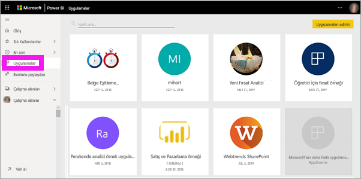

Uygulamaları görüntüleme hakkında daha fazla bilgi edinmek için bkz. [Power BI uygulamaları](end-user-apps.md)

### Raporlar

Power BI raporları, bir veri kümesinden edinilen farklı bulguları ve öngörüleri temsil eden görseller yardımıyla bu veri kümesine ilişkin çok yönlü bir yaklaşım sunar. Bir raporda tek bir görsel olabilir veya rapor, görsellerle dolu sayfalardan oluşabilir. Raporlar Power BI *tasarımcıları* tarafından oluşturulur ve sizin gibi *tüketicilere* dağıtılarak paylaşılır.

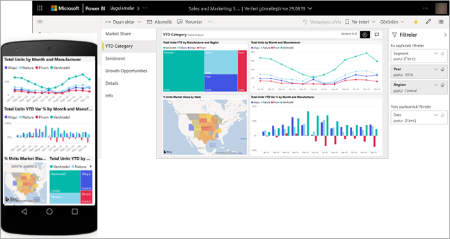

Raporların nasıl görüntülendiğini öğrenmek için bkz. [Power BI raporları](end-user-reports.md)

### Panolar

Power BI panosu, görselleştirmeler kullanarak bir hikaye anlatan ve genellikle tuval olarak adlandırılan tek bir sayfadır. Tek sayfayla sınırlı olduğundan, iyi tasarlanmış bir panoda yalnızca hikayenin en önemli parçaları yer alır.

Panoda gördüğünüz görselleştirmeler, kutucuk olarak adlandırılır ve rapor *tasarımcıları* tarafından panoya sabitlenir. Çoğu durumda bir kutucuğu seçtiğinizde görselleştirmenin oluşturulduğu rapor sayfasına gidersiniz. 

Panoların nasıl görüntüleneceğini öğrenmek için bkz. [Power BI panoları](end-user-dashboards.md)
 
## Power BI hizmetinde etkileşim kurma

### İş arkadaşlarınızla işbirliği yapma
E-postayı boşverin. Doğrudan o panoda kişisel bir açıklama ekleyin ve iş arkadaşlarınızla pano hakkında bir konuşma başlatın. Açıklama özelliği, diğer kişilerle işbirliği yapmak için kullanabileceğiniz yollarından yalnızca biridir. 

[Açıklama ekleme](end-user-comment.md) hakkında daha fazla bilgi edinin

### Arkanıza dayanın ve Power BI’ın sizin için çalışmasına izin verin
Power BI hizmetinin sizin için çalışmasını sağlamanın yollarından ikisi abonelikler ve uyarılardır. 

#### Bir panoya (veya rapora) abone olma
Bir panoyu izlemek için Power BI'ı açmanıza gerek yoktur.  Bunun yerine abone olabilir ve Power BI'ın belirlediğiniz aralıklarla ilgili panonun anlık görüntüsünü e-posta ile göndermesini sağlayabilirsiniz. 

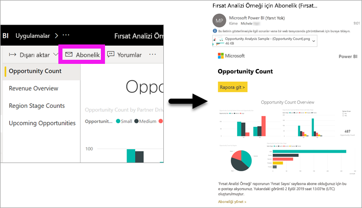.

 [Power BI abonelikleri](end-user-subscribe.md) hakkında daha fazla bilgi edinin

#### Verileriniz bir eşiğe ulaştığında uyarı alma
Verileriniz canlıdır ve görselleriniz bunu yansıtacak şekilde otomatik olarak güncelleştirilir. Verilerdeki değişiklikler sizin ayarladığınız bir eşiğin üzerine çıktığında veya altına düştüğünde bildirim almak istiyorsanız veri uyarılarını kullanın. Uyarılar, ölçerlerde, KPI’lerde ve kartlarda çalışır.    

Değer ayarladığınız sınırın üzerine çıkar veya altına düşerse Power BI size bir e-posta gönderir.  
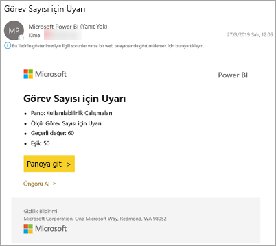

[Power BI uyarıları](end-user-alerts.md) hakkında daha fazla bilgi edinin

### Doğal dil kullanarak soru sormak için Soru-Cevap özelliğini kullanma
Bazen verilerinize ilişkin cevaplar edinmenin en hızlı yolu doğal dil kullanarak bir soru sormaktır. Soru-Cevap soru kutusu panonuzun en üstünde bulunur. Örneğin "show me count of large opportunities by sales stage as a funnel" (satış aşamasına göre büyük fırsat sayısını huni olarak göster). 

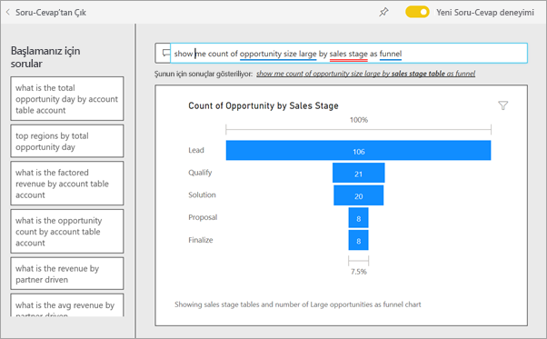

[Power BI Soru-Cevap](end-user-q-and-a.md) hakkında daha fazla bilgi edinin

### Görselleştirme ayrıntılarını görüntüleme
Görseller veri noktalarından oluşur ve bir veri noktasının üzerine geldiğinizde ayrıntıları görüntüleyebilirsiniz.

### Bir panoyu sık kullanılanlara ekleme
İçeriği *sık kullanılanlara* eklediğinizde buna gezinti bölmesinden erişebilirsiniz. Gezinti bölmesi, Power BI'ın neredeyse tüm alanlarından görünür. Sık kullanılanlar, en çok ziyaret ettiğiniz panolar, rapor sayfaları ve uygulamalardır.

Power BI hizmetinin sağ üst köşesinde **Sık Kullan**’ı seçin veya bu seçenek görünmüyorsa **Diğer seçenekler**’i (...) ve açılır listeden **Sık Kullanılan**’ı seçin. 
   
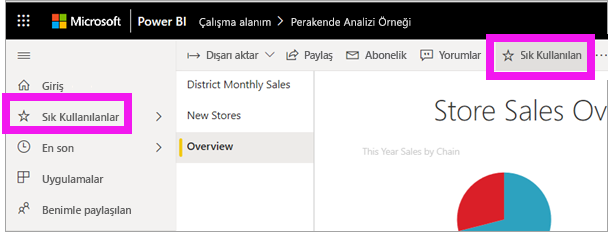

Açılan listede sağlanan diğer eylemleri gözden geçirin.  Bunların tümünü bu makaleye almadık ama başka makalelere ekledik.  Power BI içindekiler tablosunu veya **Arama** alanını kullanma hakkında daha fazla bilgi edinin. 

[Sık kullanılanlar ve öne çıkanlar](end-user-favorite.md) hakkında daha fazla bilgi edinin

### Görüntüleme boyutlarını ayarlama
Raporlar çok farklı cihazlarda görüntülenir ve bu cihazların ekran boyutlarıyla en/boy oranları birbirinden farklıdır.  Rapor, varsayılan oluşturma işlemi sonucunda cihazda görüntülemek istediğinizden farklı olabilir.  

Görüntüyü ayarlamak için sağ üst menü çubuğunda **Görünüm**’ü seçin ve görüntü seçeneklerinden birini belirtin. 

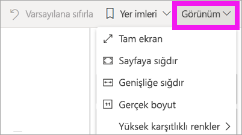

### Sayfadaki tüm görseller arasındaki bağlantıyı görme
Rapor sayfasındaki ilgili görselleştirmeleri çapraz vurgulayın ve çapraz filtreleyin. Tek bir rapor sayfasındaki görselleştirmeler birbirine "bağlıdır".  Başka bir deyişle, görselleştirmenizdeki değerlerin birini veya daha fazlasını seçtiğinizde aynı verileri kullanan diğer görselleştirmeler de yaptığınız seçime göre değişir.

> 

[Görsel etkileşimleri](end-user-interactions.md) hakkında daha fazla bilgi edinin

<!-- ###  Open the **Selection** pane
Easily navigate between the visualizations on the report page. 

1. Select **View > Selection pane** to open the Selection pane. Toggle **Selection pane** to On.

    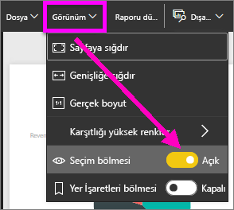

2. The Selection pane opens on your report canvas. Select a visual from the list to make it active.

    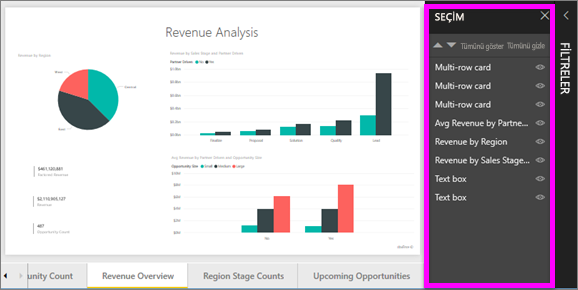 -->

### Görselleri yakınlaştırma
Görselin üzerine gelip **Odak modu** simgesini  seçin. Bir görselleştirmeyi Odak modunda görüntülediğinizde aşağıda gösterildiği gibi rapor tuvalinin tamamını dolduracak şekilde genişletilir.

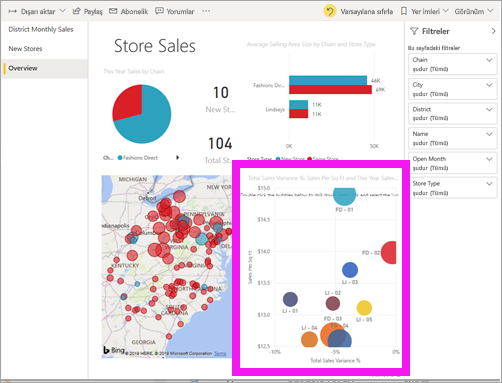

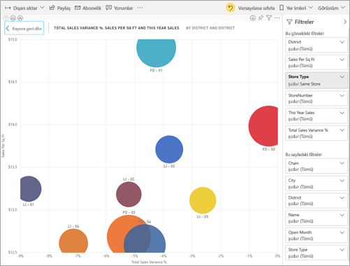

<!-- To display that same visualization without the distraction of menubars, filter pane, and other chrome -- select the **Full Screen** icon from the top menubar    .

 -->

[Odak modu ve tam ekran modu](end-user-focus.md) hakkında daha fazla bilgi edinin

### Bir görselleştirmeyi sıralama
Bir rapor sayfasındaki görseller sıralanabilir ve yaptığınız değişiklikler kaydedilebilir. 

Görseli etkinleştirmek için üzerine gelin ve **Diğer seçenekler**’i (...) seçerek sıralama seçeneklerini açın.

 

[Görselleri sıralama](end-user-search-sort.md) hakkında daha fazla bilgi edinin

### Görselleştirmeyi oluşturmak için kullanılan verileri gösterme
Power BI görselleştirmeleri, bağlı veri kümelerindeki veriler kullanılarak oluşturulur. Verilerin kaynağını merak ediyorsanız Power BI, görseli oluşturmak için kullanılan verileri *görüntülemenizi* sağlar. **Verileri Göster**'i seçtiğinizde, Power BI ilgili verileri görselleştirmenin altında (veya yanında) görüntüler.

Bir görsel etkinken **Diğer seçenekler**’i (...) ve **Verileri göster**’i seçin.
   
   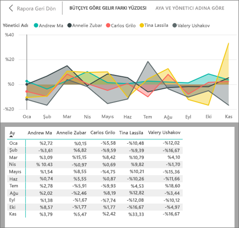

### Excel’e verileri aktarma
Görseli oluştururken kullanılan verileri göstermenin yanı sıra, bu verileri dışarı aktarabilir ve Microsoft Excel’de görüntüleyebilirsiniz. Excel’e aktardığınızda ayrı bir belge, Power BI’ın parçası olmayan bir elektronik tablo oluşturursunuz. Excel dosyasında yaptığınız hiçbir değişiklik Power BI’daki verileri etkilemez. Verilere daha yakından bakmak ya da verileri başka bir uygulamada veya başka bir amaçla kullanmak istiyor olabilirsiniz; Power BI size bu esnekliği sağlar.

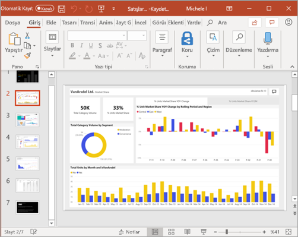

<!-- Exporting isn't limited to individual visuals; you can export entire reports to PowerPoint or PDF to share with your colleagues.

 -->

Bu hızlı başlangıç, *tüketicilerin* Power BI hizmeti ile gerçekleştirebileceği işlemlere hızlı bir genel bakış niteliğindedir.  

## Kaynakları temizleme
- Bir uygulamaya bağlandıysanız gezinti bölmesinden **Uygulamalar**'ı seçerek Uygulamalar içerik listesini açın. Silmek istediğiniz uygulamanın üzerine gelip çöp kutusu simgesini seçin.

- Bir Power BI örnek raporunu içeri aktardıysanız veya raporla bağlantı kurduysanız gezinti bölmesinden **Çalışma alanım**'ı açın. Yukarıdaki sekmeleri kullanarak panoyu, raporu ve veri kümesini bulun ve her birinin yanındaki çöp kutusu simgesini seçin.

## Sonraki adımlar
[Tüketiciler için Power BI](end-user-consumer.md)

