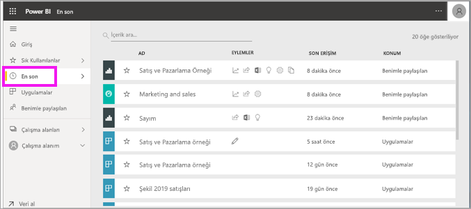
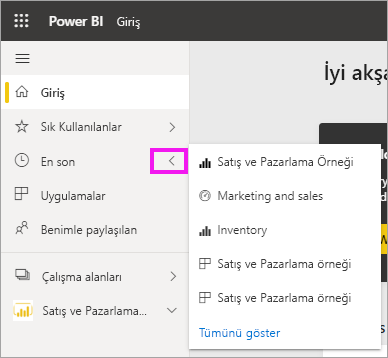
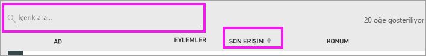

# Power BI hizmetinde **son görüntülenen** içerik
Son görüntülenen içerik, Power BI hizmetinde en son ziyaret ettiğiniz öğeleri (en fazla 20 öğe) içerir.  Bunlar içerisinde panolar, raporlar, uygulamalar ve çalışma kitapları bulunur.

Aşağıdaki videoda Amanda, Power BI hizmeti **Son görüntülenen** içerik listelerinin nasıl doldurulduğunu göstermektedir. Bu videoyu izledikten sonra kendiniz denemek için videonun altında bulunan adım adım yönergeleri uygulayın.

<iframe width="560" height="315" src="https://www.youtube.com/embed/G26dr2PsEpk" frameborder="0" allowfullscreen></iframe>

> [!NOTE]
> Bu videoda Power BI hizmetinin eski bir sürümü kullanılmaktadır.

## Son görüntülenen içeriği görüntüleme
En son ziyaret ettiğiniz beş öğeyi görmek için gezinti bölmesinde **Son görüntülenen** sekmesinin sağındaki oku seçin.  Burada, son görüntülenen içeriği seçip açabilirsiniz. Yalnızca son görüntülenen beş öğe listelenir.

Son ziyaret ettiğiniz öğe sayısı beşten fazlaysa Son görüntülenen ekranını açmak için **Tümünü göster**’i seçin. Gezinti bölmesinden **Son görüntülenen**’i veya Son görüntülenen  simgesini de seçebilirsiniz.

## **Son görüntülenen** içerik listesinden yapılabilen işlemler
Yapabileceğiniz işlemler, içerik *tasarımcısı* tarafından atanan ayarlara bağlıdır. Bazı seçenekleriniz şunlar olabilir:
* Yıldız simgesini seçerek [Panoyu, raporu veya uygulamayı sık kullanılanlara ekleyin](end-user-favorite.md) .
* Bazı panolar ve raporlar yeniden paylaşılabilir  .
* [Raporu Excel’de açın](end-user-export.md)  
* Power BI’ın verilerde bulduğu [içgörüleri görüntüleyin](end-user-insights.md).
* Ayrıca listeniz uzarsa [arama alanını ve sıralama özelliğini kullanarak, aradığınızı bulabilirsiniz](end-user-search-sort.md). Bir sütunun sıralanıp sıralanamayacağını öğrenmek için üzerine gelerek bir okun görünüp görünmediğine bakın. Bu örnekte, **Son erişim**’in üzerine geldiğinizde bir ok görüntülenir ve son görüntülediğiniz içerikler erişim tarihine göre sıralanabilir. 

    

## Sonraki adımlar
[Power BI hizmet uygulamaları](end-user-apps.md)

Başka bir sorunuz mu var? [Power BI Topluluğu'na başvurun](https://community.powerbi.com/)

