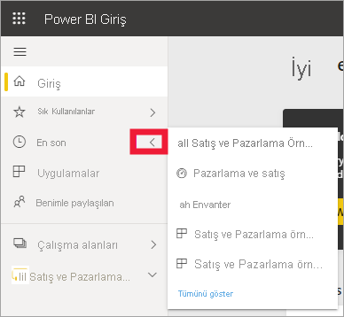
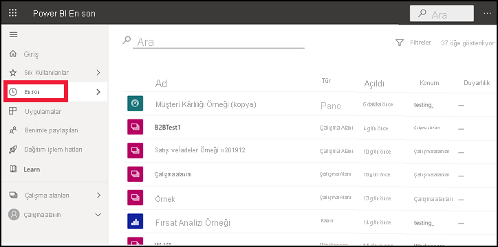
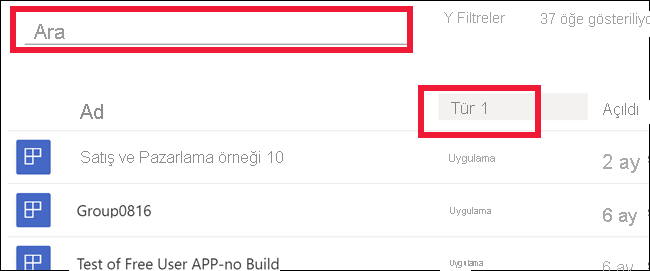

# Power BI hizmetinde **son görüntülenen** içerik

[!INCLUDE[consumer-appliesto-yyny](../includes/consumer-appliesto-yyny.md)]

**Son görüntülenen** içerik, Power BI hizmetinde en son ziyaret ettiğiniz öğeleri içerir. Bunlar içerisinde panolar, raporlar, uygulamalar ve çalışma kitapları bulunur. Gezinti çubuğunda **Son görüntülenen**'i seçtiğinizde Power BI bu içerikleri tarihe göre azalan sırada görüntüler.  Sıralama düzenini değiştirmek için başlıklardan birini seçip artan veya azalan düzeni seçin.

Gördüğünüz gibi iki öğe [sık kullanılanlar](end-user-favorite.md) arasında olduğundan yanında yıldız simgesi vardır. Bir diğer öğe olan Müşteri Kârlılığı Örneği ise [Premium kapasitede](end-user-license.md) depolanmaktadır.

## Son görüntülediğiniz beş içeriği görme

Yalnızca en son ziyaret ettiğiniz beş öğeyi görüntülemek için gezinti bölmesinde **Son görüntülenen**'in sağındaki oku seçin.  Buradan istediğiniz içeriği seçerek açabilirsiniz. 

## Son görüntülediğiniz içeriklerin tümünü görme

Son ziyaret ettiğiniz öğe sayısı beşten fazlaysa **Son görüntülenen** ekranını açmak için **Tümünü göster**’i seçin. Bu makalenin başında yaptığınız gibi gezinti bölmesinde **Son görüntülenen** sözcüğünü veya simgesini  seçerek açılan menüyü atlayabilir ve **Son görüntülenen** ekranını açabilirsiniz.

## Son görüntülenen içeriklerinizi arama ve sıralama

Listeniz uzarsa [arama alanını ve sıralama özelliğini kullanarak, aradığınızı bulabilirsiniz](end-user-search-sort.md). Bir sütunun sıralanıp sıralanamayacağını öğrenmek için üzerine gelerek bir okun görünüp görünmediğine bakın. Bu örnekte, **Tür**’ün üzerine geldiğinizde bir ok görüntülenir ve son görüntülediğiniz içerikler türe göre alfabetik olarak sıralanabilir. 

Aşağıdaki videoda Amanda, Power BI hizmeti **Son görüntülenen** içerik listelerinin nasıl doldurulduğunu göstermektedir. Bu videoyu izledikten sonra kendiniz denemek için videonun altında bulunan adım adım yönergeleri uygulayın.

<iframe width="560" height="315" src="https://www.youtube.com/embed/G26dr2PsEpk" frameborder="0" allowfullscreen></iframe>

> [!NOTE]
> Bu videoda Power BI hizmetinin eski bir sürümü kullanılmaktadır.

<!--
## Actions available from the **Recent** content list
The actions available to you will depend on the settings assigned by the content *designer*. Some of your options may include:
* Select the star icon to [favorite a dashboard, report, or app](end-user-favorite.md) .
* Some dashboards and reports can be re-shared  .
* [Open the report in Excel](end-user-export.md)  
* [View insights](end-user-insights.md) that Power BI finds in the data . -->

## Sonraki adımlar
[Power BI hizmet uygulamaları](end-user-apps.md)

Başka bir sorunuz mu var? [Power BI Topluluğu'na başvurun](https://community.powerbi.com/)

