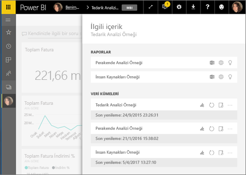
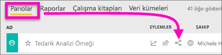
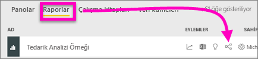
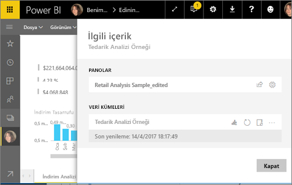
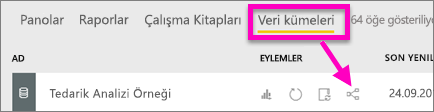

# Power BI hizmetinde ilişkili içeriği görüntüleme
**İlişkili içerik** bölmesi, Power BI hizmet içeriğinizin (panolar, raporlar ve veri kümeleri) birbirine nasıl bağlı olduğunu gösterir. İlgili içerik panosu da eylem gerçekleştirmek için bir fırlatma rampasıdır. Burada içgörüleri yenileyebilir, yeniden adlandırabilir, oluşturabilir ve daha birçok şey yapabilirsiniz. Bir ilgili rapor veya pano seçin, ardından seçiminiz Power BI çalışma alanınızda açılır.   

Power BI'da raporlar veri kümeleri temelinde oluşturulur, rapor görselleri panolara sabitlenir ve pano görselleri raporlara geri bağlanır. Peki hangi panoların Pazarlama raporunuzdaki görselleri barındırdığını nasıl bilebilirsiniz? Bu panoları nasıl bulabilirsiniz? Tedarik panonuz birden fazla veri kümesine ait görselleri mi kullanıyor? Öyleyse bunların adları nedir ve bunları nasıl açabilir ve düzenleyebilirsiniz? İK veri kümeniz herhangi bir rapor veya panoda kullanılıyor mu? Veya, herhangi bir bağlantı kesintisine neden olmadan taşınabilir mi? Bu ve benzeri tüm soruların cevapları **İlişkili içerik** bölmesinde verilebilir.  Bölme, ilişkili içeriği görüntülemenin yanı sıra içerik üzerinde işlem yapmanıza ve ilişkili içerik arasında kolayca gezinmenize olanak tanır.

> [!NOTE]
> İlişkili içerik özelliği, akış veri kümeleri için çalışmaz.
> 
> 

## Bir panonun ilişkili içeriğini görüntüleme
Bir panonun ilişkili içeriğini görüntüleyen Will'i izleyin. Ardından Tedarik Analizi örneği veri kümesinde kendiniz denemek için videonun altındaki adım adım yönergeleri uygulayın.

<iframe width="560" height="315" src="https://www.youtube.com/embed/B2vd4MQrz4M#t=3m05s" frameborder="0" allowfullscreen></iframe>

**İlişkili içerik** bölmesini açmak için en azından bir panoyu *görüntüleme* izinleriniz olmalıdır. Bu örnekte [Tedarik Analizi örneğini](../sample-procurement.md) kullanıyoruz.

**1. Yöntem**

Bir çalışma alanında **Panolar** sekmesini ve sonra **İlişkilileri görüntüle** simgesini  seçin.

 

**2. Yöntem**

Pano açıkken, üstteki menü çubuğundan    seçin.

**İlişkili içerik** bölmesi açılır. Panoya sabitlenmiş görselleştirmeleri bulunan tüm raporları ve bunların ilişkili veri kümelerini gösterir. Bu panoda, üç farklı rapordan sabitlenmiş görselleştirmeler bulunur ve bu raporlar üç farklı veri kümesine dayanır.

Burada ilişkili içerik üzerinde doğrudan işlem yapabilirsiniz.  Örneğin, açmak için bir rapor adı seçin.  Listelenen bir raporda [Excel'de çözümleme](../service-analyze-in-excel.md), [yeniden adlandırma](../service-rename.md) veya [öngörüler alma](end-user-insights.md) işlemleri için bir simge seçin. Bir veri kümesinde [yeni bir rapor oluşturma](../service-report-create-new.md), [yenileme](../refresh-data.md), yeniden adlandırma, [Excel'de çözümleme](../service-analyze-in-excel.md), [öngörüler alma](end-user-insights.md) işlemleri için bir simge seçin veya veri kümesinin **Ayarlar** penceresini açın.  

## Bir raporun ilişkili içeriğini görüntüleme
**İlişkili içerik** bölmesini açmak için en azından bir raporu *görüntüleme* izinleriniz olmalıdır. Bu örnekte [Tedarik Analizi örneğini](../sample-procurement.md) kullanıyoruz.

**1. Yöntem**

Bir çalışma alanında **Raporlar** sekmesini ve sonra **İlişkilileri görüntüle** simgesini  seçin.

 

**2. Yöntem**

Raporu [Okuma görünümü](end-user-reading-view.md)’nde açın ve üstteki menü çubuğundan simgesini seçin.

**İlişkili içerik** bölmesi açılır. İlişkili veri kümesini ve en az bir kutucuğu rapordan sabitlenmiş olan tüm panoları gösterir. Bu raporda, 2 farklı panoya sabitlenmiş görselleştirmeler bulunur.

Burada ilişkili içerik üzerinde doğrudan işlem yapabilirsiniz.  Örneğin, açmak için bir pano adı seçin.  Listedeki bir panoda [panoyu başkalarıyla paylaşmak](../service-share-dashboards.md) için bir simge seçin veya panonun **Ayarlar** penceresini açın. Veri kümesinde [yeni bir rapor oluşturma](../service-report-create-new.md), [yenileme](../refresh-data.md), yeniden adlandırma, [Excel'de çözümleme](../service-analyze-in-excel.md), [öngörüler alma](end-user-insights.md) işlemleri için bir simge seçin veya veri kümesinin **Ayarlar** penceresini açın.  

## Bir veri kümesinin ilişkili içeriğini görüntüleme
**İlişkili içerik** bölmesini açmak için en azından bir veri kümesini *görüntüleme* izinleriniz olmalıdır. Bu örnekte [Tedarik Analizi örneğini](../sample-procurement.md) kullanıyoruz.

Bir çalışma alanında **Veri kümeleri** sekmesini seçin ve **İlişkilileri görüntüle** simgesini  bulun.

**İlişkili içerik** bölmesini açmak için simgeyi seçin.

Burada ilişkili içerik üzerinde doğrudan işlem yapabilirsiniz. Örneğin, açmak için bir pano veya rapor adı seçin.  Listedeki bir panoda [panoyu başkalarıyla paylaşmak](../service-share-dashboards.md) için bir simge seçin veya panonun **Ayarlar** penceresini açın. Bir raporda [Excel'de çözümleme](../service-analyze-in-excel.md), [yeniden adlandırma](../service-rename.md) veya [içgörüler alma](end-user-insights.md) işlemleri için bir simge seçin.  

## Sınırlamalar ve sorun giderme
* "İlişkilileri görüntüle" simgesini görmüyorsanız, onun yerine  simgesini bulun. **İlişkili içerik** bölmesini açmak için simgeyi seçin.
* Bir raporun İlişkili içeriğini görmek için [Okuma görünümü](end-user-reading-view.md)'nde olmanız gerekir.
* İlişkili içerik özelliği, akış veri kümeleri için çalışmaz.

## Sonraki adımlar
* [Power BI hizmeti ile çalışmaya başlama](../service-get-started.md)
* Başka bir sorunuz mu var? [Power BI Topluluğu'na başvurun](http://community.powerbi.com/)

