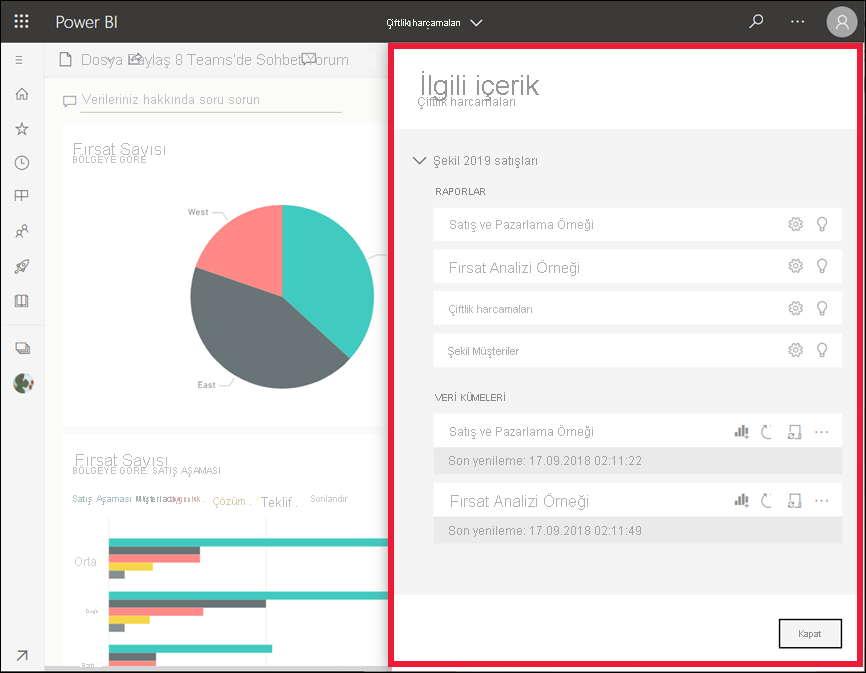

# Power BI hizmetinde ilişkili içeriği görme

[!INCLUDE[consumer-appliesto-yyny](../includes/consumer-appliesto-yyny.md)]

[!INCLUDE [power-bi-service-new-look-include](../includes/power-bi-service-new-look-include.md)]

**İlişkili içerik** bölmesi, Power BI hizmet içeriğinizin (panolar, raporlar ve veri kümeleri) birbirine nasıl bağlı olduğunu gösterir. **İlgili içerik** panosu ayrıca eylem gerçekleştirmek için bir fırlatma rampasıdır. Buradan, pano açma, rapor açma, içgörü oluşturma, Excel'de verileri çözümleme ve daha birçok şey yapabilirsiniz.  

Power BI hizmetinde raporlar veri kümeleri temelinde oluşturulur, rapor görselleri panolara sabitlenir ve pano görselleri raporlara geri bağlanır. Peki hangi panoların Pazarlama raporunuzdaki görselleri barındırdığını nasıl bilebilirsiniz? Bu panoları nasıl bulabilirsiniz? Tedarik panonuz birden fazla veri kümesine ait görselleri mi kullanıyor? Öyleyse bunların adları nedir ve bunları nasıl açabilir ve düzenleyebilirsiniz? İK veri kümeniz herhangi bir rapor veya panoda kullanılıyor mu? Veya, herhangi bir bağlantı kesintisine neden olmadan taşınabilir mi? Bu ve benzeri tüm soruların cevapları **İlişkili içerik** bölmesinde verilebilir.  Bölme, ilişkili içeriği görüntülemenin yanı sıra içerik üzerinde işlem yapmanıza ve ilişkili içerik arasında kolayca gezinmenize olanak tanır.

> [!NOTE]
> İlişkili içerik özelliği, akış veri kümeleri için çalışmaz.
> 
> 

## Bir panonun veya raporun ilişkili içeriğini görme
Bir panonun ilişkili içeriğini görüntüleyen Will'i izleyin. Ardından Tedarik Analizi örneğinde kendiniz denemek için videonun altındaki adım adım yönergeleri uygulayın.

> [!NOTE]
> Bu videoda Power BI hizmetinin eski bir sürümü gösterilmektedir. 

<iframe width="560" height="315" src="https://www.youtube.com/embed/B2vd4MQrz4M#t=3m05s" frameborder="0" allowfullscreen></iframe>

Bir pano veya rapor açıkken menü çubuğundan **Diğer seçenekler**’i (...) ve açılan listeden **İlgili içeriği görüntüle**’yi seçin.

**İlişkili içerik** bölmesi açılır. Bir pano için, panoya sabitlenmiş görselleştirmeleri bulunan tüm raporları ve bunların ilişkili veri kümelerini gösterir. Bu pano için yalnızca bir rapordan sabitlenmiş görselleştirmeler vardır ve o rapor yalnızca bir veri kümesini temel almaktadır. Bu makalenin başındaki görüntüye bakacak olursanız dört rapordan ve iki veri kümesinden sabitlenmiş görselleştirmelere sahip olan bir panoyla ilgili içeriği görebilirsiniz.

Burada sahip olduğunuz izinlere göre ilgili içerik üzerinde doğrudan işlem yapabilirsiniz.  Örneğin, açmak için bir rapor veya pano adı seçin.  Listelenen bir rapor için simgeleri seçerek raporu açıp ayarlarını düzenleyebilir, [içgörü alabilir](end-user-insights.md) ve daha fazlasını yapabilirsiniz. Bir veri kümesi için son yenileme tarihini ve saatini görüntüleyebilir, [Excel’de analiz edebilir](../collaborate-share/service-analyze-in-excel.md), [içgörü alabilir](end-user-insights.md), yenileyebilir ve daha fazlasını yapabilirsiniz.  

<!-- ## See related content for a dataset
You'll need at least *view* permissions to a dataset to open the **Related content** pane. In this example, we're using the [Procurement Analysis sample](../create-reports/sample-procurement.md).

From the nav pane, locate the **Workspaces** heading and select a workspace from the list. If you have content in a workspace, it will display in the canvas to the right. 

In a workspace, select the **Datasets** tab and locate the **See related** icon .

Select the icon to open the **Related content** pane.

From here, you can take direct action on the related content. For example, select a dashboard or report name to open it.  For any dashboard in the list, select an icon to [share the dashboard with others](../collaborate-share/service-share-dashboards.md) or to open the **Settings** window for the dashboard. For a report, select an icon to [analyze in Excel](../collaborate-share/service-analyze-in-excel.md), [rename](../create-reports/service-rename.md), or [get insights](end-user-insights.md).  -->

## Sınırlamalar ve sorun giderme
* "İlgili içeriği görüntüle" seçeneğini görmüyorsanız, onun yerine  simgesini bulun. **İlişkili içerik** bölmesini açmak için simgeyi seçin.
* Bir raporun ilgili içeriğini açmak için [Okuma görünümü](end-user-reading-view.md)'nde olmanız gerekir.
* İlgili içerik özelliği, akış veri kümeleri için çalışmaz.

## Sonraki adımlar
* [Power BI hizmeti ile çalışmaya başlama](../fundamentals/service-get-started.md)
* Başka bir sorunuz mu var? [Power BI Topluluğu'na başvurun](https://community.powerbi.com/)
