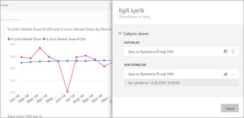

# Power BI hizmetinde ilişkili içeriği görüntüleme

[!INCLUDE[consumer-appliesto-ynny](../includes/consumer-appliesto-ynny.md)]

[!INCLUDE [power-bi-service-new-look-include](../includes/power-bi-service-new-look-include.md)]

**İlişkili içerik** bölmesi, Power BI hizmet içeriğinizin (panolar, raporlar ve veri kümeleri) birbirine nasıl bağlı olduğunu gösterir. **İlgili içerik** panosu ayrıca eylem gerçekleştirmek için bir fırlatma rampasıdır. Buradan, pano açma, rapor açma, içgörü oluşturma, Excel'de verileri çözümleme ve daha birçok şey yapabilirsiniz.  

Power BI'da raporlar veri kümeleri temelinde oluşturulur, rapor görselleri panolara sabitlenir ve pano görselleri raporlara geri bağlanır. Peki hangi panoların Pazarlama raporunuzdaki görselleri barındırdığını nasıl bilebilirsiniz? Bu panoları nasıl bulabilirsiniz? Tedarik panonuz birden fazla veri kümesine ait görselleri mi kullanıyor? Öyleyse bunların adları nedir ve bunları nasıl açabilir ve düzenleyebilirsiniz? İK veri kümeniz herhangi bir rapor veya panoda kullanılıyor mu? Veya, herhangi bir bağlantı kesintisine neden olmadan taşınabilir mi? Bu ve benzeri tüm soruların cevapları **İlişkili içerik** bölmesinde verilebilir.  Bölme, ilişkili içeriği görüntülemenin yanı sıra içerik üzerinde işlem yapmanıza ve ilişkili içerik arasında kolayca gezinmenize olanak tanır.

> [!NOTE]
> İlişkili içerik özelliği, akış veri kümeleri için çalışmaz.
> 
> 

## Bir panonun veya raporun ilişkili içeriğini görüntüleme
Bir panonun ilişkili içeriğini görüntüleyen Will'i izleyin. Ardından Tedarik Analizi örneği veri kümesinde kendiniz denemek için videonun altındaki adım adım yönergeleri uygulayın.

<iframe width="560" height="315" src="https://www.youtube.com/embed/B2vd4MQrz4M#t=3m05s" frameborder="0" allowfullscreen></iframe>

Bir pano veya rapor açıkken menü çubuğundan **Diğer seçenekler**’i (...) ve açılır listeden **İlişkilileri görüntüle**’yi seçin.

**İlişkili içerik** bölmesi açılır. Bir pano için, panoya sabitlenmiş görselleştirmeleri bulunan tüm raporları ve bunların ilişkili veri kümelerini gösterir. Bu pano için yalnızca bir rapordan sabitlenmiş görselleştirmeler vardır ve o rapor yalnızca bir veri kümesini temel almaktadır. 

Burada ilişkili içerik üzerinde doğrudan işlem yapabilirsiniz.  Örneğin, açmak için bir rapor veya pano adı seçin.  Listelenen bir rapor için [Excel’de analiz et](../service-analyze-in-excel.md) veya [içgörüleri al](end-user-insights.md) simgesini seçin. Bir veri kümesi için son yenileme tarihi ile saatini, [Excel’de analiz et](../service-analyze-in-excel.md) ve [içgörüleri al](end-user-insights.md) seçeneklerini görebilirsiniz.  

## Bir veri kümesinin ilişkili içeriğini görüntüleme
*İlişkili içerik* bölmesini açmak için en azından bir veri kümesini **görüntüleme** izinleriniz olmalıdır. Bu örnekte [Tedarik Analizi örneğini](../sample-procurement.md) kullanıyoruz.

Gezinti bölmesinden **Çalışma Alanları** başlığını bulun ve listeden bir çalışma alanı seçin. Bir çalışma alanında içeriğiniz varsa sağdaki tuvalde görüntülenir. 

Bir çalışma alanında **Veri kümeleri** sekmesini seçin ve **İlişkilileri görüntüle** simgesini  bulun.

**İlişkili içerik** bölmesini açmak için simgeyi seçin.

Burada ilişkili içerik üzerinde doğrudan işlem yapabilirsiniz. Örneğin, açmak için bir pano veya rapor adı seçin.  Listedeki bir panoda [panoyu başkalarıyla paylaşmak](../service-share-dashboards.md) için bir simge seçin veya panonun **Ayarlar** penceresini açın. Bir raporda [Excel'de çözümleme](../service-analyze-in-excel.md), [yeniden adlandırma](../service-rename.md) veya [öngörüler alma](end-user-insights.md) işlemleri için bir simge seçin.  

## Sınırlamalar ve sorun giderme
* "İlişkilileri görüntüle" simgesini görmüyorsanız, onun yerine  simgesini bulun. **İlişkili içerik** bölmesini açmak için simgeyi seçin.
* Bir raporun İlişkili içeriğini görmek için [Okuma görünümü](end-user-reading-view.md)'nde olmanız gerekir.
* İlişkili içerik özelliği, akış veri kümeleri için çalışmaz.

## Sonraki adımlar
* [Power BI hizmeti ile çalışmaya başlama](../service-get-started.md)
* Başka bir sorunuz mu var? [Power BI Topluluğu'na başvurun](https://community.powerbi.com/)

