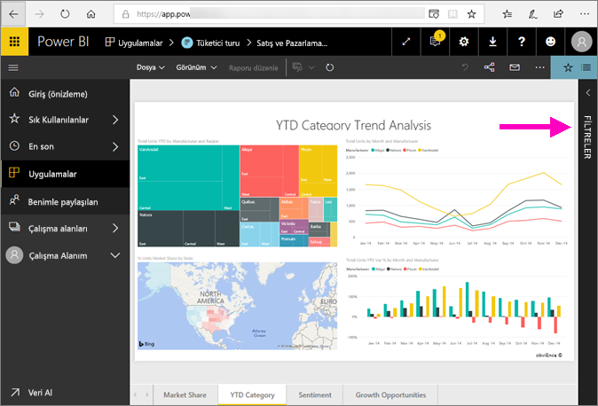
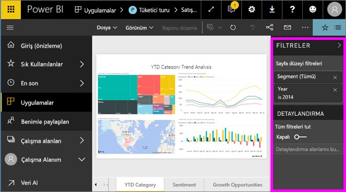
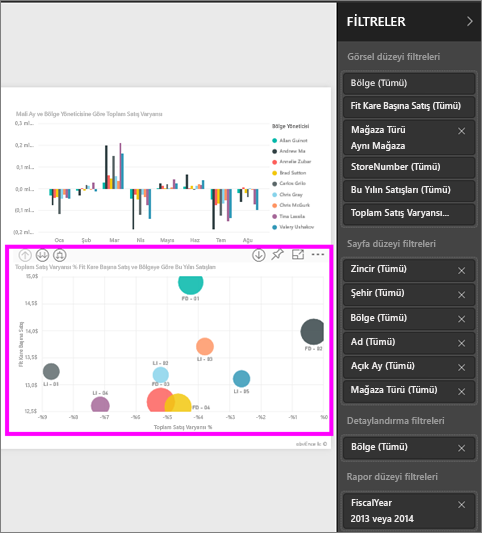
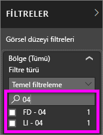
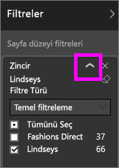
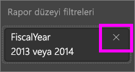
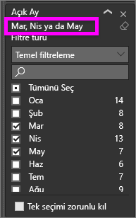
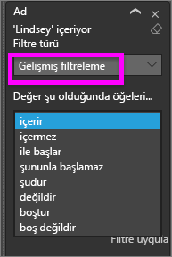
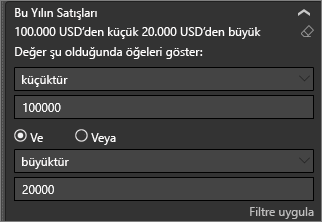
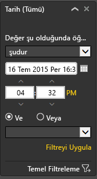

# Power BI Filtreler bölmesine ilişkin tura katılın
Bu makale Power BI hizmetindeki Rapor Filtreleri bölmesine bir bakış sunmaktadır.

Power BI'da verileri filtrelemenin birçok yolu vardır ancak öncelikle [Filtreler ve vurgulama hakkında](../power-bi-reports-filters-and-highlighting.md) başlıklı makaleyi okumanızı öneririz.

## Raporun Filtreler bölmesiyle çalışma
Bir iş arkadaşı sizinle bir rapor paylaştığında **Filtreler** bölmesine bakmayı unutmayın. Bölme bazen raporun sağ kenarı boyunca katlanır. Genişletmek için raporu seçin.   

Filtreler bölmesi, rapor *tasarımcısı* tarafından eklenen filtreler içerir. Sizin gibi *tüketiciler* filtrelerle etkileşebilir ve değişikliklerini kaydedebilir, ancak rapora yeni filtre ekleyemez. Örneğin yukarıdaki ekran görüntüsünde tasarımcı iki sayfa düzeyi filtre eklemiştir: Segment ve Year. Bu filtrelerle etkileşim kurabilir ve bunları değiştirebilirsiniz ancak üçüncü bir sayfa düzeyi filtre ekleyemezsiniz.

Power BI hizmetinde raporlar, Filtreler bölmesinde yaptığınız tüm değişiklikleri korur ve bu değişiklikler, raporun mobil sürümüne taşınır. Filtre bölmesini tasarımcının varsayılanlarına geri döndürmek için en üstteki menü çubuğundan **Varsayılana sıfırla**'yı seçin.     

## Filtreler bölmesini açma
Bir rapor açıldığında, rapor tuvalinin sağ tarafında Filtreler bölmesi görüntülenir. Bölmeyi görmüyorsanız genişletmek için sağ üst köşedeki oku seçin.  

Bu örnekte, 6 filtresi bulunan bir görsel seçtik. Rapor sayfasında da filtreler bulunur ve bunlar **Sayfa düzeyi filtreleri** başlığı altında yer alır. Bir [Detaylandırma filtresinin](../power-bi-report-add-filter.md) yanı sıra raporun tamamına uygulanmış bir filtre daha bulunur:  **FiscalYear** 2013 veya 2014 değeridir.

Bazı filtrelerin yanında **Tümü** ifadesi bulunur ve bu, tüm değerlerin söz konusu filtreye dahil edildiği anlamına gelir.  Örneğin, yukarıdaki ekran görüntüsünde **Chain(All)**, bize bu rapor sayfasının tüm mağaza zincirleriyle ilgili verileri içerdiğini gösterir.  Diğer yandan, **FiscalYear 2013 veya 2014 değeridir** rapor düzeyi filtresi, bize raporun yalnızca 2013 ve 2014 mali yıllarına ilişkin verileri içerdiğini gösterir.

Bu raporu görüntüleyen tüm kullanıcılar filtrelerle etkileşime geçebilir.

- İstediğiniz değeri bulmak ve seçmek için sayfa, görsel, rapor ve detaylandırma filtrelerinde arama yapın. 

    

- Filtrenin üzerine gelip yanındaki oku seçerek ayrıntılarını görüntüleyebilir.
  
   
* Filtreyi değiştirebilir (örneğin, **Lindseys** filtresini **Fashions Direct** ile değiştirme).
  
     

* Üstteki menü çubuğundan **Varsayılana sıfırla**’yı seçerek filtreleri özgün durumuna geri döndürebilir.    
    
    
* Filtre adının yanındaki **x** işaretini seçerek filtreyi silebilir.
  
    

  Bir filtre silindiğinde listeden kaldırılır ancak rapordan silinmez.  Örneğin, **FiscalYear 2013 veya 2014 değeridir** filtresini silerseniz mali yıl verileri raporda kalmaya devam eder ancak artık yalnızca 2013 ve 2014 yıllarını gösterecek şekilde filtrelenmek yerine verilerin kapsadığı tüm mali yılları gösterir.  Ancak sildiğiniz filtreler listeden kaldırılacağından bu filtreleri artık değiştiremezsiniz. Silgi simgesini  seçerek filtreyi temizlemek daha kullanışlı bir seçenektir.
  
  

## Bir filtreyi temizleme
 Gelişmiş veya temel filtreleme modunda silgi simgesini seçerek   filtreyi temizleyin. 

## Filtre türleri: metin alanı filtreleri
### Liste modu
Bir onay kutusunun işaretlenmesi ilgili değerin seçilmesini veya seçiminin kaldırılmasını sağlar. Tüm onay kutularının durumunu açık veya kapalı olarak değiştirmek için **Tümü** onay kutusu kullanılabilir. Onay kutuları, söz konusu alan için kullanılabilen tüm değerleri temsil eder.  Siz filtreyi ayarlarken, ifade, seçimlerinizi yansıtacak şekilde güncelleştirilir. 

İfadenin artık "Mar, Apr veya May değeridir" olarak göründüğüne dikkat edin.

### Gelişmiş mod
Gelişmiş moda geçmek için **Gelişmiş Filtreleme** seçeneğini belirleyin. Hangi alanların dahil edileceğini belirlemek için açılan menü denetimlerini ve metin kutularını kullanın. **Ve** ile **Veya** arasında seçim yaparak karmaşık filtre ifadeleri oluşturabilirsiniz. İstediğiniz değerleri belirledikten sonra **Filtre Uygula** düğmesini seçin.  

## Filtre türleri: sayısal alan filtreleri
### Liste modu
Değerler sınırlıysa, alanı seçtiğinizde bir liste görüntülenir.  Onay kutuları kullanma ile ilgili yardım için yukarıdaki **Metin alanı filtreleri** &gt; **Liste modu** başlığına bakın.   

### Gelişmiş mod
Değerler sınırsızsa veya bir aralığı temsil ediyorsa alanı seçtiğinizde gelişmiş filtreleme modu açılır. Görmek istediğiniz değer aralığını belirtmek için, açılan menüyü ve metin kutularını kullanın. 

**Ve** ile **Veya** arasında seçim yaparak karmaşık filtre ifadeleri oluşturabilirsiniz. İstediğiniz değerleri belirledikten sonra **Filtre Uygula** düğmesini seçin.

## Filtre türleri: tarih ve saat
### Liste modu
Değerler sınırlıysa, alanı seçtiğinizde bir liste görüntülenir.  Onay kutuları kullanma ile ilgili yardım için yukarıdaki **Metin alanı filtreleri** &gt; **Liste modu** başlığına bakın.   

### Gelişmiş mod
Alan değerleri tarih veya saat temsil ediyorsa Tarih/Saat filtrelerini kullanırken başlangıç/bitiş zamanı belirtebilirsiniz.  

## Sonraki adımlar
[Görsellerin bir rapor sayfasında nasıl birbirlerini karşılıklı olarak filtrelediğini ve vurguladığını öğrenin](end-user-interactions.md)