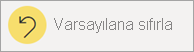
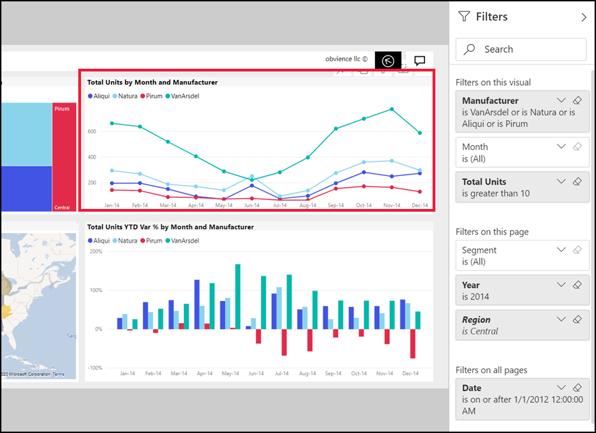
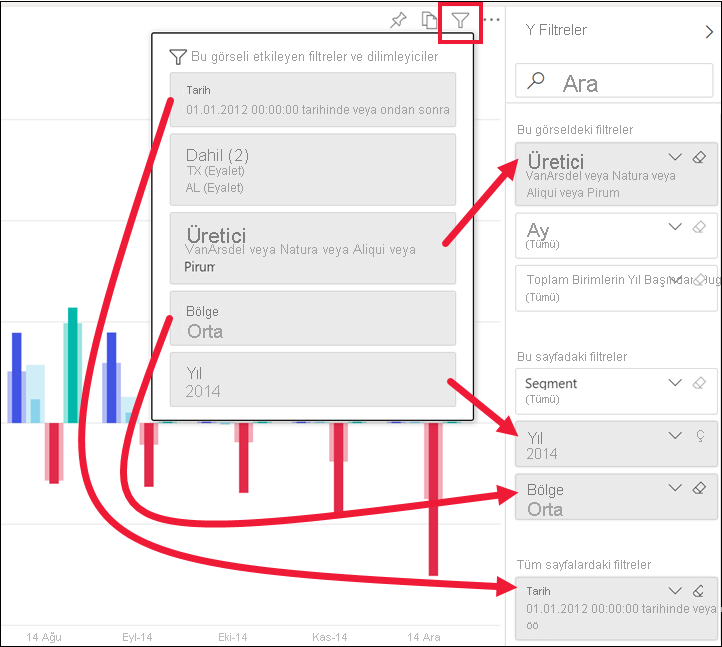
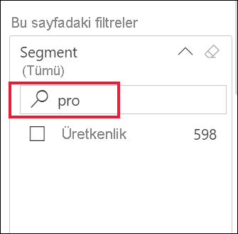
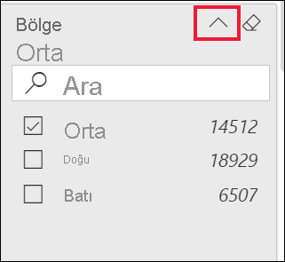
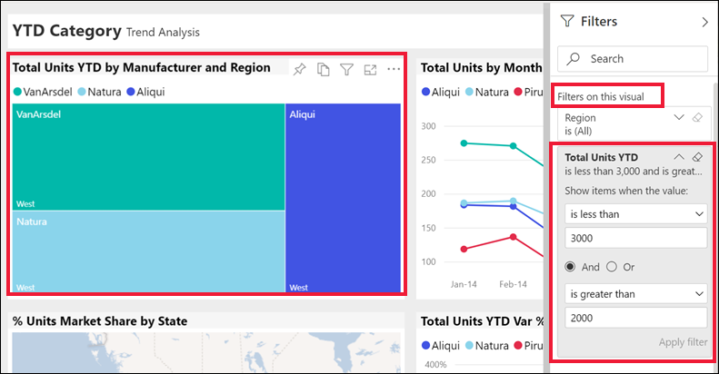

# Power BI Filtreler bölmesine ilişkin tura katılın

[!INCLUDE[consumer-appliesto-yyny](../includes/consumer-appliesto-yyny.md)]

[!INCLUDE [power-bi-service-new-look-include](../includes/power-bi-service-new-look-include.md)]

Bu makale Power BI hizmetindeki Rapor **Filtreleri** bölmesine bir bakış sunmaktadır. Verilerinizde yeni içgörüler keşfetmek için filtreleri kullanın.

Power BI'da verilere filtre uygulamanın birçok farklı yolu vardır. Bu makalede, **Filtreler** bölmesinin nasıl kullanılacağı açıklanmaktadır.  Sayfadaki diğer görselleri filtrelemek için bir rapor görselindeki veri noktalarını seçerek de filtre uygulayabilirsiniz. Buna **çapraz filtreleme** ve **çapraz vurgulama** adı verilir. Çapraz filtreleme ve çapraz vurgulama hakkında daha fazla bilgi için bkz. [Power BI raporlarında filtreler ve vurgulama](../create-reports/power-bi-reports-filters-and-highlighting.md).

## Raporun Filtreler bölmesiyle çalışma

Bir iş arkadaşı sizinle bir rapor paylaştığında **Filtreler** bölmesine bakmayı unutmayın. Bölme bazen raporun sağ kenarı boyunca katlanır. Genişletmek için raporu seçin.

**Filtreler** bölmesi, rapor *tasarımcısı* tarafından rapora eklenen filtreleri içerir. Sizin gibi *iş kullanıcıları* mevcut filtrelerle etkileşim kurabilir ve değişikliklerini kaydedebilir, ancak rapora yeni filtre ekleyemez. Örneğin yukarıdaki ekran görüntüsünde tasarımcı üç sayfa düzeyi filtre eklemiştir: **Segment is All**, **Year is 2014** ve **Region is Central**. Bu filtrelerle etkileşim kurabilir ve bunları değiştirebilirsiniz ancak dördüncü bir sayfa düzeyi filtresi ekleyemezsiniz.

Filtrelerin bazıları gölgelidir, bazıları değildir. Bir filtrenin gölgeli olması, filtrenin uygulandığı ve bazı verilerin dışlandığı anlamına gelir. Örneğin **Bölge** filtresi kartı gölgeliyse kartı genişlettiğinizde açılan listeden yalnızca **Orta** seçeneğinin belirtilmiş olduğunu görürsünüz. Bölge **Bu sayfadaki filtreler** başlığı altında olduğundan, bu sayfadaki tüm görseller **Batı** ve **Doğu** bölgelerindeki verileri görüntülemez (dışlar).

Power BI hizmetinde raporlar, **Filtreler** bölümünde yaptığınız tüm değişiklikleri saklar. Hizmet, raporun mobil versiyonu aracılığıyla bu değişiklikleri taşır. 

**Filtreler** bölmesini tasarımcının varsayılanlarına geri döndürmek için üstteki menü çubuğundan **Varsayılana sıfırla**'yı seçin.

 

> [!NOTE]
> **Varsayılana sıfırla** seçeneğini görmüyorsanız rapor *tasarımcısı* tarafından devre dışı bırakılmış olabilir. *Tasarımcı*, değiştirememeniz için belirli filtreleri de kilitleyebilir.

## Bir rapor sayfasının tüm filtrelerini görüntüleme

**Filtreler** bölmesinde, tasarımcının rapora eklediği tüm filtreler gösterilir. **Filtreler** bölmesi ayrıca filtreler hakkındaki bilgileri görüntüleyebileceğini ve filtrelerle etkileşimde bulunabileceğiniz alandır. Yaptığınız değişiklikleri kaydedin veya **Varsayılana sıfırla**’yı kullanarak özgün filtre ayarlarına dönün.

Kaydetmek istediğiniz değişiklikler varsa, kişisel bir yer işareti de oluşturabilirsiniz. Daha fazla bilgi için bkz. [Yer işareti nedir?](end-user-bookmarks.md).

**Filtreler** bölmesi birkaç türde rapor filtresi gösterir ve yönetir: rapor, rapor sayfası ve görsel.

Bu örnekte, üç filtresi olan bir görsel seçtik: **Üretici**, **Ay** ve **Toplam birim sayısı**. Rapor sayfasında da filtreler bulunur ve bunlar **Bu sayfadaki filtreler** başlığı altında yer alır. Tüm raporda, **Tüm sayfalardaki filtreler** altında listelenmiş bir **Tarih** filtresi bulunur.

Bazı filtrelerin yanında **(Tümü)** ifadesi bulunur. **(Tümü)**, filtreye tüm değerlerin dahil edildiği anlamına gelir. Yukarıdaki ekran görüntüsünde **Segment(Tümü)** ifadesi, bu rapor sayfasının tüm ürün segmentleriyle ilgili verileri içerdiğini gösterir. 

Bu raporu görüntüleme iznine sahip tüm kullanıcılar filtrelerle etkileşim kurabilir.

### Yalnızca bir görsele uygulanmış filtreleri görüntüleme

Belirli bir görseli etkileyen filtrelere yakından bakmak için fareyle görselin üzerine gelerek filtre simgesini  ortaya çıkarın. Bir görseli etkileyen tüm filtreleri, dilimleyicileri, vb. içeren açılan listeyi görüntülemek için bu filtre simgesini seçin. Açılır penceredeki **Filtreler** bölmesinde gösterilen filtreleri ve ayrıca seçili görseli etkileyen tüm ek filtreleri içerir.

Bu görünümde gösterilebilen filtre türleri şunlardır:

- Temel filtreler
- Dilimleyiciler
- Çapraz vurgulama
- Çapraz filtreleme
- Gelişmiş filtreler
- Üst N filtreler
- Göreli Tarih filtreleri
- Eşitleme dilimleyicileri
- Ekleme/Dışlama filtreleri
- URL aracılığıyla geçirilen filtreler

Bu örnekte:
1. **Included** değeri, görsele çapraz filtre uygulandığını belirtir. Bunun anlamı, Alabama ve Texas eyaletlerinin bu rapor sayfasındaki diğer görsellerden birinde seçilmiş olmasıdır. Bu örnekte harita görselidir. Bu iki eyaletin seçilmesi, diğer tüm eyaletlere ilişkin verilerin seçili çubuk grafikte gösterilmesini engellemiştir.  

1. **Date**, bu rapordaki tüm sayfalara uygulanan bir filtredir.

1. **Region is Central** ile **Year is 2014** bu rapor sayfasına uygulanmış filtrelerdir.

4. **Manufacturer is VanArsdel, Natura, Aliqui, or Pirum** bu görsele uygulanmış bir filtredir.

### Filtrede arama yapma

Bazen bir filtre uzun bir değer listesine sahip olabilir. İstediğiniz değeri bulup seçmek için arama kutusunu kullanın.

### Filtre ayrıntılarını görüntüleme

Bir filtreyi anlamak için genişletip mevcut değerlere ve sayılara göz atın.  Filtreyi genişletmek için filtre adının yanındaki oku seçin.
  

### Filtre seçimlerini değiştirme

Veri içgörüleri aramanın bir yolu, filtrelerle etkileşimde bulunmaktır. Filtre seçimlerini, alan adının yanındaki açılır oku kullanarak değiştirebilirsiniz.  Filtreye ve Power BI’ın filtrelediği verilerin türüne bağlı olarak, listeden basit seçimler ile tarih veya sayı aralığı belirlemeye varan seçenekleriniz mevcut olacaktır. Aşağıdaki gelişmiş filtrede, ağaç haritası üzerindeki **Toplam Birim YTD** filtresini 2.000 ile 3.000 arasında olacak şekilde değiştirdik. Bu değişikliğin ağaç haritasından Pirum’u kaldırdığına dikkat edin.
  

> [!TIP]
> Aynı anda birden fazla filtre değeri seçmek için CTRL tuşunu basılı tutun. Çoğu filtre çoklu seçimi destekler.

### Filtreyi varsayılana sıfırlama

Filtrelerde yaptığınız tüm değişiklikleri geri almak isterseniz üstteki menü çubuğundan **Varsayılana sıfırla**’yı seçin.  Bu seçim, filtreleri rapor tasarımcısı tarafından ayarlandığı özgün durumuna geri döndürür.

### Filtreyi temizleme

Bir filtreyi (Tümü) olarak sıfırlamak için, filtre adının yanındaki silgi simgesini seçerek temizleyin.

  
<!--  too much detail for consumers

## Types of filters: text field filters
### List mode
Ticking a checkbox either selects or deselects the value. The **All** checkbox can be used to toggle the state of all checkboxes on or off. The checkboxes represent all the available values for that field.  As you adjust the filter, the restatement updates to reflect your choices. 

Note how the restatement now says "is Mar, Apr or May".

### Advanced mode
Select **Advanced Filtering** to switch to advanced mode. Use the dropdown controls and text boxes to identify which fields to include. By choosing between **And** and **Or**, you can build complex filter expressions. Select the **Apply Filter** button when you've set the values you want.  

## Types of filters: numeric field filters
### List mode
If the values are finite, selecting the field name displays a list.  See **Text field filters** &gt; **List mode** above for help using checkboxes.   

### Advanced mode
If the values are infinite or represent a range, selecting the field name opens the advanced filter mode. Use the dropdown and text boxes to specify a range of values that you want to see. 

By choosing between **And** and **Or**, you can build complex filter expressions. Select the **Apply Filter** button when you've set the values you want.

## Types of filters: date and time
### List mode
If the values are finite, selecting the field name displays a list.  See **Text field filters** &gt; **List mode** above for help using checkboxes.   

### Advanced mode
If the field values represent date or time, you can specify a start/end time when using Date/Time filters.  

-->

## Sonraki adımlar

[Görsellerin bir rapor sayfasında nasıl birbirlerini karşılıklı olarak filtrelediğini ve vurguladığını](end-user-interactions.md) öğrenin
