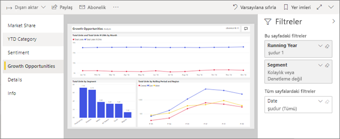
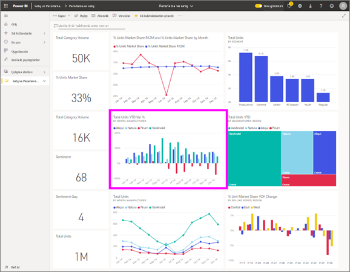

# *Tüketiciler* için Power BI hizmetinde rapor görüntüleme
Rapor, görsellerden oluşan bir veya daha çok sayfalık bir belgedir. Raporları Power BI tarafından oluşturulan *tasarımcıları* ve [ile paylaşılan *tüketiciler* doğrudan](end-user-shared-with-me.md) veya parçası olarak bir [uygulama](end-user-apps.md). 

Bir raporu açmak için birçok farklı yolu vardır ve ikisini göstereceğiz: evden açın ve bir Pano açın. 

<!-- add art-->

## Bir raporu Power BI giriş açın
Önce doğrudan sizinle paylaşılan bir raporu, ardından da bir uygulama aracılığıyla paylaşılan bir raporu açalım.

   

### Sizinle paylaşılmış olan bir raporu açma
Power BI *tasarımcıları* bir rapor sizinle doğrudan paylaşabilirsiniz. İçinde bu şekilde paylaşılan içerik görünür **benimle paylaşılan** , gezinti çubuğunda hem de kapsayıcı **benimle paylaşılan** giriş tuvalinize bölümü.

1. Power BI hizmetinde (app.powerbi.com) açın.

2. Gezinti çubuğundan seçin **giriş** giriş tuvalinize görüntülenecek.  

   
   
3. **Benimle paylaşılan** bölümünü görene kadar aşağı kaydırın. Rapor simgesini  bulun. Bu ekran görüntüsünde bir Pano ve adlı bir raporu sahibiz *satış ve pazarlama örneği*. 
   
   

4. Rapor seçmeniz yeterlidir *kart* seçerek raporu açın.

   

5. Sol tarafta sekmeleri dikkat edin.  Bu sekmelerin her biri raporunuzun bir *sayfasını* temsil eder. Şu anda sahip olduğumuz *büyüme Fırsat* sayfasını açın. Seçin *Yılbaşından BUGÜNE kategorisi* bunun yerine, rapor sayfasını açmak için sekmesinde. 

   

6. Biz tüm rapor sayfasını görüyorsunuz hemen. Sayfa (yakınlaştırma) görünümünü değiştirmek için sağ üst köşeden görünümü açılan menüyü seçin ( **>** ) seçip **Gerçek Boyut**.

   

   

### Bir uygulamanın parçası olan bir raporu açma
Uygulamalar, iş arkadaşlarınızın veya AppSource kaynağından aldıysanız bu uygulamaları giriş gelen ve kullanılabilir **uygulamaları** , gezinti çubuğunda kapsayıcı. [Uygulama](end-user-apps.md), panolardan ve raporlardan oluşan bir pakettir.

1. Git seçerek geri giriş **giriş** gezinti çubuğundan.

7. **Uygulamalarım** bölümünü görene kadar aşağı kaydırın.

   

8. Uygulamalardan birini seçerek açın. Uygulama *tasarımcısı* tarafından belirlenen seçeneklere bağlı olarak uygulama bir pano, rapor veya uygulama içerik listesi ile açılır. Uygulamayı seçtiğinizde:
    - rapor açılırsa başka bir işlem yapmanıza gerek yoktur.
    - pano açılırsa aşağıdaki ***Bir raporu panodan açma*** bölümüne bakın.
    - uygulama içerik listesi açılırsa **Raporlar** bölümünden raporu seçerek açın.

## Bir raporu panodan açma
Raporlar panodan açılabilir. Çoğu pano kutucuğu, raporlardan *sabitlenmiştir*. Bir kutucuğu seçtiğinizde panoyu oluşturmak için kullanılan rapor açılır. 

1. Panodan bir kutucuk seçin. Bu örnekte, "Total Units YTD..." sütun grafiği kutucuğunu seçmeyi tercih ettik.

    

2.  İlişkili rapor açılır. "YTD Category" adlı sayfada olduğumuza dikkat edin. Bu, panodan seçtiğimiz sütun grafiğinin yer aldığı rapor sayfasıdır.

    

> [!NOTE]
> Tüm kutucuklar rapor açmaz. [Soru-Cevap ile oluşturulan](end-user-q-and-a.md) bir kutucuğu seçerseniz Soru-Cevap ekranı açılır. [Panodaki **Kutucuk ekle** pencere öğesi kullanılarak oluşturulan](../service-dashboard-add-widget.md) bir kutucuğu seçerseniz farklı işlemler gerçekleşebilir.  

##  Raporları açmak için kullanabileceğiniz yöntemler bunlarla sınırlı değildir
Power BI hizmetinde gezinme konusunda daha yetkin hale geldikçe sizin için en iyi çalışan iş akışlarını keşfedeceksiniz. Raporlara erişmek için kullanabileceğiniz diğer yöntemlerden bazıları aşağıda verilmiştir:
- Gezinti çubuğunu kullanarak gelen **Sık Kullanılanlar** ve **son**    
- [İlişkilileri görüntüle](end-user-related.md) seçeneğini kullanma    
- Bir kullanıcı [sizinle paylaşımda bulunduğunda](../service-share-reports.md) veya [uyarı ayarladığınızda](end-user-alerts.md) aldığınız e-postadan    
- [Bildirim merkezinizi](end-user-notification-center.md) kullanma    
- ve daha fazlası

## Sonraki adımlar
[Bir rapor ile etkileşimde bulunmanın birçok yolu](end-user-reading-view.md) vardır.  Her sekme rapor tuvalinin kenarına keşfederek başlayabilirsiniz.

