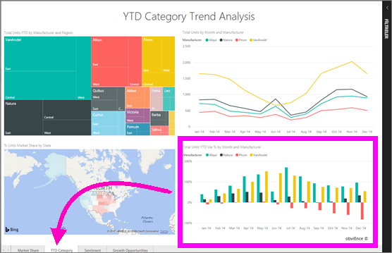

# *Tüketiciler* için Power BI hizmetinde rapor görüntüleme
Rapor, görsellerden oluşan bir veya daha çok sayfalık bir belgedir. Raporlar Power BI *rapor tasarımcıları* tarafından oluşturulur ve [*tüketicilerle* doğrudan](end-user-shared-with-me.md) veya bir [uygulama](end-user-apps.md) aracılığıyla paylaşılır. 

Bir raporu açmanın birçok farklı yolu vardır. Burada Giriş sayfasından açma ve panodan açma olmak üzere iki farklı yöntem gösterilmektedir. 

<!-- add art-->

## Giriş sayfanızdan rapor açma
Önce doğrudan sizinle paylaşılan bir raporu, ardından da bir uygulama aracılığıyla paylaşılan bir raporu açalım.

   

### Sizinle paylaşılmış olan bir raporu açma
Power BI *tasarımcıları* oluşturdukları raporu üst menü çubuğundaki **Paylaş** düğmesine tıklayarak doğrudan sizinle paylaşabilir. Bu durumda paylaşılan içerik sol gezinti çubuğunuzdaki **Benimle paylaşılan** kapsayıcısında ve Giriş sayfanızın **Benimle paylaşılan** bölümünde gösterilir.

1. Power BI hizmetini (app.powerbi.com) açın.

2. Sol gezinti çubuğunda **Giriş (Önizleme)** öğesini seçerek Giriş sayfanızı açın.  

   
   
3. **Benimle paylaşılan** bölümünü görene kadar aşağı kaydırın. Rapor simgesini  bulun. Bu ekran görüntüsünde iki rapor var: *Financial* ve *Northwind*. 
   
   

4. Raporu açmak için rapor *kartlarından* birini seçmeniz yeterlidir.

   

5. Sayfanın alt tarafındaki sekmelere dikkat edin. Bu sekmelerin her biri raporunuzun bir *sayfasını* temsil eder. Şu anda *IT Spend Trend* sayfası açık. Farklı bir sekmeyi seçerek ilgili rapor sayfasını açın. 

   

6. Şu an rapor sayfasının yalnızca bir bölümünü görebiliyoruz. Sayfanın görünümünü (yakınlaştırma) değiştirmek için **Görünüm** > **Sayfaya sığdır**'ı seçin.

   

   

### Bir uygulamanın parçası olan bir raporu açma
İş arkadaşlarınızdan veya AppSource'tan aldığınız uygulamalar Giriş sayfanızda ve sol gezinti çubuğundaki **Uygulamalar** kapsayıcısında yer alır. [Uygulama](end-user-apps.md), panolardan ve raporlardan oluşan bir pakettir.

1. Sol gezinti çubuğundan **Giriş (Önizleme)** öğesini seçerek Giriş sayfanıza dönün.

7. **Uygulamalarım** bölümünü görene kadar aşağı kaydırın.

   

8. Uygulamalardan birini seçerek açın. Uygulama *tasarımcısı* tarafından belirlenen seçeneklere bağlı olarak uygulama bir pano, rapor veya uygulama içerik listesi ile açılır. Uygulamayı seçtiğinizde:
    - rapor açılırsa başka bir işlem yapmanıza gerek yoktur.
    - pano açılırsa aşağıdaki [Bir raporu panodan açma](#Open-a-report-from-a-dashboard) bölümüne bakın.
    - uygulama içerik listesi açılırsa **Raporlar** bölümünden raporu seçerek açın.

## Bir raporu panodan açma
Raporlar panodan açılabilir. Çoğu pano kutucuğu, raporlardan *sabitlenmiştir*. Bir kutucuğu seçtiğinizde panoyu oluşturmak için kullanılan rapor açılır. 

1. Panodan bir kutucuk seçin. Bu örnekte, "Total Units YTD..." sütun grafiği kutucuğunu seçmeyi tercih ettik.

    

2.  İlişkili rapor açılır. "YTD Category" adlı sayfada olduğumuza dikkat edin. Bu, panodan seçtiğimiz sütun grafiğinin yer aldığı rapor sayfasıdır.

    

> [!NOTE]
> Tüm kutucuklar rapor açmaz. [Soru-Cevap ile oluşturulan](end-user-q-and-a.md) bir kutucuğu seçerseniz Soru-Cevap ekranı açılır. [Panodaki **Kutucuk ekle** pencere öğesi kullanılarak oluşturulan](../service-dashboard-add-widget.md) bir kutucuğu seçerseniz farklı işlemler gerçekleşebilir.  

##  Raporları açmak için kullanabileceğiniz yöntemler bunlarla sınırlı değildir
Power BI hizmetinde gezinme konusunda daha yetkin hale geldikçe sizin için en uygun iş akışlarını keşfedeceksiniz. Raporlara erişmek için kullanabileceğiniz diğer yöntemlerden bazıları aşağıda verilmiştir:
- Sol gezinti bölmesinde bulunan **Sık Kullanılanlar** ve **Son Görüntülenen** seçeneklerinden    
- [İlişkilileri görüntüle](end-user-related.md) seçeneğini kullanma    
- Bir kullanıcı [sizinle paylaşımda bulunduğunda](../service-share-reports.md) veya [uyarı ayarladığınızda](end-user-alerts.md) aldığınız e-postadan    
- [Bildirim merkezinizi](end-user-notification-center.md) kullanma    
- ve daha fazlası

## Sonraki adımlar
[Bir rapor ile etkileşimde bulunmanın birçok yolu](end-user-reading-view.md) vardır.  Rapor tuvalinin en altındaki sekmeleri keşfederek başlayabilirsiniz.

