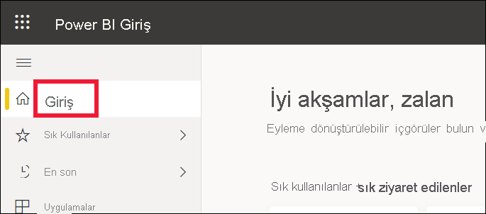
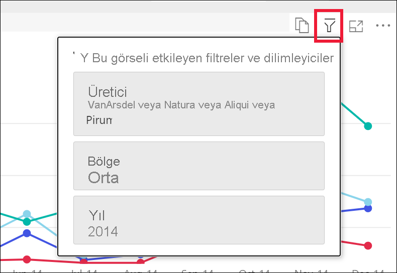
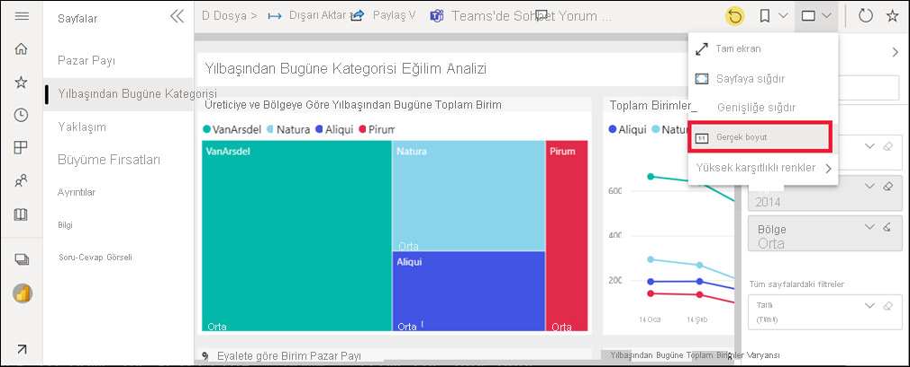
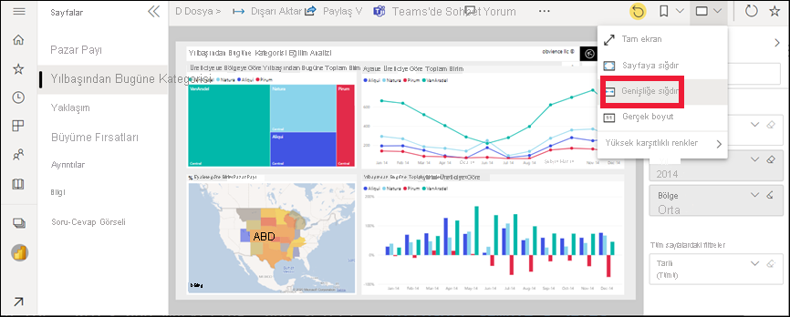
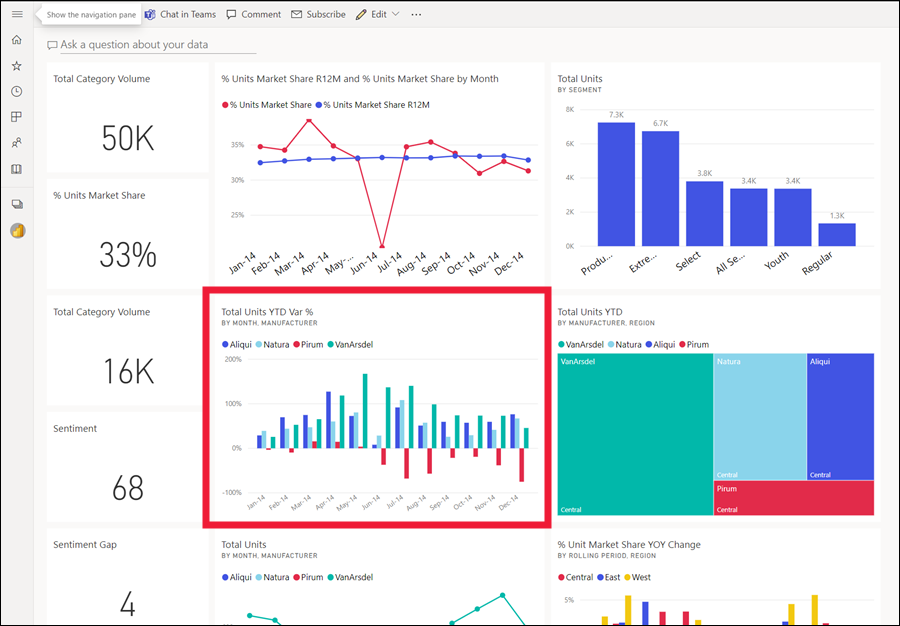

# *İşletme kullanıcıları* için Power BI hizmetinde rapor görüntüleme

[!INCLUDE[consumer-appliesto-yynn](../includes/consumer-appliesto-yynn.md)]

[!INCLUDE [power-bi-service-new-look-include](../includes/power-bi-service-new-look-include.md)]

Rapor, görsellerden oluşan bir veya daha çok sayfalık bir belgedir. Raporlar Power BI *tasarımcıları* tarafından oluşturulur ve [*işletme kullanıcılarıyla* doğrudan](end-user-shared-with-me.md) veya bir [uygulama](end-user-apps.md) aracılığıyla paylaşılır. Bir raporu açabilmek için Power BI Pro lisansına sahip olmanız veya raporun Premium ayrılmış kapasitede depolanan bir çalışma alanına ait olması gerekir. [Lisanslar ve abonelikler hakkında bilgi edinin](end-user-license.md)

Bir raporu açmanın birçok farklı yolu vardır. Burada, Giriş’ten açma ve panodan açma olmak üzere iki farklı yöntem gösterilmektedir. 

<!-- add art-->

## Power BI Giriş’ten raporu açma
Önce doğrudan sizinle paylaşılan bir raporu, ardından da bir uygulama aracılığıyla paylaşılan bir raporu açalım.

   

### Doğrudan sizinle paylaşılmış olan bir raporu açma
Power BI *tasarımcıları* e-postaya bir bağlantı yerleştirerek veya bu bağlantıyı Power BI Giriş içeriğine otomatik olarak ekleyerek tek bir raporu sizinle doğrudan paylaşabilir. Bu şekilde paylaşılan raporlar gezinti bölmenizdeki **Benimle paylaşılan** kapsayıcısında ve Giriş tuvalinizin **Benimle paylaşılan** bölümünde gösterilir.

1. Power BI hizmetini açın (app.powerbi.com).

2. Giriş tuvalinizi görüntülemek için gezinti bölmesinden **Giriş**’i seçin.  

   
   
3. **Benimle paylaşılan** bölümünü görene kadar aşağı kaydırın. Rapor simgesini  bulun. Bu ekran görüntüsünde bir panomuz ve bir raporumuz vardır. Rapor *Satış ve pazarlama örneği* olarak adlandırılır. 
   
   

4. Raporu açmak için rapor *kartını* seçmeniz yeterlidir.

   

5. Sol taraftaki sekmelere dikkat edin.  Bu sekmelerin her biri raporunuzun bir *sayfasını* temsil eder. Şu anda *Büyüme Fırsatı* sayfası açık. Bunun yerine bu rapor sayfasını açmak için *Yılbaşından Bu Yana Satış Kategorisi* sekmesini seçin. 

   

6. Sağ taraftaki **Filtreler** bölmesini genişletin. Bu rapor sayfasına veya raporun tamamına uygulanan filtreler burada görüntülenir. Bu filtreleri değiştirerek görsellerinize ve raporunuza olan etkilerini görebilirsiniz.

   

7. Görselin eylemler menüsünü görüntüleyin. Bir rapor görselinin üzerine geldiğinizde gerçekleştirebileceğiniz eylemler görünür. Belirli bir görsele uygulanan filtreleri görmek için filtre simgesini seçin. Burada, *Aya ve üreticiye göre toplam birim* çizgi grafiği için filtre simgesini seçtik.

   

6. Rapor sayfasının görünümünü de değiştirebilirsiniz. Şu anda rapor sayfasının tamamını görüntülüyoruz. Sayfanın görüntülenmesini (yakınlaştırmasını) değiştirmek için sağ üst köşedeki **Görünüm** açılan menüsünü ve sonra da **Gerçek boyut**’u seçin. Ardından **Genişliğe uydur** görünümüne geçin. Her bir görünüm seçeneğini raporunuzun görünümünü nasıl değiştirdiğine dikkat edin.

   

   

İçgörüleri keşfetmek ve iş kararları almak için raporla etkileşimli çalışmanızın birçok yolu vardır.  Power BI raporları hakkındaki diğer makaleleri okumak için sol taraftaki içindekiler tablosunu kullanın. 

### Bir uygulamanın parçası olan bir raporu açma
İş arkadaşlarınızdan veya AppSource’tan uygulama aldıysanız, bunlar Giriş’te ve gezinti bölmenizdeki **Uygulamalar** ve **Benimle paylaşılan** kapsayıcısında yer alır. [Uygulama](end-user-apps.md), Power BI *tasarımcısı* tarafından sizin için birlikte paketlenmiş pano ve raporlar koleksiyonudur.

### Önkoşullar
Uygulamaların açılması için bir Power BI Pro lisansı veya uygulamanın çalışma alanının Power BI Premium kapasitede depolanması gerekir. [Lisanslar ve abonelikler hakkında bilgi edinin](end-user-license.md)    
    
Takip etmek için Satış ve Pazarla uygulamasını indirin.
1. Tarayıcınızda appsource.microsoft.com adresine gidin.
1. **Power Platform** onay kutusunu seçin.
1. "Satış ve Pazarlama" araması yapın ve **Microsoft örneği - Satış ve Pazarlama**'yı seçin. Arama sonuçlarını görmek için aşağı kaydırın.
1. Uygulamayı Uygulama kapsayıcısına yüklemek için **Hemen al** > **Devam** > **Yükle**’yi seçin. 

Uygulamayı artık **Uygulamalar** kapsayıcınızdan veya **Giriş** sayfasından açabilirsiniz.
1. Gezinti bölmesinden **Giriş**’i seçerek Giriş’e geri dönün.

7. **Uygulamalarım** bölümünü görene kadar aşağı kaydırın.

   

8. Yeni *Satış ve pazarlama* uygulamanızı seçip açın. Uygulama *tasarımcısı* tarafından belirlenen seçeneklere bağlı olarak uygulama bir pano veya rapor ile açılır. Bu uygulama bir panoyu açar.  

## Panodan bir raporu açma
Raporlar panodan açılabilir. Çoğu pano [kutucuğu](end-user-tiles.md), raporlardan *sabitlenmiştir*. Bir kutucuğu seçtiğinizde panoyu oluşturmak için kullanılan rapor açılır. 

1. Panodan bir kutucuk seçin. Bu örnekte, *Total Units YTD...* sütun grafiği kutucuğunu seçmeyi tercih ettik.

    

2.  İlişkili rapor açılır. *YTD Category* adlı sayfada olduğumuza dikkat edin. Bu, panodan seçtiğimiz sütun grafiğinin yer aldığı rapor sayfasıdır.

    

> [!NOTE]
> Tüm kutucuklar rapor açmaz. [Soru-Cevap ile oluşturulan](end-user-q-and-a.md) bir kutucuğu seçerseniz Soru-Cevap ekranı açılır. [Panodaki **Kutucuk** ekle pencere öğesi kullanılarak oluşturulan](../create-reports/service-dashboard-add-widget.md) bir kutucuğu seçerseniz farklı işlemler (video oynatılması, web sitesi açılması gibi) gerçekleşebilir.  

##  Raporları açmak için kullanabileceğiniz yöntemler bunlarla sınırlı değildir
Power BI hizmetinde gezinme konusunda daha yetkin hale geldikçe sizin için en uygun iş akışlarını keşfedeceksiniz. Raporlara erişmek için kullanabileceğiniz diğer yöntemlerden bazıları aşağıda verilmiştir:
- Gezinti bölmesinde bulunan [Sık Kullanılanlar](end-user-favorite.md) ve [Son Görüntülenen](end-user-recent.md) seçeneklerinden    
- [İlişkilileri görüntüle](end-user-related.md) seçeneğini kullanma    
- Bir kullanıcı [sizinle paylaşımda bulunduğunda](../collaborate-share/service-share-reports.md) veya [uyarı ayarladığınızda](end-user-alerts.md) aldığınız e-postadan    
- [Bildirim merkezinizi](end-user-notification-center.md) kullanma    
- Bir çalışma alanından
- ve daha fazlası

## Sonraki adımlar
[Panoyu açma ve görüntüleme](end-user-dashboard-open.md)    
[Rapor filtreleri](end-user-report-filter.md)

