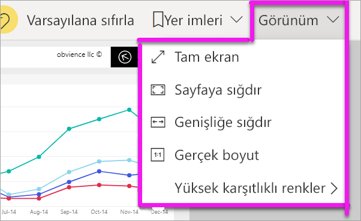

# Bir rapor sayfasının görünümünü değiştirme

Kullanıcılar raporları çok farklı cihazlarda görüntüler ve bu cihazların ekran boyutlarıyla en/boy oranları birbirinden farklıdır. Bir rapor sayfası görünümünü gereksinimlerinize uyacak şekilde değiştirin.

## Görünüm menüsünü keşfedin

**Görünüm** menüsündeki seçenekler, size rapor sayfalarını seçtiğiniz boyut ve genişlikte görüntüleme esnekliği tanır:

- Bir raporu küçük bir cihazda görüntülediğinizi ve başlıklar ile açıklamaları görmenin zor olduğunu varsayalım.  Rapor sayfasının boyutunu artırmak için **Görünüm** > **Gerçek boyut**’u seçin. Raporda gezinmek için kaydırma çubuklarını kullanın.

    

- **Genişliğe uydur**’u seçerek raporu ekranınızın genişliğine sığdırmak ise başka bir seçenektir. Söz konusu olan yükseklik değil genişlik olduğundan yine de dikey kaydırma çubuğunu kullanmanız gerekebilir.

  

- Kaydırma çubuğu istemeyip ekranınızın boyutundan en iyi şekilde yararlanmak istiyorsanız, **Sayfaya Sığdır**’ı seçin.

   

- Dört **Yüksek karşıtlık rengi** arasından da seçim yapabilirsiniz: Yüksek karşıtlık #1, Yüksek karşıtlık #2, Yüksek karşıtlık siyah ve Yüksek karşıtlık beyaz. Görme bozukluğu olan kişilerin raporları daha iyi görebilmesi için kullanabileceğiniz bir erişilebilirlik özelliğidir. Aşağıdaki örnekte yüksek karşıtlık 1 gösterilir. 

    

- Son seçenek olan **Tam ekran** ise raporunuzu menü çubukları ve üst bilgiler olmadan gösterir. Tam ekran, ayrıntılı bilgileri görmenin zor olduğu küçük ekranlar için iyi bir seçenek olabilir.  Tam ekran, kullanıcıların etkileşim kurmadan görüntülemesi için büyük ekranlara rapor sayfaları yansıtıldığında da iyi bir seçenek olabilir.  

    

Rapordan çıktığınızda **Görünüm** ayarlarınız kaydedilmez ve varsayılana geri döner. Bu ayarları kaydetmeniz gerekiyorsa [yer işaretleri](end-user-bookmarks.md) kullanın.

## Sonraki adımlar

* [Power BI Filtreler bölmesine ilişkin tura katılın](end-user-report-filter.md)