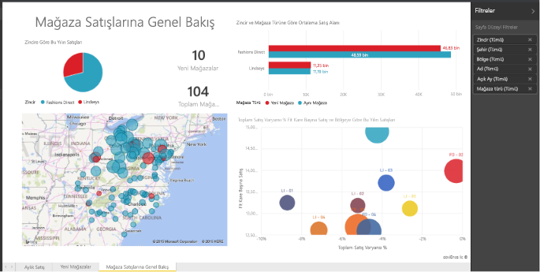

# Power BI'daki raporlar
## Bir Power BI raporu nedir?
Bir Power BI ***raporu***, bir veri kümesinden edinilen farklı bulguları ve öngörüleri temsil eden görselleştirmelerle, bu veri kümesine ilişkin çok perspektifli bir görüş sunar.  Bir raporda tek bir görselleştirme olabilir veya rapor, görselleştirmelerle dolu sayfalardan oluşabilir. İş rolünüze bağlı olarak, raporu *oluşturan* ve/veya raporu sadece *kullanan* biri olabilirsiniz.

Bu raporda 3 sayfa (veya sekme) bulunuyor ve biz şu anda Store Sales Overview sayfasını görüntülüyoruz. Bu sayfada 6 farklı görselleştirme ve bir sayfa başlığı bulunuyor. Görselleştirmeler panolara *sabitlenebilir* ve bu sabitlenen görselleştirme seçildiği zaman, sabitlenen görselleştirmenin kaynağı olan rapor açılır.

Power BI'ı kullanmaya yeni başladıysanız [Power BI temel kavramlarını](end-user-basic-concepts.md) okuyarak sağlam bir temel oluşturabilirsiniz

Raporlar, Power BI hizmetinin ve Power BI Desktop'ın bir özelliğidir. Raporlarla çalışma deneyimi her ikisinde de neredeyse aynıdır. Mobilde ise rapor oluşturamazsınız ancak [raporları görüntüleyebilir, paylaşabilir ve raporlara not ekleyebilirsiniz](mobile/mobile-reports-in-the-mobile-apps.md).

## Raporların avantajları
Raporlar tek bir veri kümesini temel alır. Bir raporda bulunan her görselleştirme önemli bir bilgi parçasını temsil eder. Ayrıca görselleştirmeler statik olmadığından, öngörüler keşfetmek ve sorularınıza yanıt aramak üzere verilerinizi ayrıntılı olarak incelemek için veri ekleyebilir veya kaldırabilir, görselleştirme türlerini değiştirebilir, filtreler ve dilimleyiciler ekleyebilirsiniz. Bir rapor bir panoya benzer şekilde, ancak panodan daha yüksek oranda etkileşimlidir, yüksek derecede özelleştirilebilir ve temel alınan veriler değiştikçe görselleştirmeler de güncelleştirilir.

## Panolarla ve raporları karşılaştırma
[Panolar](end-user-dashboards.md) da görselleştirmelerle dolu tuvaller olduklarından genellikle raporlarla karıştırılır. Ancak bazı önemli farklılıklar bulunur.  

| **Özellik** | **Panolar** | **Raporlar** |
| --- | --- | --- |
| Sayfalar |Bir sayfa |Bir veya daha fazla sayfa |
| Veri kaynakları |Pano başına bir veya daha fazla rapor ve bir veya daha fazla veri kümesi |Rapor başına tek bir veri kümesi |
| Power BI Desktop'ta kullanılabilirlik |Hayır |Evet, Desktop'ta rapor oluşturabilir ve bunları görüntüleyebilirsiniz |
| Sabitleme |Var olan görselleştirmeleri (kutucukları) yalnızca geçerli panodan diğer panolarınıza sabitleyebilirsiniz |Görselleştirmeleri (kutucuklar olarak) herhangi bir panonuza sabitleyebilirsiniz. Rapor sayfalarının tamamını herhangi bir panonuza sabitleyebilirsiniz. |
| Abonelik |Bir panoya abone olamazsınız |Rapor sayfalarına abone olabilirsiniz |
| Filtreleme |Filtreleme veya dilimleme yapamazsınız |Filtreleme, vurgulama ve dilimleme için birçok farklı yol vardır |
| Uyarı ayarlama |Belirli koşullar karşılandığında size e-posta gönderilmesini sağlamak üzere uyarılar oluşturabilirsiniz |Hayır |
| Öne çıkan özelliği |Bir panoyu "öne çıkan" panonuz olarak ayarlayabilirsiniz |Öne çıkan bir rapor oluşturamazsınız |
| Doğal dil sorguları |Panodan kullanılabilir |Raporlardan kullanılamaz |
| Görselleştirme türünü değiştirme |Hayır. Hatta bir rapor sahibi rapordaki görselleştirme türünü değiştirirse panodaki sabitlenen görselleştirme güncelleştirilmez |Evet |
| Temel alınan veri kümesi tablolarını ve alanlarını görme |Hayır. Verileri dışarı aktarabilir ancak tabloları ve alanları panonun kendisinde göremezsiniz. |Evet. Veri kümesi tablolarını, alanlarını ve değerlerini görebilirsiniz. |
| Görselleştirmeler oluşturma |"Kutucuk ekle"yi kullanarak panoya pencere öğeleri eklemekle sınırlıdır |Düzenleme izinleriyle birçok farklı türde görsel oluşturabilir, özel görseller ekleyebilir, görselleri düzenleyebilir ve daha fazlasını yapabilirsiniz |
| Özelleştirme |Görselleştirmelerde (kutucuklarla) taşıma ve düzenleme, yeniden boyutlandırma, bağlantılar ekleme, yeniden adlandırma, silme ve tam ekranda görüntüleme gibi işlemler yapabilirsiniz. Ancak, veriler ve görselleştirmelerin kendisi salt okunurdur. |Okuma görünümü'nde yayımlama, ekleme, filtreleme, dışarı aktarma, .pbix olarak indirme, ilişkili içeriği görüntüleme, QR kodları oluşturma, Excel'de çözümleme ve daha fazla işlemi yapabilirsiniz.  Düzenleme görünümü'nde şu ana kadar bahsedilen her şeyi ve çok daha fazlasını yapabilirsiniz. |

## Rapor ***oluşturucuları*** ve rapor ***kullanıcıları***
İş rolünüze bağlı olarak, kendi kullanımınız veya iş arkadaşlarınızla paylaşmak için rapor oluşturan biri olabilirsiniz. Bu durumda raporları nasıl oluşturacağınızı ve paylaşacağınızı öğrenmek istersiniz. Buna karşılık başkalarından rapor alan biri de olabilirsiniz. Bu durumda raporları nasıl anlayacağınızı ve raporlarla nasıl etkileşim kuracağınızı öğrenmek istersiniz.

Rolünüze göre, başlamanıza yardımcı olacak bazı konu başlıkları aşağıdadır.

### Rapor oluşturacak ve paylaşacaksanız
* Raporları ve rapor araçlarını nerede bulacağınızı öğrenmek için [Power BI hizmeti turu](end-user-basic-concepts.md) ile başlayın.
* [Rapor editörüne](../service-the-report-editor-take-a-tour.md) ilişkin tura katılın.
* [Bir veri kümesinden rapor oluşturmayı](../service-report-create-new.md) öğrenin.
* [Görselleştirme, sayfa ve rapor düzeyi filtreleri kullanmayı öğrenin](end-user-report-filter.md)
* [Bir raporu iş arkadaşlarınızla](../service-share-dashboards.md) paylaşmanın tüm farklı yollarını keşfedin.

### Rapor alacak ve kullanacaksanız
* Raporları ve rapor araçlarını nerede bulacağınızı öğrenmek için [Power BI hizmeti turu](end-user-basic-concepts.md) ile başlayın.
* [Okuma görünümü](end-user-reading-view.md)'nde [bir raporu açmayı](end-user-report-open.md) ve kullanabileceğiniz tüm etkileşimleri öğrenin.
* Raporları daha rahat kullanmak için [örneklerimizden](../sample-tutorial-connect-to-the-samples.md) biriyle tura katılın.  
<!--* Don't need the report any more? You can [remove it](../service-delete.md).-->
* Raporun hangi veri kümesini kullandığını ve hangi panolarda rapordan sabitlenmiş kutucuklar bulunduğunu görmek için [ilişkili içeriği görüntüleyin](end-user-related.md).

> [!TIP]
> Aradığınızı burada bulamadıysanız tüm *rapor* konu başlıklarına göz atmak için sol taraftaki İçindekiler bölümünü kullanın.
> 
> 

## Sonraki adımlar
[Power BI nedir?](../power-bi-overview.md) 

[Power BI - Temel Kavramlar](end-user-basic-concepts.md)

