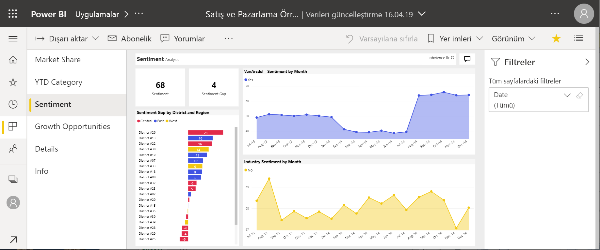

# Power BI'daki raporlar

Power BI raporları, bir veri kümesinden edinilen farklı bulguları ve öngörüleri temsil eden görseller yardımıyla bu veri kümesine ilişkin çok yönlü bir yaklaşım sunar.  Bir raporda tek bir görsel olabilir veya rapor, görsellerle dolu sayfalardan oluşabilir. İş rolünüze bağlı olarak, rapor *tasarlayan* kişi olabilirsiniz. Raporları *tüketen* veya kullanan kişi de olabilirsiniz.

Bu raporda altı sayfa (veya sekme) bulunuyor ve şu anda **Yaklaşım** sayfasını görüntülüyorsunuz. Bu sayfada beş farklı görsel ve bir sayfa başlığı bulunuyor. *Filtreler* bölmesi tüm rapor sayfalarına bir filtre uygulandığını gösteriyor. Filtreler bölmesini daraltmak için oku (**>**) seçin.

Power BI'ı kullanmaya yeni başladıysanız [Power BI hizmeti tüketicileri için temel kavramlar](end-user-basic-concepts.md) makalesini okuyarak iyi bir temel oluşturabilirsiniz. Raporlar mobil cihazlarda görüntülenebilir, paylaşılabilir ve raporlara not eklenebilir. Daha fazla bilgi için bkz. [Power BI mobil uygulamalarında raporları araştırma](mobile/mobile-reports-in-the-mobile-apps.md).

## Raporların avantajları

Power BI bir raporda tek bir veri kümesini temel alır. Rapor *tasarımcıları*, bir rapor içinde bir bilgiyi temsil eden görseller oluşturur. Görseller statik değildir.  Temel alınan veriler değiştikçe güncelleştirilir. İçgörüleri keşfetmek ve yanıt aramak için verilerin ayrıntılarına indikçe görseller ve filtrelerle etkileşimde bulunabilirsiniz. Bir pano gibi, rapor da yüksek oranda etkileşimli ve yüksek oranda özelleştirilebilir niteliktedir.

### İçerikle güvenli etkileşim kurma

İçeriğinizi keşfedip filtreleme, dilimleme, abone olma ve dışarı aktarma gibi etkileşimlerde bulundukça, raporları bozamazsınız. Çalışmanız, temel alınan veri kümesini veya özgün paylaşılan içeriği etkilemez. Bu durum panolar, raporlar ve uygulamalar için geçerlidir.

> [!NOTE]
> Verilerinize zarar veremeyeceğinizi unutmayın. Power BI, herhangi bir şeyi bozmaktan endişe duymadan keşfedip denemeniz için harika bir yerdir.

### Değişikliklerinizi kaydedin veya varsayılan ayarlara geri dönün

Bu, değişikliklerinizi kaydedemeyeceğiniz anlamına gelmez. Kaydedebilirsiniz ancak bu değişiklikler yalnızca sizin içeriği nasıl göreceğinizi etkiler. Raporun özgün varsayılan görünümüne geri dönmek için **Varsayılana sıfırla**’yı seçin.

## Panolarla raporları karşılaştırma

[Panolar](end-user-dashboards.md) da görsellerle dolu tuvaller olduklarından genellikle raporlarla karıştırılır. Ancak bazı önemli farklılıklar bulunur.  

| **Özellik** | **Panolar** | **Raporlar** |
| --- | --- | --- |
| Sayfalar |Bir sayfa |Bir veya daha fazla sayfa |
| Veri kaynakları |Pano başına bir veya daha fazla rapor ve bir veya daha fazla veri kümesi |Rapor başına tek bir veri kümesi |
| Filtreleme |Filtreleme veya dilimleme yapamazsınız |Filtreleme, vurgulama ve dilimleme için birçok farklı yol vardır |
| Uyarı ayarlama |Pano belirli koşulları karşıladığında size e-posta gönderilmesini için uyarılar oluşturabilirsiniz |Hayır |
| Öne çıkan özelliği |Bir panoyu öne çıkan panonuz olarak ayarlayabilirsiniz |Öne çıkan bir rapor oluşturamazsınız |
| Temel alınan veri kümesi tablolarını ve alanlarını görme |Hayır. Verileri dışarı aktarabilir ancak veri kümesi tablolarını ve alanları panonun kendisinde göremezsiniz |Evet. Veri kümesi tablolarını, alanlarını ve görme iznine sahip olduğunuz değerleri görebilirsiniz |
| Özelleştirme |Hayır  |İlgili içerikleri filtreleyebilir, dışarı aktarabilir, görüntüleyebilir, yer işaretleri ekleyebilir, QR kodları oluşturabilir, Excel’de analiz edebilir ve daha birçok işlem yapabilirsiniz |

<!--| Available in Power BI Desktop |No |Yes, can create and view reports in Desktop |
| Pinning |Can pin existing visuals (tiles) only from current dashboard to your other dashboards |Can pin visuals (as tiles) to any of your dashboards. Can pin entire report pages to any of your dashboards. | -->

## Rapor tasarımcıları ve rapor kullanıcıları

İş rolünüze bağlı olarak, kendi kullanımınız veya iş arkadaşlarınızla paylaşmak için rapor oluşturan bir *tasarımcı* olabilirsiniz. Bu durumda raporları nasıl oluşturacağınızı ve paylaşacağınızı öğrenmek istersiniz.

Buna karşılık başkalarından rapor alan bir *kullanıcı* da olabilirsiniz. Bu durumda raporları nasıl anlayacağınızı ve raporlarla nasıl etkileşim kuracağınızı öğrenmek istersiniz. Bir rapor *kullanıcısıysanız*, bu bağlantılar işinize yarayabilir:

* Raporları ve rapor araçlarını nerede bulacağınızı öğrenmek için [Power BI hizmeti turu](end-user-basic-concepts.md) ile başlayın.
* [Okuma görünümü](end-user-reading-view.md)'nde [bir raporu açmayı](end-user-report-open.md) ve kullanabileceğiniz tüm etkileşimleri öğrenin.
* Raporları daha rahat kullanmak için [örneklerimizden](../sample-tutorial-connect-to-the-samples.md) biriyle tura katılın.  
* Raporun hangi veri kümesini kullandığını ve hangi panolarda rapordan sabitlenmiş kutucuklar bulunduğunu görmek için bkz. [Power BI hizmetinde ilişkili içeriği görüntüleme](end-user-related.md).

> [!TIP]
> Aradığınızı burada bulamadıysanız tüm *Rapor* makalelerine göz atmak için sol taraftaki İçindekiler bölümünü kullanın.

## Sonraki adımlar

[Raporu açma ve görüntüleme](end-user-report-open.md)    
[Power BI hizmetindeki panolar](end-user-dashboards.md)