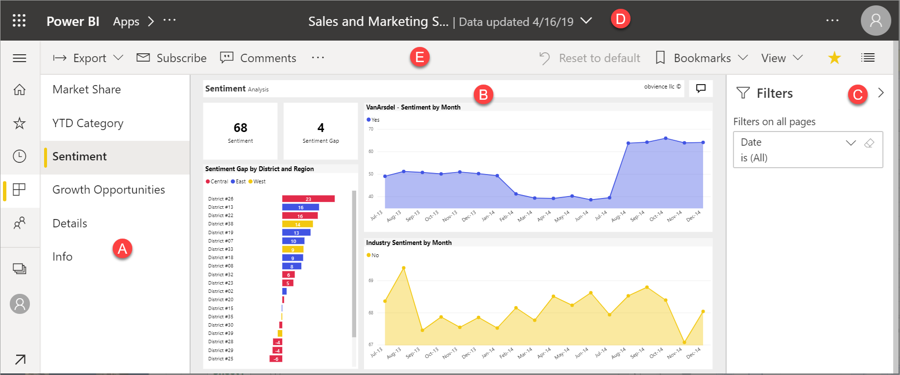

# Power BI'daki raporlar
## Bir Power BI raporu nedir?
Power BI ***rapor*** bir çok Perspektifli bir veri kümesi, veri kümesinden farklı bulguları ve öngörüleri temsil eden görsellerle olduğu.  Bir rapor, tek bir görseli veya sayfa görsellerinin tam sahip olabilir. İş rolünüze bağlı olarak, biri olabilirsiniz kimin *tasarımları* raporları ve/veya size olabilir birisi kimin *tüketir* veya raporları kullanır.

Bu rapor altı sayfaları (veya sekme) varsa ve biz şu anda yaklaşım sayfasını görüntülüyoruz. Bu sayfada 6 farklı görseller ve bir sayfa başlığı bulunur.  

Power BI'ı kullanmaya yeni başladıysanız [Power BI temel kavramlarını](end-user-basic-concepts.md) okuyarak sağlam bir temel oluşturabilirsiniz

Raporları görüntüleme, paylaşma ve mobil cihazlarda not eklemek için kullanılabilir. Daha fazla bilgi için [Power BI mobil raporları](mobile/mobile-reports-in-the-mobile-apps.md).

## Raporların avantajları
Bir rapor, tek bir veri kümesini temel alır. Bir rapordaki görsellerin raporundan oluşturulan *tasarımcıları* ve bilgi parçasını temsil eder. Ve görsellerin statik değildir; Öngörüler keşfetmek ve sorularınıza yanıt aramak için verilerin ayrıntılarına indikçe görselleri ve filtreleri ile etkileşim kurabilir. Bir pano gibi ancak daha fazla bilgi-bunu üst düzeyde etkileşimli ve özelleştirilebilir bir rapor ve temel alınan veriler değiştikçe görsellerin güncelleştirin.

### İçerikle güvenli etkileşim kurma
Keşfedin ve, içerik filtreleme, dilimleme, abone olmadan ve dışarı aktarma, içiniz rahat ile etkileşimli olarak; İş, temel alınan veri kümesine veya özgün paylaşılan içerik (panolar, raporlar ve uygulamalar) etkilemez.
 
> [!NOTE]
> Unutmayın, verilerinizi olumsuz olamaz. Power BI keşfedin ve, "herhangi bir şey bölmeniz" endişelenmeden denemeniz için harika bir yerdir.

### Yaptığınız değişiklikleri kaydedin veya varsayılan ayarlara geri döndür
Bu, değişikliklerinizi kaydedemezsiniz anlamına gelmez; devam edebilirsiniz, ancak bu değişiklikler yalnızca içerik görünümünü etkiler. Orijinal varsayılan görünüme geri döndürülürken Sıfırla varsayılan düğme olarak işaretlemektir.

## Panolarla raporları karşılaştırma
[Panolar](end-user-dashboards.md) da görsellerle dolu tuvaller olduklarından genellikle raporlarla karıştırılır. Ancak bazı önemli farklılıklar bulunur.  

| **Özellik** | **Panolar** | **Raporlar** |
| --- | --- | --- |
| Sayfalar |Bir sayfa |Bir veya daha fazla sayfa |
| Veri kaynakları |Pano başına bir veya daha fazla rapor ve bir veya daha fazla veri kümesi |Rapor başına tek bir veri kümesi |
| Filtreleme |Filtreleme veya dilimleme yapamazsınız |Filtreleme, vurgulama ve dilimleme için birçok farklı yol vardır |
| Uyarı ayarlama |Belirli koşullar karşılandığında size e-posta gönderilmesini sağlamak üzere uyarılar oluşturabilirsiniz |Hayır |
| Öne çıkan özelliği |Bir panoyu "öne çıkan" panonuz olarak ayarlayabilirsiniz |Öne çıkan bir rapor oluşturamazsınız |
| Temel alınan veri kümesi tablolarını ve alanlarını görme |Hayır. Verileri dışarı aktarabilir ancak veri kümesi tabloları ve alanları panonun kendisinde göremezsiniz. |Evet. Veri kümesi tablolarını, alanlarını ve görme iznine sahip olduğunuz değerlerini görebilirsiniz. |
| Özelleştirme |Hayır  |Filtrelemek için dışarı aktarma, ilişkili içeriği görüntüleme, yer işaretleri eklemek, QR kodları oluşturma, Excel ve daha fazlasını analiz edin.   |

<!--| Available in Power BI Desktop |No |Yes, can create and view reports in Desktop |
| Pinning |Can pin existing visuals (tiles) only from current dashboard to your other dashboards |Can pin visuals (as tiles) to any of your dashboards. Can pin entire report pages to any of your dashboards. | -->

## Rapor ***oluşturucuları*** ve rapor ***kullanıcıları***
İş rolünüze bağlı olarak, olabilir bir *Tasarımcısı*, kendi kullanımınız veya iş arkadaşlarınızla paylaşmak için rapor oluşturan. Bu durumda raporları nasıl oluşturacağınızı ve paylaşacağınızı öğrenmek istersiniz. Buna karşılık başkalarından rapor alan biri de olabilirsiniz. Bu durumda raporları nasıl anlayacağınızı ve raporlarla nasıl etkileşim kuracağınızı öğrenmek istersiniz. Bir rapor varsa **tüketici**, sizin için bu bağlantılar verilmiştir. 

* Raporları ve rapor araçlarını nerede bulacağınızı öğrenmek için [Power BI hizmeti turu](end-user-basic-concepts.md) ile başlayın.
* [Okuma görünümü](end-user-reading-view.md)'nde [bir raporu açmayı](end-user-report-open.md) ve kullanabileceğiniz tüm etkileşimleri öğrenin.
* Raporları daha rahat kullanmak için [örneklerimizden](../sample-tutorial-connect-to-the-samples.md) biriyle tura katılın.  
<!--* Don't need the report any more? You can [remove it](../service-delete.md).-->
* Raporun hangi veri kümesini kullandığını ve hangi panolarda rapordan sabitlenmiş kutucuklar bulunduğunu görmek için [ilişkili içeriği görüntüleyin](end-user-related.md).

> [!TIP]
> Aradığınızı burada bulamadıysanız tüm *rapor* konu başlıklarına göz atmak için sol taraftaki İçindekiler bölümünü kullanın.
> 
> 

## Sonraki adımlar
[Power BI nedir?](../power-bi-overview.md) 

[Power BI - Temel Kavramlar](end-user-basic-concepts.md)

