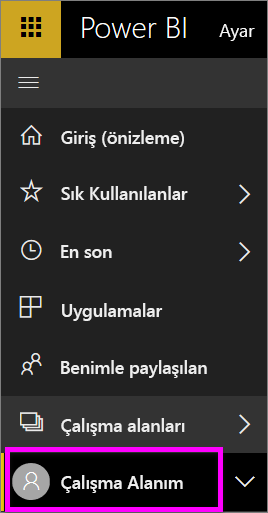
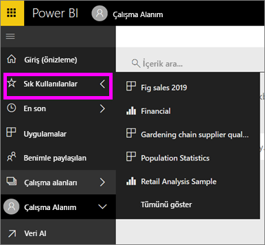

# Gezinme: Power BI hizmetinde içerik arama, bulma ve sıralama
Power BI hizmetindeki içeriğinizde gezinmek için kullanabileceğiniz birçok farklı yöntem vardır. Çalışma alanındaki içerik türe göre düzenlenmiştir: panolar, raporlar, çalışma kitapları ve veri kümeleri.  İçerik ayrıca kullanıma göre de düzenlenmiştir: sık kullanılanlar, son görüntülenenler, benimle paylaşılanlar ve öne çıkan. Giriş sayfası bir sayfadaki tüm içeriği tek bir noktadan düzenlemenizi sağlar. Bu farklı yollardan faydalanarak Power BI hizmetinde aradığınızı kolayca bulabilirsiniz.  

## Çalışma alanlarında gezinme

Power BI *tüketicileri* genellikle tek bir çalışma alanına sahiptir: **Çalışma alanım**. **Çalışma alanım** yalnızca Microsoft örneklerini indirdiyseniz veya kendiniz içerik oluşturduysanız veya indirdiyseniz dolu olur.  

Power BI hizmeti, **Çalışma alanım** sayfasındaki içeriği türe göre ayırmıştır: panolar, raporlar, çalışma kitapları ve veri kümeleri. Bir çalışma alanını seçtiğinizde bu düzenle karşılaşırsınız. Bu örnekte **Çalışma alanım** sayfasında bir pano, iki rapor, sıfır çalışma kitabı ve iki veri kümesi vardır.

________________________________________

## Sol gezinti çubuğunu kullanarak gezinme
Sol gezinti çubuğu, aradıklarınızı daha hızlı bulmanızı kolaylaştıracak şekilde içeriğinizi sınıflandırır.  

- Sizinle paylaşılan içerikler **Benimle paylaşılan** bölümünde bulunur.
- Son görüntülediğiniz içerikler **Son görüntülenen** bölümünde bulunur. 
- **Uygulamalar**'ı seçerek uygulamalarınıza ulaşabilirsiniz.
- **Giriş**, en önemli içeriğin yanı sıra önerilen içeriğin ve öğrenme kaynaklarının bulunduğu tek sayfalık bir görünümdür.

Ayrıca içerikleri [sık kullanılan](end-user-favorite.md) ve [öne çıkan](end-user-featured.md) olarak etiketleyebilirsiniz. En sık görüntülemeyi planladığınız panoyu seçip *öne çıkan* panonuz olarak ayarlayabilirsiniz. Power BI hizmetini her açtığınızda ilk olarak öne çıkan panonuz görüntülenir. Sık ziyaret ettiğiniz panolar ve uygulamalar mı var? Bu öğeleri sık kullanılanlara ekleyerek, her zaman sol gezinti çubuğunda kalmalarını sağlayabilirsiniz.

geçin.

## Önemli noktalar ve sorun giderme
* Veri kümelerinde **Sıralama ölçütü**, belge sahipleri tarafından kullanılamaz.

## Sonraki adımlar
[Power BI - Temel Kavramlar](end-user-basic-concepts.md)

Başka bir sorunuz mu var? [Power BI Topluluğu'na başvurun](http://community.powerbi.com/)