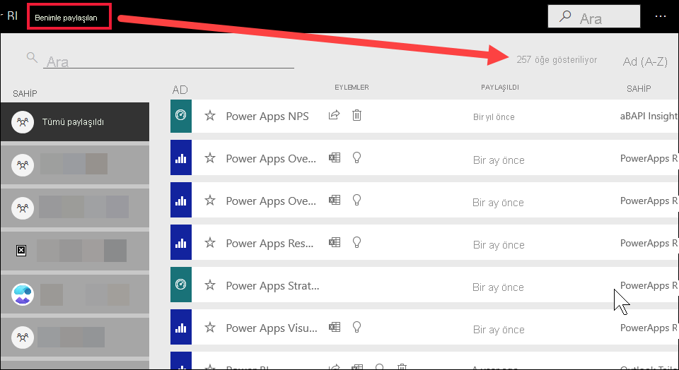

# Power BI tüketicileri için gezinti: genel arama

[!INCLUDE[consumer-appliesto-yyny](../includes/consumer-appliesto-yyny.md)]

[!INCLUDE [power-bi-service-new-look-include](../includes/power-bi-service-new-look-include.md)]

Power BI hizmetini yeni kullanmaya başladığınızda yalnızca birkaç parça içeriğiniz (panolar, raporlar, uygulamalar) olur. Ama siz uygulama indirdikçe ve iş arkadaşlarınız sizinle içerik paylaştıkça çok fazla içerikle karşılaşabilirsiniz. Bu durumda, arama ve sıralama özellikleri son derece yararlı olur.

## İçeriği arama
 Arama özelliğini Power BI hizmetinin neredeyse her kısmında kullanabilirsiniz. Arama kutusunu veya arama simgesini bulmanız yeterlidir .

 Arama alanına pano, rapor, çalışma kitabı uygulama veya sahip adının tamamını veya bir bölümünü yazın. Power BI tüm içeriğinizi arar. 

  

 Power BI’ın bazı bölümlerinde, örneğin çalışma alanlarında iki farklı arama alanı bulacaksınız. Menü çubuğundaki arama alanı tüm içeriğinizde arama yaparken, çalışma alanı tuvalindeki arama alanı yalnızca söz konusu çalışma alanında arama yapar.

  

## İçerik listelerini sıralama

Yalnızca birkaç parça içeriğiniz varsa sıralama gerekli olmayabilir.  Ama uzun pano ve rapor listeleriniz olduğunda, sıralama ihtiyacınız olanı bulmanıza yardımcı olacaktır. Örneğin bu **Benimle paylaşılan** içeri listesinde 257 öğe vardır. 

Şu anda bu içerik listesi ada göre alfabetik sırada, A’dan Z’ye sıralanmıştır. Sıralama ölçütünü değiştirmek için **Ad (A-Z)** öğesinin yanındaki oku seçin.

Sıralama, çalışma alanlarında da kullanılabilir. Bu örnekte içerik **Yenilenme** tarihine göre sıralanmıştır. Çalışma alanlarının sıralama ölçütünü ayarlamak için, sütun üst bilgilerini seçin ve ardından bir kez seçim yaparak söz konusu üst bilgiyi seçin ve ikinci kez seçim yaparak sıralama yönünü değiştirin. 

Her sütun sıralanamaz. Sıralanabilen sütunları bulmak için sütun başlığına gidin.

## Önemli noktalar ve sorun giderme
* Veri kümelerinde **Sıralama ölçütü**, belge sahipleri tarafından kullanılamaz.

## Sonraki adımlar
[Raporlardaki görselleri sıralama](end-user-change-sort.md)

[Görsellerdeki verileri sıralama](end-user-change-sort.md)

Başka bir sorunuz mu var? [Power BI Topluluğu'na başvurun](https://community.powerbi.com/)
