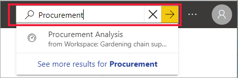
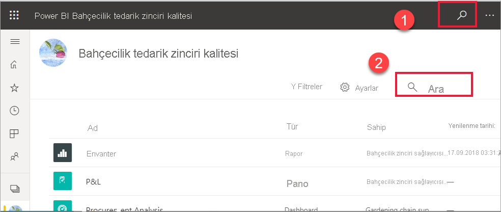
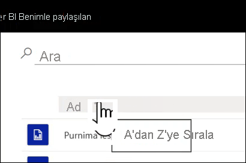
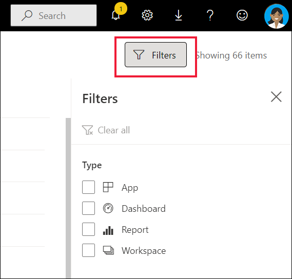

# Power BI işletme kullanıcıları için gezinti: genel arama

[!INCLUDE[consumer-appliesto-yyny](../includes/consumer-appliesto-yyny.md)]

[!INCLUDE [power-bi-service-new-look-include](../includes/power-bi-service-new-look-include.md)]

Power BI hizmetini yeni kullanmaya başladığınızda yalnızca birkaç parça içeriğiniz (panolar, raporlar, uygulamalar) olur. Ama siz uygulama indirdikçe ve iş arkadaşlarınız sizinle içerik paylaştıkça çok fazla içerikle karşılaşabilirsiniz. Bu durumda, arama ve sıralama özellikleri son derece yararlı olur.

## İçeriği arama
 Arama özelliğini Power BI hizmetinin neredeyse her kısmında kullanabilirsiniz. Arama kutusunu veya arama simgesini bulmanız yeterlidir .

 Arama alanına pano, rapor, çalışma kitabı, çalışma alanı, uygulama veya sahip adının tamamını veya bir bölümünü yazın. Power BI tüm içeriğinizi arar. 

  

 Power BI’ın bazı bölümlerinde, örneğin çalışma alanlarında iki farklı arama alanı bulacaksınız. Menü çubuğundaki arama alanı tüm içeriğinizde arama yaparken, çalışma alanı tuvalindeki arama alanı yalnızca söz konusu çalışma alanında arama yapar.

  

## İçerik listelerini sıralama

Yalnızca birkaç parça içeriğiniz varsa sıralama gerekli olmayabilir.  Ama uzun pano ve rapor listeleriniz olduğunda, sıralama ihtiyacınız olanı bulmanıza yardımcı olacaktır. Örneğin bu **Benimle paylaşılan** içerik listesinde 70 öğe vardır. 

Şu anda bu içerik listesi ada göre alfabetik sırada, Z’den A’ya doğru sıralanmıştır. Sıralama ölçütünü değiştirmek için **Ad (A-Z)** öğesinin yanındaki oku seçin.

Sıralama, çalışma alanlarında da kullanılabilir. Bu örnekte içerik **Yenilenme** tarihine göre sıralanmıştır. Çalışma alanlarının sıralama ölçütünü ayarlamak için sütun üst bilgilerini seçin ve ikinci kez seçim yaparak sıralama yönünü değiştirin. 

Her sütun sıralanamaz. Sıralanabilen sütunları bulmak için sütun başlığına gidin.

## İçerik listelerini filtreleme
İçeriği hızlıca bulmak için kullanabileceğiniz bir diğer yöntem de içerik listesi **Filtreleridir**. Sağ üst köşeden **Filtreler**'i seçerek filtreleri görüntüleyebilirsiniz. Kullanabileceğiniz filtreler, Power BI hizmetinizin konumuna göre değişir.  Aşağıdaki örnekte **En son** içerik listesi gösterilmiştir.  Listeyi içerik türüne göre filtrelemenizi sağlar.  **Benimle paylaşılan** içerik listesindeki **Filtreler** arasında Sahip ve içerik türü de bulunur.

## Sonraki adımlar
[Raporlardaki görselleri sıralama](end-user-change-sort.md)

[Görsellerdeki verileri sıralama](end-user-change-sort.md)

Başka bir sorunuz mu var? [Power BI Topluluğu'na başvurun](https://community.powerbi.com/)
